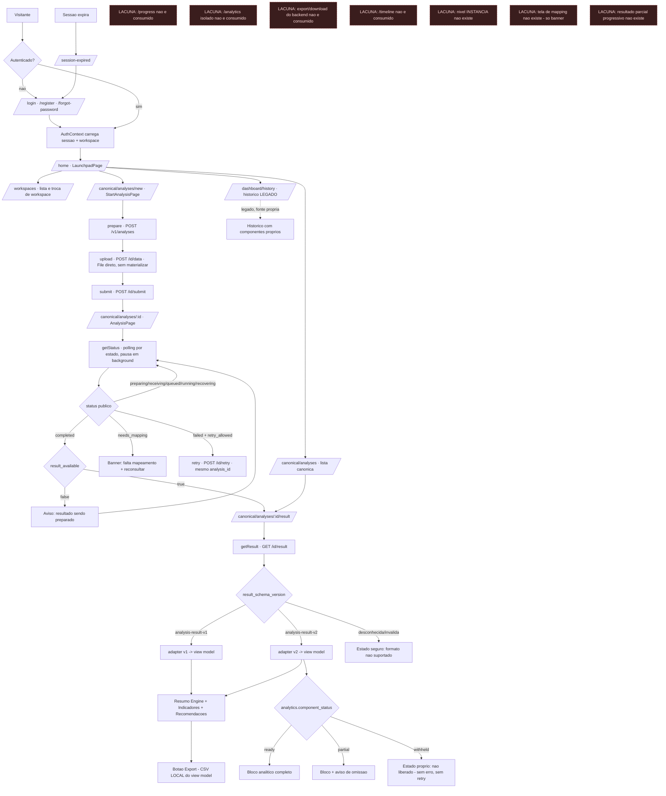
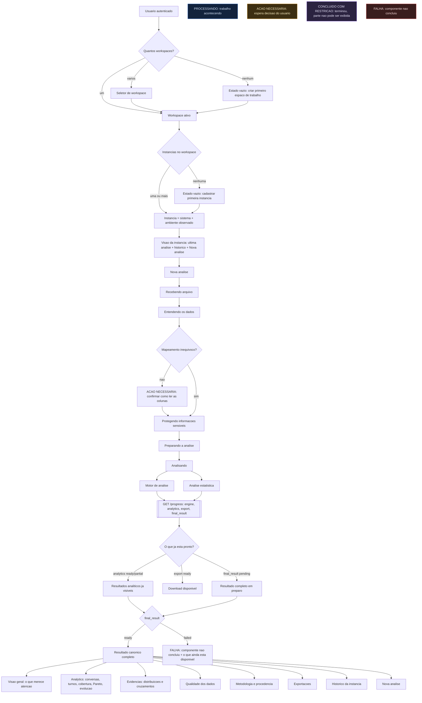

# DISCOVERY — Sentinela Front / Experiência Completa

> **Nada foi implementado.** Nenhuma dependência instalada, nenhum componente criado, nenhum
> contrato alterado, nenhuma mudança de backend. Backend **congelado**; Big Bang **bloqueado**.
>
> **Data:** 2026-08-08 · **Repo auditado:** `sentinela-front-e1` @ `a47d41a` (árvore limpa)
> **Backend de referência:** freeze global de 2026-08-08 (ver §1)

---

## 1. Fontes lidas no Obsidian

Vault `C:\Users\DESKTOP\Documents\Obsidian\Sentinela OS`.

| # | arquivo | o que trouxe para esta frente |
|---|---|---|
| 1 | `INDEX.md` | entrada obrigatória; **"Código atual vence documento antigo quando houver divergência comprovada"**; ordem "contexto → regras → owner → contrato → truth-trace → plano → implementação" |
| 2 | `REGRA DE OURO ZERO.md` | honestidade como critério de aceite; **gate de tamanho de arquivo**; "o front também não [pontua] — se o backend não mandou o valor, a tela mostra indisponível, jamais recalcula" |
| 3 | `14 - Operação/Regras de Ouro - Sentinela.md` | Top 40 (itens 9, 10, 11, 18, 19, 23, 24) e §2 "Arquitetura modular e anti-monólito"; §4 checklist de Frontend |
| 4 | `04 - Decisões/DEC - Arquitetura modular anti-monólito e topologia multi-repo.md` | decisão formal aprovada; limites de 500/800/1.000 linhas; regra do escoteiro |
| 5 | `02 - Arquitetura/INDEX - Arquitetura Sentinela.md` | índice canônico; aviso de topo apontando para o freeze |
| 6 | `02 - Arquitetura/ARQ - Arquitetura Entregue - Ondas 1 a 8 (congelamento).md` | **autoridade vigente**: contratos, estados, privacy boundaries, e as 10 narrativas antigas revogadas |
| 7 | `14 - Operação/OPS - Freeze Global e Pacote pre-Big-Bang.md` | HEADs congelados, blocker do pacote, ordem de rollout (frontend antes do Orchestrator) |
| 8 | `02 - Arquitetura/Padrões Técnicos - Sentinela.md` | padrões de implementação |
| 9 | `01 - Produto/Visão Geral do Sentinela.md` | linguagem de produto |

**Resolução de divergência.** O `INDEX.md` declara o vault como fonte de verdade *e* que código
atual vence documento antigo comprovadamente divergente. O `INDEX - Arquitetura Sentinela`
recebeu, no congelamento, um aviso de topo dizendo que onde ele ou as notas de 2026-07 divergirem
da nota `ARQ - Arquitetura Entregue`, **aquela nota vale**. Esta Discovery segue essa cadeia.

> ⚠️ `REGRA DE OURO ZERO.md` §6 ("Escopo travado") diz **"Não tocar no ARGOS (`sentinela-front`,
> `sentinela`)"**. Isso se refere ao front LEGADO `sentinela-front` — **não** a
> `sentinela-front-e1`, que é o repo desta frente. Registro aqui para a distinção não se perder.

---

## 2. Regra de ouro contra monólitos — com origem

Não parafraseada. Transcrita:

**`REGRA DE OURO ZERO.md` → §2 "Disciplina de engenharia (não negociável)" → linha "Gate de
tamanho":**

> **Gate de tamanho** | Arquivo de produção >500 linhas aciona revisão, >1000 **bloqueia**.

**`14 - Operação/Regras de Ouro - Sentinela.md` → "Top 40", itens 9–11:**

> 9. **Modular monolith é permitido; big ball of mud é proibido.**
> 10. **Arquivo de produção >1.000 linhas é bloqueio**, salvo exceção justificada, testada e registrada.
> 11. **Ao tocar um monólito, organize o caminho tocado.** Não se adiciona mais uma camada de entulho.

**Mesmo arquivo → §2 "Arquitetura modular e anti-monólito" → "Proibido":**

> - arquivo >1.000 linhas sem exceção;
> - route/controller que autentica, calcula, persiste e formata tudo;
> - `utils.py`/`helpers.ts` como depósito de regra;
> - import circular;
> - código morto preservado "por segurança" sem teste;
> - nova feature anexada a arquivo já monolítico;
> - shared package chamado `common` com lógica de todos os produtos.

**`04 - Decisões/DEC - Arquitetura modular anti-monólito…` → §2 "Big ball of mud é proibido":**

> Arquivo de produção acima de 1.000 linhas bloqueia fechamento, salvo exceção explicitamente
> justificada e registrada. Arquivos acima de 500/800 linhas acionam revisão/plano.
> Ao tocar um arquivo monolítico, o slice alterado deve ser extraído/organizado; não se adiciona
> nova responsabilidade ao monólito.

**Regras vizinhas que governam esta frente** (mesma fonte, Top 40):

> 18. **Front não decide regra de negócio.**
> 19. **Front não acessa banco diretamente na arquitetura-alvo.**
> 23. **Falha parcial nunca é silenciosa.**
> 24. **Ausência de dado não é zero.**

E de `REGRA DE OURO ZERO.md` §1:

> **Medição tem fonte única.** LLM nunca pontua. E o **front também não** — se o backend não
> mandou o valor, a tela mostra indisponível, jamais recalcula.

### Implicação prática

1. O limite **existe e é numérico** (500 revisão / 800 plano / 1.000 bloqueio). Não preciso
   inventar um.
2. O critério **não é só tamanho**: a lista de "Proibido" fala de *responsabilidade* (autenticar +
   calcular + persistir + formatar no mesmo lugar) e de *depósito* (`helpers` genérico).
3. "Nova feature anexada a arquivo já monolítico" é proibição direta: **a experiência nova não
   pode nascer dentro de `LandingPage.tsx` nem de `AionPage.tsx`**.
4. Regra do escoteiro: ao tocar um monólito, extrair o slice tocado — não deixar para depois.

---

## 3. Arquitetura real do Front

### 3.1 Camadas que existem hoje (eixo canônico)

```
lib/v1/                 transporte — cliente HTTP tipado do contrato público
   ↓
features/canonical-analysis/data/     queries TanStack + view models de estado/lista/erro
   ↓
features/canonical-analysis/result/   validator → adapter (v1 | v2) → view model
   ↓  (fronteira única de versão: result/adaptar.ts)
features/canonical-analysis/ui/       páginas + áreas analíticas
   ↓
components/ui/ + shared/states/       Design System
```

**A camada-alvo do enunciado já existe no eixo canônico.** O que não existe é ela cobrindo o
resto do produto.

### 3.2 Distribuição real do código

| área | arquivos `.ts/.tsx` | observação |
|---|---|---|
| `features/` | 92 | dominante; canonical-analysis é a maior |
| `lib/` | 25 | `lib/v1` é o cliente canônico; `lib/auth` mistura provedores |
| `test/` | 34 | fixtures + MSW + gates de arquitetura |
| `components/` | 12 | 10 são `ui/` (DS), 2 são `auth/` e `brand/` |
| `shell/` | 6 | AppShell, Sidebar, TopBar, PageFrame |
| `shared/` | 6 | 4 estados + PageHeader + ConfirmDialog |
| `app/` | 4 | router, providers, App, FundacaoV1 |
| `contexts/` | 3 | Auth, Language |
| `hooks/` | 2 | use-toast, outro |

Total de produção: **15.733 linhas** em **121 arquivos** (excluindo testes e e2e).

### 3.3 Transporte e estado

- **Um cliente canônico** (`lib/v1/client.ts`, 215 linhas) com 8 métodos.
- **TanStack Query só em 3 arquivos**: `data/analysis.ts`, `data/list.ts`, `ui/AnalysisPage.tsx`.
  Todo o resto do produto (auth, perfil, settings, histórico) **não usa Query**.
- **`fetch` cru em produção: 1 ocorrência** — `AionPage.tsx:934`, para um formulário externo
  (`api.web3forms.com`). O eixo canônico não tem fetch cru.
- **Supabase ainda importado** em `ProfilePage`, `SettingsPage` e nas páginas de auth
  (`supabase.auth.updateUser`). O eixo canônico não o toca.
- **Estado global**: `AuthContext` (275 linhas) e `LanguageContext`. Não há store global de
  domínio — o servidor é a fonte, o que está correto.
- **Polling**: existe e é *state-aware* (`proximoPolling` decide por status e
  `result_available`), com `refetchIntervalInBackground: false`. Bom padrão, aplicado a **uma**
  query.

---

## 4. Stack real × stack desejado

| item | classificação | evidência |
|---|---|---|
| React 18 + Vite 5 + TypeScript 5.8 | **já existe e é usado** | `package.json`; 6 projetos de typecheck |
| React Router 6.30 | **já existe e é usado** | `app/router.tsx`, 32 rotas |
| TanStack Query 5.83 | **existe mas subutilizado** | 3 arquivos; resto do produto sem cache de servidor |
| Tailwind 3.4 | **já existe e é usado** | `tailwind.config.ts` com tokens semânticos |
| Radix (10 pacotes) | **já existe e é usado** | base do `components/ui` |
| shadcn/ui | **existe com padrão inconsistente** | `components.json` presente, componentes **vendorizados** (não é dependência). Só 10 dos ~50 do catálogo |
| Motion / framer-motion | **não existe** | animação hoje é `animate-*`/`transition-*` do Tailwind |
| React Hook Form | **não existe** | formulários são `useState` + `onSubmit` manuais (auth, settings, profile) |
| Zod | **não existe** | validação de contrato é feita por validadores manuais escritos à mão (`validator.ts`, `validatorV2.ts`, `leitores.ts`) |
| TanStack Virtual | **não existe** | nenhuma lista virtualizada |
| Recharts | **não existe** | **zero biblioteca de gráfico** no repo |

### Notas que mudam a leitura

- **Zod não é simplesmente "faltando".** Os validadores manuais foram escritos com semântica que
  um schema genérico não expressa de graça: coerência estado×valor, `null` ≠ zero, recusa por
  folha ilegível derrubando o bloco, taxonomia de razões. Trocar por Zod é **decisão**, não
  upgrade óbvio — e teria que preservar essas recusas.
- **Recharts** entra como delta novo. Regra a carregar junto: *gráfico recebe apenas view model
  agregado, nunca dataset cru, nunca recalcula Analytics.* Hoje as barras (distribuições, Pareto,
  séries) são marcação + tokens, e a largura sai **pronta do adapter** como valor CSS —
  precisamente para não haver aritmética no componente.
- **React Hook Form + Zod** teriam impacto real onde há formulário de verdade: auth, settings,
  profile e o passo de mapping (que ainda não existe como tela).

---

## 5. Inventário de rotas / telas / features

### 5.1 Rotas (32, todas com `lazy()` + `Suspense`)

| rota | tela | estado |
|---|---|---|
| `/` | LandingPage | **legado/monólito** (1.215 linhas) |
| `/aion` | AionPage | **legado/monólito** (1.180 linhas) |
| `/privacy` `/terms` `/security` | páginas legais | existe |
| `/login` `/register` `/forgot-password` `/session-expired` | auth | existe, fora do DS canônico |
| `/auth/callback` `/auth/reset-password` | auth | existe |
| `/home` `/home/welcome` | LaunchpadPage | existe |
| `/profile` `/dashboard/settings` | perfil/config | existe, **usa Supabase direto** |
| `/workspaces` | WorkspacesPage | existe |
| `/dashboard/history` | HistoryPage | existe (303 linhas) |
| `/dashboard/history/:id` | redirect legado | compat |
| **`/canonical/analyses`** | AnalysesListPage | **eixo vivo** |
| **`/canonical/analyses/new`** | StartAnalysisPage | **eixo vivo** |
| **`/canonical/analyses/:id`** | AnalysisPage (jornada) | **eixo vivo** |
| **`/canonical/analyses/:id/result`** | ResultPage (v1+v2) | **eixo vivo** |
| `/dashboard` | DashboardCompatRoute | compat |
| `/dashboard/analysis|diagnostics|guardrails|optimization` | `Navigate` | **redirects** (painéis legados removidos) |
| `/manage-context` `/dashboard/workspaces` `/dashboard/manage-context` | `Navigate` | compat |
| `/error` `*` | erro / 404 | existe |

### 5.2 Capacidades × existência real

| capacidade | existe? | onde / observação |
|---|---|---|
| routes / layouts | **existe** | `app/router.tsx` + `shell/` (AppShell, PageFrame, Sidebar, TopBar) |
| Design System | **parcial** | 10 componentes `ui/` + 4 estados + tokens; sem table/tabs/breadcrumb/chart |
| tokens | **existe** | `styles/tokens.css` + `tailwind.config.ts` (cores semânticas, radius, screens, fontFamily) |
| API client | **existe** | `lib/v1/client.ts` — 8 métodos |
| TanStack Query | **parcial** | 3 arquivos |
| adapters de contrato | **existe** | v1 e v2 distintos, fronteira única em `adaptar.ts` |
| view models | **existe** | `ResultViewModel`, `ResultV2ViewModel`, `IndicatorView`, `listView`, `stateView`, `errorView` |
| forms | **legado** | `useState` manual; sem RHF/Zod |
| validation (contrato) | **existe** | validadores manuais com recusas tipadas |
| loading / error / empty / skeleton | **existe** | `shared/states/` (4) — porém com hex hardcoded |
| auth / sessão | **existe** | `AuthContext`, rota `/session-expired`, bypass E2E isolado do bundle de produção |
| workspace context | **existe** | `useCanonicalScope()` → `{ workspaceId }` |
| **instância** | **inexistente** | ver §6 |
| deep links | **existe** | `/canonical/analyses/:id` e `/…/result` funcionam por URL; provado em E2E |
| result v1 | **existe** | adapter + tela |
| result v2 | **existe** | adapter + bloco analítico completo |
| analytics (rota dedicada) | **inexistente no front** | backend expõe `GET /{id}/analytics` |
| progress | **inexistente no front** | backend expõe `GET /{id}/progress` |
| export / download | **inexistente no front** | backend expõe `GET /{id}/analytics/export/download`. O botão "Export" atual gera **CSV local** do view model — não é o export do backend |
| timeline | **inexistente no front** | backend expõe `GET /{id}/timeline` |
| histórico | **existe** | `/canonical/analyses` (canônico) **e** `/dashboard/history` (legado) — **duplicado** |

### 5.3 O achado maior: quatro capacidades públicas não consumidas

O Gateway congelado expõe **11 rotas públicas**. O cliente do front implementa **8**. Ficam de
fora, com contrato pronto e sem consumidor:

```
GET /v1/analyses/{id}/progress                    disponibilidade por componente
GET /v1/analyses/{id}/analytics                   projeção analítica isolada
GET /v1/analyses/{id}/analytics/export/download   download do export
GET /v1/analyses/{id}/timeline                    linha do tempo por eventos
```

E o vocabulário de `/progress` já é exatamente o que a experiência-alvo pede
(`infra/progresso.py`):

| eixo | estados |
|---|---|
| `engine` | `pending` · `running` · `ready` · `failed` |
| `analytics` | `pending` · `running` · `ready` · `partial` · `withheld` · `failed` · `unknown` |
| `export` | `unavailable` · `preparing` · `ready` · `expired` · `failed` · `unknown` |
| `final_result` | `pending` · `ready` · `failed` |

> Isto **não é** delta de backend. É delta tipo **D**: o contrato já suporta, o front ainda não usa.

---

## 6. Modelo mental do produto — Workspace › Instância › Análise

| conceito | no backend | no front | veredito |
|---|---|---|---|
| **Workspace** | `workspace_id` obrigatório em toda rota pública; autorização decide por ele | `useCanonicalScope()` → `{ workspaceId }`; `/workspaces` | **respeitado** |
| **Instância** (sistema + ambiente observado) | o contrato aceita `project_id` e `environment_id` **opcionais** em todas as rotas | o cliente **nunca os envia**; nenhuma rota, tela, contexto ou breadcrumb menciona instância | **quebrado / inexistente** |
| **Análise** | `analysis_id ≡ job_id`; rotas por id | rotas `/canonical/analyses/:id` e `/…/result` | **respeitado** |

**Consequência prática.** Hoje a navegação é `Workspace → Análise`. O nível do meio não existe:
não há "esta análise é do sistema X, ambiente Y". O histórico é uma lista plana por workspace, o
breadcrumb não tem o degrau intermediário, e "nova análise" não pergunta a instância.

**Isto é uma pergunta de produto, não um bug** (ver §15, Q1): *instância* é `project_id` +
`environment_id` do contrato congelado, ou é uma entidade nova? Se for a primeira, o delta é
tipo **D** (contrato pronto, front não usa). Se for a segunda, é **E** (backend congelado não
suporta) e **paro aqui**, como instruído.

---

## 7. Riscos de monólito (medidos, não estimados)

### 7.1 Bloqueios pela regra de tamanho

| arquivo | linhas | veredito |
|---|---|---|
| `features/landing/LandingPage.tsx` | **1.215** | 🔴 **BLOQUEIO** (>1.000) |
| `features/aion/AionPage.tsx` | **1.180** | 🔴 **BLOQUEIO** (>1.000) |
| `features/canonical-analysis/result/adapterV2.ts` | 570 | 🟡 aciona revisão (>500) |
| `features/canonical-analysis/result/analyticsProjection.ts` | 444 | ok |
| `features/auth/LoginPage.tsx` | 342 | ok |
| `app/router.tsx` | 304 | ok |
| `features/history/HistoryPage.tsx` | 303 | ok |

Os dois bloqueios são **legado, anteriores a esta frente** — mas a regra 11 vale: a experiência
nova **não pode** ser anexada a eles.

`adapterV2.ts` (570) é meu, da MF6.4b, e está acima do gatilho de revisão. Ele é coeso (um
contrato → um view model), mas a divisão natural existe: apresentação por bloco analítico
(medidas, distribuições, concentração, série) poderia sair para arquivos próprios mantendo o
adapter como composição.

### 7.2 Responsabilidade e acoplamento

| risco | onde | gravidade |
|---|---|---|
| fetch + parsing + regra + render no mesmo arquivo | `AionPage.tsx` (fetch cru para terceiro + página inteira) | alta (legado) |
| página como aplicação inteira | `LandingPage.tsx`, `AionPage.tsx` | alta (legado) |
| `if` de versão espalhado | **não ocorre** — confinado a `result/adaptar.ts`, com gate (`fonte-unica-do-resultado`) | ok |
| cálculo analítico no componente | **não ocorre** no eixo canônico — gate `backend-first-result` proíbe `*100`, `Math.*`, `reduce` em `ui/` | ok |
| componentes duplicados | histórico em **duas** telas (`/canonical/analyses` e `/dashboard/history`); `RunRow`/`RunComparePanel` no eixo legado | média |
| Design System contornado | 50 hex em `LoginPage`, 39 em `AionPage`, 32 em `LandingPage`, 26 em `ProfilePage`, 23 em `SettingsPage` | média |
| CSS ad-hoc | `bg-[#070C18]` em `app/router.tsx:113` (loader de tela cheia) | baixa |
| `components/` como depósito | **não ocorre** — `components/` tem 12 arquivos, 10 deles DS | ok |
| feature sem ownership | `features/dashboard` é só rota de compat; `features/errors`/`legal` são páginas simples | baixa |

> ⚠️ **Armadilha de medição registrada.** Uma varredura ingênua por `#RRGGBB` acusa
> `ui/analytics/Retido.tsx` — mas ali o hex está **dentro de um comentário**, explicando por que
> `shared/states` é legado. O eixo canônico segue com **zero hex em código**. Medir prosa como se
> fosse programa erra nas duas direções.

### 7.3 O que já protege (não regredir)

Três gates arquiteturais em `src/test/v1/` sustentam a camada:

- `backend-first-result` — nenhum componente faz aritmética analítica; só validador/adapter/schema conhecem o payload;
- `fonte-unica-do-resultado` — quem lê o contrato é uma lista fechada de 4 arquivos;
- `privacidadeNoNavegador` — sem `localStorage`/IndexedDB/Cache/cookie; sem leitura do arquivo do usuário (uma exceção nomeada, com duas provas).

---

## 8. Fluxo AS-IS (comportamento real de hoje)



---

## 9. Fluxo TO-BE (experiência-alvo, para revisão)

Linguagem de produto na superfície; vocabulário interno só na documentação técnica.



### Linguagem de produto ↔ vocabulário interno

| tela diz | internamente é |
|---|---|
| Recebendo arquivo | upload → `POST /{id}/data` |
| Entendendo os dados | mapping / `dataset-mapping-v1` |
| Protegendo informações sensíveis | Privacy Gate / sanitização do Ingestion |
| Preparando a análise | Input Artifact promovido + comanda analítica |
| Analisando | Engine + Analytics em paralelo |
| Resultados disponíveis | `/progress` por componente |
| Não foi possível liberar parte dos resultados | `analytics.component_status = withheld` |

O usuário nunca vê: *Privacy Gate, Input Artifact, Orchestrator, measure_schema, Analytics
Worker, fencing, lease*.

---

## 10. Matriz de cenários e transições

Fonte backend: `S` = `GET /{id}` (status) · `P` = `GET /{id}/progress` · `R` = `GET /{id}/result`
· `L` = `GET /v1/analyses` · `A` = `GET /{id}/analytics` · `E` = export · `T` = timeline.

| ID | cenário | estado atual | evento | próximo estado | usuário vê | CTA principal | CTA secundário | auto? | refresh | deep-link | fonte | no Front? | lacuna |
|---|---|---|---|---|---|---|---|---|---|---|---|---|---|
| **E1** | usuário sem workspace | autenticado | carregar contexto | sem escopo | "workspace ausente" | criar workspace | — | não | mantém | n/a | AuthContext | **parcial** | estado vazio é texto, não tela |
| E2 | 1 workspace | autenticado | carregar | escopo ativo | conteúdo do workspace | nova análise | histórico | sim | mantém | sim | AuthContext | existe | — |
| E3 | vários workspaces | autenticado | trocar | escopo novo | lista recarrega | selecionar | — | sim | mantém | sim | `/workspaces` | existe | troca não preserva a rota atual |
| E4 | primeiro acesso | autenticado | sem análises | vazio | onboarding | criar 1ª análise | — | não | mantém | n/a | `L` | **parcial** | vazio genérico |
| E5 | deep link autorizado | qualquer | abrir URL | rota alvo | tela pedida | — | — | sim | mantém | sim | `S`/`R` | existe | — |
| E6 | deep link sem acesso | qualquer | abrir URL | negado | erro público, sem revelar existência | voltar | — | não | mantém | sim | Gateway | existe | — |
| E7 | análise inexistente | qualquer | abrir URL | 404 público | não encontrado | voltar ao histórico | — | não | mantém | sim | `S` | existe | — |
| **W1** | workspace vazio | escopo ativo | listar | vazio | estado vazio | nova análise | — | não | mantém | sim | `L` | existe | sem menção a instância |
| W2 | primeira instância | — | — | — | — | — | — | — | — | — | — | **inexistente** | **§6 / Q1** |
| W3 | instância sem análises | — | — | — | — | — | — | — | — | — | — | **inexistente** | **§6 / Q1** |
| W4 | instância com histórico | — | — | — | — | — | — | — | — | — | — | **inexistente** | **§6 / Q1** |
| W5 | nova análise na instância | — | — | — | — | — | — | — | — | — | — | **inexistente** | **§6 / Q1** |
| **U1** | arquivo válido | `prepared` | upload | `receiving`→`queued` | progresso do envio | — | cancelar | sim | retoma | sim | `S` | existe | — |
| U2 | arquivo inválido | `prepared` | upload rejeitado | `prepared` | motivo público do erro | escolher outro | — | não | mantém | sim | problem+json | existe | — |
| U3 | upload em andamento | `receiving` | — | — | indicador de envio | — | cancelar | sim | retoma | sim | `S` | **parcial** | cancelamento não existe |
| U4 | queda de rede | `receiving` | erro | `prepared` | falha explícita | tentar de novo | — | não | retoma | sim | cliente | existe | sem retomada de bytes |
| U5 | refresh no meio | qualquer | F5 | mesmo | retoma pelo id | — | — | sim | **sim** | sim | `S` | existe | provado em E2E |
| U6 | tamanho/formato rejeitado | `prepared` | validação | `prepared` | limite declarado | corrigir | — | não | mantém | sim | problem+json | **parcial** | limite não é declarado antes |
| **M1** | mapeamento inequívoco | `queued` | auto | `running` | "entendendo os dados" | — | — | sim | retoma | sim | `S` | existe | linguagem ainda técnica |
| M2 | ambíguo | `needs_mapping` | — | espera decisão | **AÇÃO NECESSÁRIA** | confirmar leitura | cancelar | não | mantém | sim | `S` | **banner apenas** | **tela de mapping não existe** |
| M3 | usuário confirma | `needs_mapping` | confirmar | `queued` | volta a processar | — | — | sim | retoma | sim | — | **inexistente** | idem |
| M4 | usuário abandona | `needs_mapping` | sair | `needs_mapping` | pendência no histórico | retomar | — | não | mantém | sim | `L` | **parcial** | lista não destaca pendência |
| M5 | base recusada | qualquer | rejeição | `failed` | motivo público | nova análise | — | não | mantém | sim | `S` | existe | — |
| M6 | base sem conteúdo analisável | qualquer | rejeição | `failed` | motivo público | nova análise | — | não | mantém | sim | `S` | existe | — |
| **P1** | Engine + Analytics rodando | `running` | — | — | **PROCESSANDO** por componente | — | cancelar | sim | retoma | sim | **`P`** | **inexistente** | hoje é um estado só |
| P2 | Analytics termina primeiro | `running` | analytics ready | parcial disponível | analytics já visível | ver analytics | aguardar | sim | retoma | sim | **`P`+`A`** | **inexistente** | **maior lacuna de UX** |
| P3 | Engine termina primeiro | `running` | engine ready | aguarda analytics | indicadores já visíveis | — | — | sim | retoma | sim | **`P`** | **inexistente** | idem |
| P4 | recovery da Engine | `recovering` | auto | `running` | "retomando" | — | — | sim | retoma | sim | `S` | existe | — |
| P5 | recovery do Analytics | `running` | auto | `running` | sem ruído | — | — | sim | retoma | sim | **`P`** | **inexistente** | invisível hoje |
| **A1** | analytics `ready` | v2 | — | — | bloco completo | explorar | exportar | sim | mantém | sim | `R` | **existe** | — |
| A2 | analytics `partial` | v2 | — | — | **CONCLUÍDO COM RESTRIÇÃO** | explorar | — | sim | mantém | sim | `R` | **existe** | — |
| A3 | analytics `withheld` | v2 | — | — | não liberado, sem erro | ver indicadores | — | sim | mantém | sim | `R` | **existe** | — |
| A4 | analytics `failed` | — | — | — | **FALHA** só do componente | ver o resto | tentar de novo | sim | mantém | sim | **`P`** | **inexistente** | v2 não nasce; hoje some |
| A5 | analytics `unknown` | — | — | — | indisponível, sem chute | reconsultar | — | sim | mantém | sim | **`P`** | **inexistente** | — |
| **X1** | export `unavailable` | — | — | — | ação indisponível | — | — | sim | mantém | sim | **`P`** | **inexistente** | — |
| X2 | export `preparing` | — | — | `ready` | **PROCESSANDO** (≠ analytics) | aguardar | — | sim | mantém | sim | **`P`** | **inexistente** | — |
| X3 | export `ready` | — | — | — | download disponível | baixar | — | sim | mantém | sim | **`E`** | **inexistente** | hoje só CSV local |
| X4 | export `expired` | — | — | — | expirou | gerar de novo | — | não | mantém | sim | **`P`** | **inexistente** | — |
| X5 | export `failed` | — | — | — | **FALHA** do export | tentar de novo | — | não | mantém | sim | **`P`** | **inexistente** | — |
| **R1** | v1 histórico | `completed` | — | — | tela sem bloco analítico | exportar | nova análise | sim | mantém | sim | `R` | **existe** | — |
| R2 | v2 ready | `completed` | — | — | tela completa | explorar | exportar | sim | mantém | sim | `R` | **existe** | — |
| R3 | v2 partial | `completed` | — | — | aviso de omissão | explorar | — | sim | mantém | sim | `R` | **existe** | — |
| R4 | v2 withheld | `completed` | — | — | estado próprio | ver indicadores | — | sim | mantém | sim | `R` | **existe** | — |
| R5 | resultado ainda pendente | `completed`+`result_available=false` | — | — | "em preparo" | aguardar | — | sim | retoma | sim | `S` | **existe** | poderia usar `P` |
| **F1** | Engine falha / Analytics conclui | — | — | — | falha parcial explícita | ver analytics | tentar de novo | sim | mantém | sim | **`P`** | **inexistente** | hoje: falha total |
| F2 | Analytics falha / Engine conclui | — | — | — | indicadores + falha do analytics | ver indicadores | — | sim | mantém | sim | **`P`** | **inexistente** | idem |
| F3 | ambos falham | `failed` | — | — | falha | tentar de novo | nova análise | não | mantém | sim | `S` | existe | — |
| F4 | componente indisponível | — | — | — | espera neutra, sem vermelho | reconsultar | — | sim | mantém | sim | problem+json | **existe** | `capacity_wait` já é neutro |
| F5 | retry | `failed`+`retry_allowed` | retry | `queued` | mesmo `analysis_id` | — | — | sim | retoma | sim | `S` | **existe** | provado (0 prepare, 0 upload) |
| F6 | cancelamento | qualquer | cancelar | — | — | — | — | — | — | — | — | **inexistente** | **não há rota pública de cancelar → Q4** |
| **S1** | sessão expira | qualquer | 401 | `/session-expired` | sessão encerrada | entrar de novo | — | sim | perde rota | sim | AuthContext | **parcial** | não volta à rota anterior |
| S2 | login novamente | deslogado | login | `/home` | home | — | — | sim | — | — | AuthContext | **parcial** | idem |
| S3 | retorno à rota anterior | — | — | — | — | — | — | — | — | — | `state.from` | **parcial** | guardado no `ProtectedRoute`, não usado após expirar |
| S4 | browser refresh | qualquer | F5 | mesmo | mesma tela | — | — | sim | **sim** | sim | queries | **existe** | — |
| S5 | back / forward | qualquer | histórico | rota anterior | tela | — | — | sim | mantém | sim | Router | **existe** | — |
| S6 | deep link durante processamento | `running` | abrir | jornada | progresso | — | — | sim | retoma | sim | `S` | **existe** | — |
| S7 | deep link depois da conclusão | `completed` | abrir | resultado | resultado | — | — | sim | mantém | sim | `R` | **existe** | — |

**Resumo (contado da própria tabela, não estimado):** 57 cenários · **29 existem** ·
**9 parciais** · **19 inexistentes**.

Das 19 inexistentes, **5 estão bloqueadas por decisão** — W2–W5 (instância, Q1) e F6
(cancelamento, Q4) — e as **14 restantes dependem apenas de consumir contrato já congelado**
(tipo D): os quatro eixos de `/progress`, os cinco estados de export, `analytics failed/unknown`,
falha parcial por componente, e a tela de confirmação do mapeamento.

---

## 11. Hierarquia candidata do resultado — o que existe, o que falta

| nível proposto | existe hoje? | onde | veredito |
|---|---|---|---|
| **Visão geral — o que merece atenção** | **não** | — | falta. Exige priorização **vinda da origem** (o documento traz `recommendations` com `priority`, e a UI preserva a ordem — nunca reordena) |
| ↳ sinais principais | parcial | seção "Indicators" (cards) | existe como lista plana, sem destaque |
| ↳ recomendações prioritárias | **existe** | `SecaoDeRecomendacoes` | ordem da origem preservada |
| **Analytics** | **existe** | `BlocoAnalitico` | completo |
| ↳ conversas | existe | "Conversations in the projection" | — |
| ↳ declared turns | existe | área de Medidas | — |
| ↳ cobertura | **parcial** | as 4 contagens aparecem como contagens | **não há percentual** — e não pode haver: o backend não publica cobertura. Ver Q3 |
| ↳ Pareto / concentração | **existe** | `AreaDeConcentracao` | com exatidão declarada |
| ↳ evolução temporal | **existe** | `AreaDeSerie` | janelas rotuladas pela granularidade |
| **Evidências** | **parcial** | distribuições e dimensões existem | **cruzamentos não são apresentados** (contados em "About this view") |
| **Qualidade dos dados** | **parcial** | contagens null/inválido/ausente por bloco | espalhado, sem seção própria |
| **Metodologia / Tracking** | **parcial** | procedência = duas versões de contrato | `method_id`/`method_version`/`method_definition_digest` chegam no documento e **não** são exibidos |
| **Exportações** | **parcial** | botão de CSV local | export do backend não é consumido |

**Duplicado:** histórico em `/canonical/analyses` e `/dashboard/history`.
**Só recomposição:** Analytics, Pareto, temporal, distribuições — já são view models prontos;
reorganizá-los em abas/seções não exige backend nem DS novo.

---

## 12. Auditoria de leveza / performance

### O que já está bom

- **Lazy em 100% das rotas** — **24** `lazy()` + `Suspense` por rota (32 `path`, várias apontando para a mesma tela ou para `Navigate`).
- **Polling state-aware** com pausa em background (`refetchIntervalInBackground: false`).
- **Upload sem materialização** — o `File` vai direto como corpo; não há `FileReader`/`.text()`.
- **Sem estado global duplicando servidor** — não há Redux/Zustand espelhando o backend.
- **Zero biblioteca de gráfico** hoje ⇒ nenhum peso de chart carregado onde não se usa.
- **Ferramenta de bundle existe**: `scripts/gate-bundle-sem-cache.mjs` lê o **sourcemap**
  (`sourcesContent`), não o minificado — o caminho certo para medir o que entrou no build.

### Pesos e oportunidades reais

| item | medida | oportunidade |
|---|---|---|
| `LandingPage` 1.215 + `AionPage` 1.180 linhas | 2.395 linhas em 2 rotas públicas | são lazy, então não pesam nas rotas do produto — mas são o maior alvo de decomposição |
| TanStack Query em 3 arquivos | auth/perfil/settings/histórico fora do cache | padronizar reduz re-fetch manual e `useState` de servidor |
| listas sem virtualização | `AnalysesListPage` e `HistoryPage` renderizam tudo | virtualizar **quando** a página crescer; hoje é paginada por cursor |
| `shared/states` com hex | 4 componentes fora dos tokens | recomposição barata |
| `AionPage` com `fetch` para terceiro | 1 chamada externa direta | mover para camada de transporte ou remover a página |
| histórico duplicado | 2 telas, 2 caminhos de dado | remover um reduz superfície e bundle |
| Recharts (se entrar) | ~100 kB gz | carregar **só** na superfície analítica, via `lazy()` |

Nenhuma micro-otimização especulativa proposta.

---

## 13. Delta AS-IS × TO-BE

Tipos: **A** recomposição · **B** componente/feature nova · **C** DS precisa extensão ·
**D** contrato já suporta, front não usa · **E** backend congelado não suporta · **F** legado a remover.

| área | hoje | desejado | delta | risco | tamanho | backend? | DS? | prioridade |
|---|---|---|---|---|---|---|---|---|
| Disponibilidade progressiva | 1 status agregado | 4 eixos (`engine`/`analytics`/`export`/`final_result`) | **D** | baixo | M | não | pequena | **P0** |
| Analytics antes do resultado final | só após `completed` | visível quando `analytics ready/partial` | **D** | médio (novo modelo mental) | M | não | não | **P0** |
| Export real | CSV local do view model | `GET /analytics/export/download` + estados | **D** | baixo | S | não | não | **P0** |
| Distinção dos 4 estados | processando × falha | + AÇÃO NECESSÁRIA e CONCLUÍDO COM RESTRIÇÃO | **A+C** | baixo | S | não | sim | **P0** |
| Tela de mapping | banner | tela de confirmação | **B** | médio | M | não | forms | **P1** |
| Nível Instância | inexistente | Workspace › Instância › Análise | **D ou E** | **alto** | L | **decisão** | sim | **P1 — bloqueado por Q1** |
| Hierarquia do resultado | seções planas | 6 níveis com "o que merece atenção" | **A** | baixo | M | não | tabs | **P1** |
| Timeline da análise | inexistente | linha do tempo por eventos | **D** | baixo | S | não | pequena | **P2** |
| Cruzamentos (evidências) | contados, não exibidos | área própria | **A** | baixo | S | não | não | **P2** |
| Metodologia/tracking | não exibido | seção de procedência | **A** | baixo | S | não | não | **P2** |
| Gráficos (Recharts) | zero | só na superfície analítica | **B** | médio (peso) | M | não | sim | **P2** |
| Formulários (RHF+Zod) | `useState` manual | validação declarativa | **B** | médio | M | não | forms | **P2** |
| Histórico duplicado | 2 telas | 1 | **F** | baixo | S | não | não | **P1** |
| `LandingPage`/`AionPage` >1.000 | bloqueio da regra | decompostas | **F** | médio | L | não | não | **P1** |
| Supabase em profile/settings | direto | pelo contrato | **F ou E** | médio | M | **decisão** | não | **P2 — Q5** |
| `shared/states` com hex | fora dos tokens | dentro | **A+C** | baixo | S | não | sim | **P1** |
| Cancelamento de análise | inexistente | cancelar | **E** | — | — | **sim** | — | **bloqueado — Q4** |
| Cobertura como % | contagens | percentual | **E** | — | — | **sim** | — | **bloqueado — Q3** |
| Virtualização de listas | nenhuma | quando crescer | **B** | baixo | S | não | não | P3 |
| `adapterV2.ts` 570 linhas | acima do gatilho | dividido por bloco | **A** | baixo | S | não | não | P2 |

**Nenhum delta desta Discovery exige mudança de backend, exceto os três marcados E** — e nesses
eu **parei**, como instruído.

---

## 14. Proposta de ordem de implementação

Cada etapa é fechável e observável sozinha. Nada aqui foi iniciado.

1. **Etapa 0 — decisões (§15).** Q1 (instância) bloqueia a navegação inteira. Sem resposta, as
   etapas seguintes não mexem em rotas.
2. **Etapa 1 — `/progress` como fonte da jornada.** Cliente + view model dos 4 eixos + os quatro
   estados distintos. É o que desbloqueia P1/P2/P3/P5, A4/A5, X1–X5, F1/F2.
3. **Etapa 2 — resultados progressivos.** Analytics visível antes do resultado final, com o
   aviso honesto de que a Engine ainda roda (≠ `partial`).
4. **Etapa 3 — export real.** Substituir o CSV local pelo download do backend, com os 5 estados.
   Manter o CSV como "exportar o que está na tela" **ou** remover — decisão pequena (Q6).
5. **Etapa 4 — higiene do legado.** Unificar histórico; decompor `LandingPage`/`AionPage`;
   levar `shared/states` para os tokens.
6. **Etapa 5 — hierarquia do resultado.** Recomposição em 6 níveis; cruzamentos e metodologia.
7. **Etapa 6 — mapping como tela.** Aqui entram RHF + Zod, se aprovados.
8. **Etapa 7 — gráficos.** Recharts só na superfície analítica, lazy, recebendo view model
   agregado.
9. **Etapa 8 — instância.** Depende de Q1.

---

## 15. Perguntas e decisões que voltam para vocês

| # | pergunta | por que importa | consequência |
|---|---|---|---|
| **Q1** | **"Instância" é `project_id` + `environment_id` do contrato congelado, ou é entidade nova?** | O contrato público já aceita os dois campos em todas as rotas, e o front nunca os envia. Se for entidade nova (com CRUD, listagem, dono), o backend congelado **não** suporta | Se contrato existente → delta **D**. Se entidade nova → **E**, e é decisão de backend pós-freeze |
| **Q2** | Resultados progressivos mudam o modelo mental: o usuário passa a ver analytics **antes** do resultado final. Confirmam? | É a mudança de experiência mais profunda desta frente | Define se a Etapa 2 acontece |
| **Q3** | "Cobertura" na hierarquia do resultado: hoje o backend publica **contagens**, não percentual. Calcular no front é **proibido** pela regra de ouro | Aparece explicitamente na hierarquia candidata | Ou exibimos as 4 contagens, ou é **delta de backend** (E) |
| **Q4** | Cancelamento de análise (U3, F6) não tem rota pública | Aparece em dois cenários pedidos | **E** — decisão de backend pós-freeze |
| **Q5** | `ProfilePage`/`SettingsPage` ainda chamam `supabase.auth.updateUser` direto | Contradiz "front não acessa banco diretamente na arquitetura-alvo" (Top 40, item 19) | Migrar exige rota pública equivalente → possivelmente **E** |
| **Q6** | O botão "Export" atual gera CSV **local** do view model. Com o export do backend, ele fica, vira "exportar esta tela", ou sai? | Dois exports com nomes parecidos confundem | Decisão pequena, mas de produto |
| **Q7** | `LandingPage` e `AionPage` violam o bloqueio de 1.000 linhas hoje. Decompor entra nesta frente ou vira missão própria? | A regra 11 proíbe anexar feature nova a elas — não proíbe deixá-las como estão | Define escopo da Etapa 4 |
| **Q8** | Zod substituiria validadores manuais que hoje carregam semântica difícil (coerência estado×valor, `null` ≠ zero, folha ilegível derruba bloco) | Trocar sem preservar isso seria regressão silenciosa | Se sim, exige paridade provada antes da troca |

---

## Anexo — o que esta Discovery NÃO fez

Não implementou, não instalou dependência, não criou componente, não desenhou wireframe, não
alterou backend, não tocou contrato, não fez push, deploy, Railway nem Big Bang. Backend
permanece congelado; o Big Bang permanece bloqueado até o Experience Freeze.
