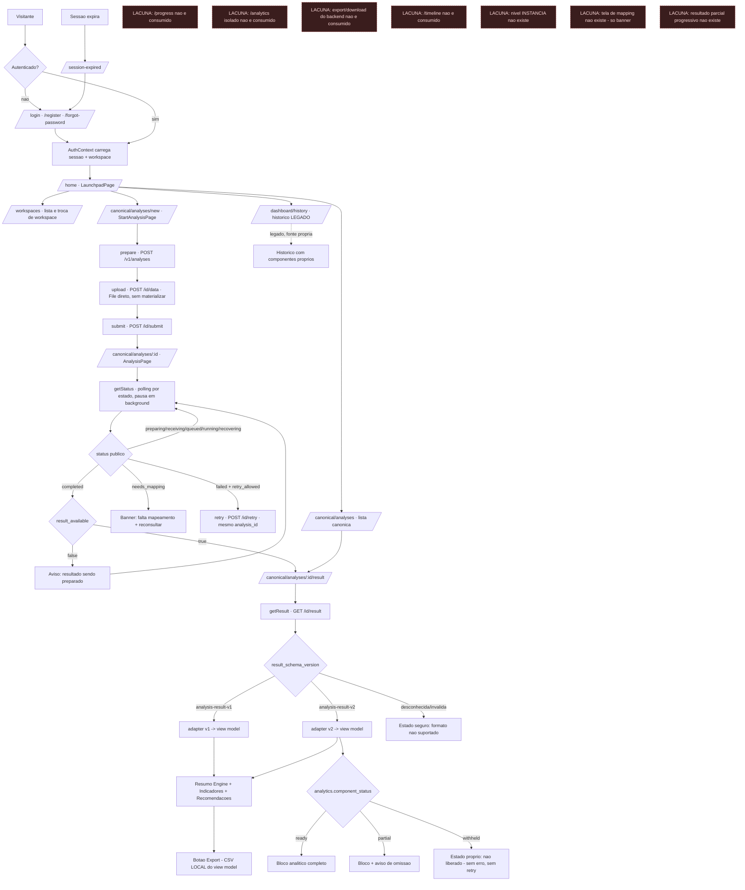
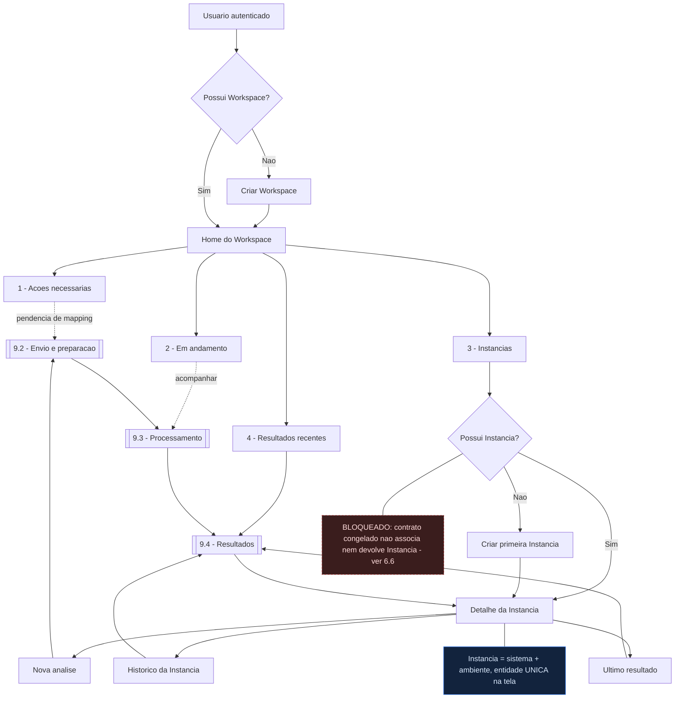
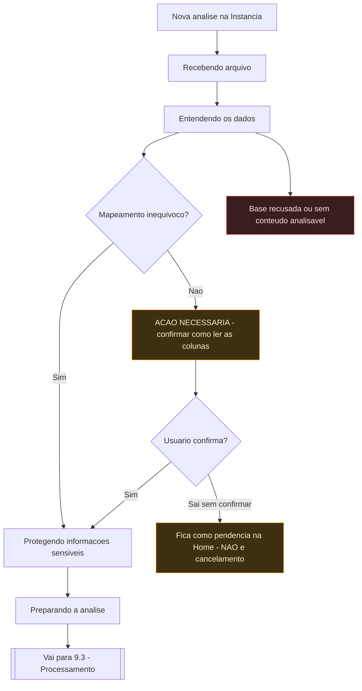
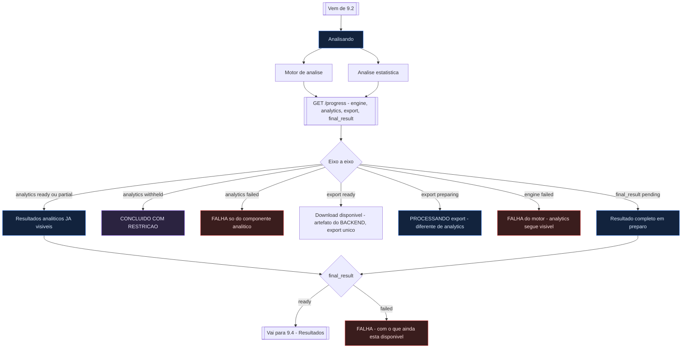
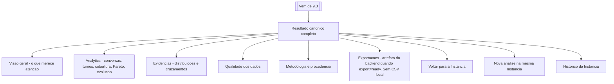

# DISCOVERY — Sentinela Front / Experiência Completa

> **Nada foi implementado.** Nenhuma dependência instalada, nenhum componente criado, nenhum
> contrato alterado, nenhuma mudança de backend. Backend **congelado**; Big Bang **bloqueado**.
>
> **Data:** 2026-08-08 · **Repo auditado:** `sentinela-front-e1` @ `a47d41a` (árvore limpa)
> **Backend de referência:** freeze global de 2026-08-08 (ver §1)

---

## 0. Decisões congeladas (V1) — não são perguntas abertas

| # | decisão | onde |
|---|---|---|
| **D1** | **Administrador único na experiência.** A infraestrutura suporta múltiplos usuários; a V1 não expõe colaboração. Todo usuário nasce com autonomia sobre o que criou | §6.1 |
| **D2** | **Nenhuma UI antecipando colaboração** — sem convite, equipe, Viewer/Analyst, papéis, permissões, aprovação, administração de membros | §6.1 |
| **D3** | **Não mostrar "Admin"** em badge, chip, seletor ou texto. Papel só informa quando existe outro papel possível | §6.2 |
| **D4** | **Workspace** = conta/espaço operacional (ex.: `Baluarte`) | §6.3 |
| **D5** | **Instância** = sistema **+** ambiente, **entidade única na tela** (ex.: `Chatbot de Cobrança — Produção`). Sem árvores de projeto/sistema/ambiente | §6.3 |
| **D6** | **Análise** = execução sobre uma base enviada **para uma Instância** | §6.3 |
| **D7** | **Hierarquia oficial:** `Workspace → Instâncias → Análises`, orientando navegação, breadcrumb, Home, histórico, deep link, nova análise e contexto do resultado | §6.3 |
| **D8** | **Momentos da jornada, não personas.** O produto reage ao estado, não a Viewer/Admin/Analista | §6.4 |
| **D9** | **Home do Workspace** = 1 Ações necessárias · 2 Em andamento · 3 Instâncias · 4 Resultados recentes. **Não** é dashboard de KPIs | §9.1 |
| **D10** | **Regra "não tocar no ARGOS" REVOGADA**, substituída por regra atemporal de escopo | §1 |
| **D11** | **A V1 terá Instância.** O nível entra como **novo delta explícito de backend**, posterior ao freeze atual. Não descongela nem reescreve as Ondas 1–8: é frente própria, com contrato, testes, provas e freeze próprios | §6.7 |
| **D12** | **Instância é gate de RELEASE/Big Bang da V1 — não é gate de desenvolvimento das Etapas 1–7.** Essas etapas avançam sem ela, mas **não podem cristalizar `Workspace → Análise` como arquitetura definitiva** | §6.7, §14 |
| **D13** | **Analytics aparece assim que `analytics = ready \| partial`**, mesmo com `final_result` pendente. Isso é **disponibilidade progressiva** — e **não** se chama "resultado parcial" só porque a Engine ainda roda. `analytics = partial` mantém significado próprio e **não** pode ser confundido com disponibilidade progressiva | §9.3, §9.5 |
| **D14** | **A V1 exibe as 4 contagens.** Nada de percentual de cobertura calculado no Front, e **nenhum delta de backend agora** só para criar o percentual. Se um dia existir, vem do backend como **métrica canônica** | §11 |
| **D15** | **Cancelamento fica FORA da V1.** Nenhum CTA ou promessa de cancelar onde o backend não suporta. O sistema representa honestamente que **uma análise iniciada não pode ser cancelada pelo usuário nesta versão**. Registrado como **dívida/capacidade futura**, não como bloqueio do Big Bang | §10, §13 |
| **D16** | **Uma única noção de exportação: o artefato do backend.** O CSV local **sai**. Com `export = ready`, download; nos demais estados, representar o estado vindo de `/progress` | §9.4, §13 |
| **D17** | **Decomposição de `LandingPage`/`AionPage` é MISSÃO PRÓPRIA**, escopada à parte. A dívida do bloqueio >1.000 linhas continua registrada, e **nenhuma responsabilidade nova entra nesses arquivos durante esta frente** | §7.1, §14 |
| **D18** | **Zod NÃO substitui validação canônica.** `validator.ts`, `validatorV2.ts`, `leitores.ts` e afins ficam como estão. Zod pode ser usado em **formulários de entrada da UI** (inclusive mapping). Trocar fronteira validada exigiria missão própria de **paridade formal** | §4, §14 |

> **Q1 e Q1' encerradas.** Instância existe (produto) e é tecnicamente **E** (prova em §6.6). A
> decisão sobre o caminho está em **D11/D12** — não é mais pergunta aberta.

> ⚠️ **Consequência de D5/D6/D7.** "V1 sem Instância" implicaria **reabrir o Experience Freeze**,
> porque a hierarquia já está congelada como decisão de produto. Não se faz isso.

---

## 1. Fontes lidas no Obsidian

Vault `C:\Users\DESKTOP\Documents\Obsidian\Sentinela OS`.

| # | arquivo | o que trouxe para esta frente |
|---|---|---|
| 1 | `INDEX.md` | entrada obrigatória; **"Código atual vence documento antigo quando houver divergência comprovada"**; ordem "contexto → regras → owner → contrato → truth-trace → plano → implementação" |
| 2 | `REGRA DE OURO ZERO.md` | honestidade como critério de aceite; **gate de tamanho de arquivo**; "o front também não [pontua] — se o backend não mandou o valor, a tela mostra indisponível, jamais recalcula" |
| 3 | `14 - Operação/Regras de Ouro - Sentinela.md` | Top 40 (itens 9, 10, 11, 18, 19, 23, 24) e §2 "Arquitetura modular e anti-monólito"; §4 checklist de Frontend |
| 4 | `04 - Decisões/DEC - Arquitetura modular anti-monólito e topologia multi-repo.md` | decisão formal aprovada; limites de 500/800/1.000 linhas; regra do escoteiro |
| 5 | `02 - Arquitetura/INDEX - Arquitetura Sentinela.md` | índice canônico; aviso de topo apontando para o freeze |
| 6 | `02 - Arquitetura/ARQ - Arquitetura Entregue - Ondas 1 a 8 (congelamento).md` | **autoridade vigente**: contratos, estados, privacy boundaries, e as 10 narrativas antigas revogadas |
| 7 | `14 - Operação/OPS - Freeze Global e Pacote pre-Big-Bang.md` | HEADs congelados, blocker do pacote, ordem de rollout (frontend antes do Orchestrator) |
| 8 | `02 - Arquitetura/Padrões Técnicos - Sentinela.md` | padrões de implementação |
| 9 | `01 - Produto/Visão Geral do Sentinela.md` | linguagem de produto |

**Resolução de divergência.** O `INDEX.md` declara o vault como fonte de verdade *e* que código
atual vence documento antigo comprovadamente divergente. O `INDEX - Arquitetura Sentinela`
recebeu, no congelamento, um aviso de topo dizendo que onde ele ou as notas de 2026-07 divergirem
da nota `ARQ - Arquitetura Entregue`, **aquela nota vale**. Esta Discovery segue essa cadeia.

> ✅ **Regra do ARGOS REVOGADA (2026-08-08).** `REGRA DE OURO ZERO.md` §6 dizia *"Não tocar no
> ARGOS (`sentinela-front`, `sentinela`)"*. Ela foi **substituída** — não reinterpretada por nota
> lateral — por uma regra atemporal:
>
> > **Escopo travado é o escopo explicitamente declarado pela frente ativa.** Repositórios ou
> > superfícies fora dele só podem ser alterados por **delta explícito**.
>
> Motivo: a redação antiga nomeava repositórios e envelheceu com a topologia. `sentinela` é
> **worktree do mesmo repositório** de `sentinela-facts` — o Gateway/Engine que as Ondas 1–8
> entregaram — e `sentinela-front-e1` tem nome vizinho a `sentinela-front`. A regra antiga fica no
> vault marcada como revogada, para rastreabilidade.

---

## 2. Regra de ouro contra monólitos — com origem

Não parafraseada. Transcrita:

**`REGRA DE OURO ZERO.md` → §2 "Disciplina de engenharia (não negociável)" → linha "Gate de
tamanho":**

> **Gate de tamanho** | Arquivo de produção >500 linhas aciona revisão, >1000 **bloqueia**.

**`14 - Operação/Regras de Ouro - Sentinela.md` → "Top 40", itens 9–11:**

> 9. **Modular monolith é permitido; big ball of mud é proibido.**
> 10. **Arquivo de produção >1.000 linhas é bloqueio**, salvo exceção justificada, testada e registrada.
> 11. **Ao tocar um monólito, organize o caminho tocado.** Não se adiciona mais uma camada de entulho.

**Mesmo arquivo → §2 "Arquitetura modular e anti-monólito" → "Proibido":**

> - arquivo >1.000 linhas sem exceção;
> - route/controller que autentica, calcula, persiste e formata tudo;
> - `utils.py`/`helpers.ts` como depósito de regra;
> - import circular;
> - código morto preservado "por segurança" sem teste;
> - nova feature anexada a arquivo já monolítico;
> - shared package chamado `common` com lógica de todos os produtos.

**`04 - Decisões/DEC - Arquitetura modular anti-monólito…` → §2 "Big ball of mud é proibido":**

> Arquivo de produção acima de 1.000 linhas bloqueia fechamento, salvo exceção explicitamente
> justificada e registrada. Arquivos acima de 500/800 linhas acionam revisão/plano.
> Ao tocar um arquivo monolítico, o slice alterado deve ser extraído/organizado; não se adiciona
> nova responsabilidade ao monólito.

**Regras vizinhas que governam esta frente** (mesma fonte, Top 40):

> 18. **Front não decide regra de negócio.**
> 19. **Front não acessa banco diretamente na arquitetura-alvo.**
> 23. **Falha parcial nunca é silenciosa.**
> 24. **Ausência de dado não é zero.**

E de `REGRA DE OURO ZERO.md` §1:

> **Medição tem fonte única.** LLM nunca pontua. E o **front também não** — se o backend não
> mandou o valor, a tela mostra indisponível, jamais recalcula.

### Implicação prática

1. O limite **existe e é numérico** (500 revisão / 800 plano / 1.000 bloqueio). Não preciso
   inventar um.
2. O critério **não é só tamanho**: a lista de "Proibido" fala de *responsabilidade* (autenticar +
   calcular + persistir + formatar no mesmo lugar) e de *depósito* (`helpers` genérico).
3. "Nova feature anexada a arquivo já monolítico" é proibição direta: **a experiência nova não
   pode nascer dentro de `LandingPage.tsx` nem de `AionPage.tsx`**.
4. Regra do escoteiro: ao tocar um monólito, extrair o slice tocado — não deixar para depois.

---

## 3. Arquitetura real do Front

### 3.1 Camadas que existem hoje (eixo canônico)

```
lib/v1/                 transporte — cliente HTTP tipado do contrato público
   ↓
features/canonical-analysis/data/     queries TanStack + view models de estado/lista/erro
   ↓
features/canonical-analysis/result/   validator → adapter (v1 | v2) → view model
   ↓  (fronteira única de versão: result/adaptar.ts)
features/canonical-analysis/ui/       páginas + áreas analíticas
   ↓
components/ui/ + shared/states/       Design System
```

**A camada-alvo do enunciado já existe no eixo canônico.** O que não existe é ela cobrindo o
resto do produto.

### 3.2 Distribuição real do código

| área | arquivos `.ts/.tsx` | observação |
|---|---|---|
| `features/` | 92 | dominante; canonical-analysis é a maior |
| `lib/` | 25 | `lib/v1` é o cliente canônico; `lib/auth` mistura provedores |
| `test/` | 34 | fixtures + MSW + gates de arquitetura |
| `components/` | 12 | 10 são `ui/` (DS), 2 são `auth/` e `brand/` |
| `shell/` | 6 | AppShell, Sidebar, TopBar, PageFrame |
| `shared/` | 6 | 4 estados + PageHeader + ConfirmDialog |
| `app/` | 4 | router, providers, App, FundacaoV1 |
| `contexts/` | 3 | Auth, Language |
| `hooks/` | 2 | use-toast, outro |

Total de produção: **15.733 linhas** em **121 arquivos** (excluindo testes e e2e).

### 3.3 Transporte e estado

- **Um cliente canônico** (`lib/v1/client.ts`, 215 linhas) com 8 métodos.
- **TanStack Query só em 3 arquivos**: `data/analysis.ts`, `data/list.ts`, `ui/AnalysisPage.tsx`.
  Todo o resto do produto (auth, perfil, settings, histórico) **não usa Query**.
- **`fetch` cru em produção: 1 ocorrência** — `AionPage.tsx:934`, para um formulário externo
  (`api.web3forms.com`). O eixo canônico não tem fetch cru.
- **Supabase ainda importado** em `ProfilePage`, `SettingsPage` e nas páginas de auth
  (`supabase.auth.updateUser`). O eixo canônico não o toca.
- **Estado global**: `AuthContext` (275 linhas) e `LanguageContext`. Não há store global de
  domínio — o servidor é a fonte, o que está correto.
- **Polling**: existe e é *state-aware* (`proximoPolling` decide por status e
  `result_available`), com `refetchIntervalInBackground: false`. Bom padrão, aplicado a **uma**
  query.

---

## 4. Stack real × stack desejado

| item | classificação | evidência |
|---|---|---|
| React 18 + Vite 5 + TypeScript 5.8 | **já existe e é usado** | `package.json`; 6 projetos de typecheck |
| React Router 6.30 | **já existe e é usado** | `app/router.tsx`, 32 rotas |
| TanStack Query 5.83 | **existe mas subutilizado** | 3 arquivos; resto do produto sem cache de servidor |
| Tailwind 3.4 | **já existe e é usado** | `tailwind.config.ts` com tokens semânticos |
| Radix (10 pacotes) | **já existe e é usado** | base do `components/ui` |
| shadcn/ui | **existe com padrão inconsistente** | `components.json` presente, componentes **vendorizados** (não é dependência). Só 10 dos ~50 do catálogo |
| Motion / framer-motion | **não existe** | animação hoje é `animate-*`/`transition-*` do Tailwind |
| React Hook Form | **não existe** | formulários são `useState` + `onSubmit` manuais (auth, settings, profile) |
| Zod | **não existe** | validação de contrato é feita por validadores manuais escritos à mão (`validator.ts`, `validatorV2.ts`, `leitores.ts`) |
| TanStack Virtual | **não existe** | nenhuma lista virtualizada |
| Recharts | **não existe** | **zero biblioteca de gráfico** no repo |

### Notas que mudam a leitura

- **Zod não é simplesmente "faltando".** Os validadores manuais foram escritos com semântica que
  um schema genérico não expressa de graça: coerência estado×valor, `null` ≠ zero, recusa por
  folha ilegível derrubando o bloco, taxonomia de razões. Trocar por Zod é **decisão**, não
  upgrade óbvio — e teria que preservar essas recusas.
- **Recharts** entra como delta novo. Regra a carregar junto: *gráfico recebe apenas view model
  agregado, nunca dataset cru, nunca recalcula Analytics.* Hoje as barras (distribuições, Pareto,
  séries) são marcação + tokens, e a largura sai **pronta do adapter** como valor CSS —
  precisamente para não haver aritmética no componente.
- **React Hook Form + Zod** teriam impacto real onde há formulário de verdade: auth, settings,
  profile e o passo de mapping (que ainda não existe como tela).

---

## 5. Inventário de rotas / telas / features

### 5.1 Rotas (32, todas com `lazy()` + `Suspense`)

| rota | tela | estado |
|---|---|---|
| `/` | LandingPage | **legado/monólito** (1.215 linhas) |
| `/aion` | AionPage | **legado/monólito** (1.180 linhas) |
| `/privacy` `/terms` `/security` | páginas legais | existe |
| `/login` `/register` `/forgot-password` `/session-expired` | auth | existe, fora do DS canônico |
| `/auth/callback` `/auth/reset-password` | auth | existe |
| `/home` `/home/welcome` | LaunchpadPage | existe |
| `/profile` `/dashboard/settings` | perfil/config | existe, **usa Supabase direto** |
| `/workspaces` | WorkspacesPage | existe |
| `/dashboard/history` | HistoryPage | existe (303 linhas) |
| `/dashboard/history/:id` | redirect legado | compat |
| **`/canonical/analyses`** | AnalysesListPage | **eixo vivo** |
| **`/canonical/analyses/new`** | StartAnalysisPage | **eixo vivo** |
| **`/canonical/analyses/:id`** | AnalysisPage (jornada) | **eixo vivo** |
| **`/canonical/analyses/:id/result`** | ResultPage (v1+v2) | **eixo vivo** |
| `/dashboard` | DashboardCompatRoute | compat |
| `/dashboard/analysis|diagnostics|guardrails|optimization` | `Navigate` | **redirects** (painéis legados removidos) |
| `/manage-context` `/dashboard/workspaces` `/dashboard/manage-context` | `Navigate` | compat |
| `/error` `*` | erro / 404 | existe |

### 5.2 Capacidades × existência real

| capacidade | existe? | onde / observação |
|---|---|---|
| routes / layouts | **existe** | `app/router.tsx` + `shell/` (AppShell, PageFrame, Sidebar, TopBar) |
| Design System | **parcial** | 10 componentes `ui/` + 4 estados + tokens; sem table/tabs/breadcrumb/chart |
| tokens | **existe** | `styles/tokens.css` + `tailwind.config.ts` (cores semânticas, radius, screens, fontFamily) |
| API client | **existe** | `lib/v1/client.ts` — 8 métodos |
| TanStack Query | **parcial** | 3 arquivos |
| adapters de contrato | **existe** | v1 e v2 distintos, fronteira única em `adaptar.ts` |
| view models | **existe** | `ResultViewModel`, `ResultV2ViewModel`, `IndicatorView`, `listView`, `stateView`, `errorView` |
| forms | **legado** | `useState` manual; sem RHF/Zod |
| validation (contrato) | **existe** | validadores manuais com recusas tipadas |
| loading / error / empty / skeleton | **existe** | `shared/states/` (4) — porém com hex hardcoded |
| auth / sessão | **existe** | `AuthContext`, rota `/session-expired`, bypass E2E isolado do bundle de produção |
| workspace context | **existe** | `useCanonicalScope()` → `{ workspaceId }` |
| **instância** | **inexistente** | ver §6 |
| deep links | **existe** | `/canonical/analyses/:id` e `/…/result` funcionam por URL; provado em E2E |
| result v1 | **existe** | adapter + tela |
| result v2 | **existe** | adapter + bloco analítico completo |
| analytics (rota dedicada) | **inexistente no front** | backend expõe `GET /{id}/analytics` |
| progress | **inexistente no front** | backend expõe `GET /{id}/progress` |
| export / download | **inexistente no front** | backend expõe `GET /{id}/analytics/export/download`. O botão "Export" atual gera **CSV local** do view model — não é o export do backend |
| timeline | **inexistente no front** | backend expõe `GET /{id}/timeline` |
| histórico | **existe** | `/canonical/analyses` (canônico) **e** `/dashboard/history` (legado) — **duplicado** |

### 5.3 O achado maior: quatro capacidades públicas não consumidas

O Gateway congelado expõe **11 rotas públicas**. O cliente do front implementa **8**. Ficam de
fora, com contrato pronto e sem consumidor:

```
GET /v1/analyses/{id}/progress                    disponibilidade por componente
GET /v1/analyses/{id}/analytics                   projeção analítica isolada
GET /v1/analyses/{id}/analytics/export/download   download do export
GET /v1/analyses/{id}/timeline                    linha do tempo por eventos
```

E o vocabulário de `/progress` já é exatamente o que a experiência-alvo pede
(`infra/progresso.py`):

| eixo | estados |
|---|---|
| `engine` | `pending` · `running` · `ready` · `failed` |
| `analytics` | `pending` · `running` · `ready` · `partial` · `withheld` · `failed` · `unknown` |
| `export` | `unavailable` · `preparing` · `ready` · `expired` · `failed` · `unknown` |
| `final_result` | `pending` · `ready` · `failed` |

> Isto **não é** delta de backend. É delta tipo **D**: o contrato já suporta, o front ainda não usa.

---

## 6. Modelo mental do produto — DECISÕES CONGELADAS DA V1

> Esta seção deixou de ser pergunta aberta. São **decisões de produto da V1**, congeladas.

### 6.1 Modelo de usuário

O modelo **não** é "workspace individual porque nunca haverá equipe". É:

> **A infraestrutura já suporta múltiplos usuários, mas a experiência inicial é de administrador
> único.** Todo usuário cadastrado nasce com autonomia sobre o que criou.

```
Usuário autenticado → administra o que criou → cria seu Workspace
  → cria e controla suas Instâncias → envia bases → acompanha análises
  → vê resultados → exporta resultados
```

**Não existem na interface da V1:** convite de membros, gestão de equipe, Viewer, Analyst, papéis
configuráveis, gestão de permissões, aprovação de acesso, administração de membros.

A fundação de identidade/autorização **permite** essa evolução — as claims já carregam `role` por
workspace —, mas a complexidade fica **dormente**. Não se antecipa UI de colaboração.

### 6.2 Não mostrar "Admin"

Nenhum badge, chip, seletor ou texto dizendo **Admin** enquanto todos os usuários da V1 tiverem o
mesmo modelo de autonomia. *Um papel só tem valor informativo quando existe outro papel possível.*
Internamente o modelo é "administrador/owner do que criou"; isso **não vira decoração de
interface**.

> ⚠️ **Achado que isto torna acionável:** `GET /v1/me` já devolve `role` por workspace
> (`me_workspace_fields = ['id','name','role']`) e `/workspaces` também. O dado existe — a decisão
> é **não exibi-lo**.

### 6.3 Nomenclatura congelada

| conceito | definição | exemplo |
|---|---|---|
| **Workspace** | a conta / espaço operacional do usuário dentro do Sentinela | `Baluarte` |
| **Instância** | o sistema específico **+** o ambiente que o usuário acompanha | `Chatbot de Cobrança — Produção` |
| **Análise** | uma execução sobre uma base enviada **para uma Instância** | — |

A Instância pode ter internamente `nome` + `ambiente`, mas **na experiência aparece como entidade
única**: `Chatbot de Cobrança — Produção`. **Não** se criam árvores separadas de *projeto* /
*sistema* / *ambiente* só porque o modelo técnico tem campos distintos.

**Hierarquia oficial de produto:**

```
Workspace
└── Instâncias
    └── Análises
```

Ela orienta: navegação, breadcrumbs, Home, histórico, deep links, nova análise, contexto do
resultado e o retorno após processamento.

### 6.4 Momentos da jornada — não personas por papel

A V1 **não** classifica usuários em Viewer/Admin/Analista. O produto reage ao **estado da
jornada**:

| momento | o produto faz |
|---|---|
| novo, sem Workspace | leva a criar o Workspace |
| Workspace vazio | leva a criar a primeira Instância |
| recorrente | mostra Instâncias, pendências e últimas análises |
| processamento em andamento | acompanha Engine e Analytics |
| ação necessária | resolve mapping ou outra pendência autorizada |
| com resultados | visualiza e exporta |

### 6.5 Futuro (não implementar agora)

Quando colaboração for liberada: o criador do Workspace continua Owner/Admin; convidados recebem
papéis e escopos. Essa possibilidade **não** pode contaminar navegação, formulários, settings,
Home, criação de Workspace ou criação de Instância da V1.

---

### 6.6 Q1 — PROVA TÉCNICA contra o Gateway congelado

A pergunta de produto está encerrada (Instância existe). Restava a técnica: *os contratos públicos
congelados permitem implementar Workspace → Instância → Análise com `project_id` +
`environment_id`?*

**Não bastava os dois campos existirem.** As seis perguntas, respondidas por leitura do código
congelado:

| # | pergunta | resposta | evidência |
|---|---|---|---|
| 1 | como **listar** Instâncias? | ⚠️ possível, **fora do contrato congelado** | `GET /workspaces/{id}/projects` e `GET /projects/{id}/environments` existem em `api/routes/context.py`, servidas por `PgContextStore`. **Mas** o snapshot `public-v1` congela **11 operações, todas sob `/v1/analyses`** — estas não estão nele |
| 2 | como obter o **nome exibível**? | ⚠️ idem | `list_workspace_projects` devolve `name`; mesma ressalva de contrato |
| 3 | como obter o **ambiente**? | ⚠️ idem | `list_project_environments`; mesma ressalva |
| 4 | como **criar/selecionar** uma? | ⚠️ idem | `POST /workspaces/{id}/projects`, `POST /projects/{id}/environments`; mesma ressalva |
| 5 | como **associar** nova análise? | 🔴 **NÃO É POSSÍVEL** | o Gateway **descarta** os campos: `del project_id, environment_id` em `_tenant_autorizado` |
| 6 | como **recuperar** no histórico / deep link? | 🔴 **NÃO É POSSÍVEL** | nenhum read-model congelado devolve os campos, e a listagem não filtra por eles |

**A frase é do próprio Gateway** (`api/routes/analyses_v1.py`, docstring de `_tenant_autorizado`):

> `project_id` e `environment_id` continuam **aceitos** pelo contrato público, mas **não
> participam da decisão**: eram o eixo do histórico legado, que o modelo canônico não tem.

E os read-models congelados, verbatim do snapshot:

```
status_read_model_fields = [analysis_id, status, record_count, result_available,
                            retry_allowed, created_at, updated_at]
list_item_fields         = [analysis_id, status, record_count, result_available,
                            created_at, observed_conversations]
result_read_model_fields = [analysis_id, result_schema_version,
                            indicator_registry_version, result]
timeline_event_fields    = [event_id, event_type, event_schema_version, analysis_id,
                            workspace_id, sequence, occurred_at, data]
```

Nenhum deles carrega `project_id` nem `environment_id`. A API do Orchestrator **nem chega a
receber** os campos — o Gateway os apaga antes.

### 🔴 Veredito: **Q1 técnico = E — PRODUCT/BACKEND DELTA CANDIDATE**

O contrato público congelado **aceita** os identificadores e **não os usa**: uma análise não pode
ser associada a uma Instância, e a associação não pode ser recuperada depois. Sem isso, a
hierarquia `Workspace → Instância → Análise` não é implementável só no Front.

**Paro nesta decisão**, como instruído. E registro o que **não** foi feito, porque as três
tentações estavam à mão:

- ❌ **não** inventei catálogo de Instâncias no browser;
- ❌ **não** guardei pseudo-Instância local (o cadeado de privacidade proíbe, e seria mentira);
- ❌ **não** derivei nome de Instância a partir de ID.

**Delta mínimo que o backend precisaria:** a análise precisa **nascer com** e **devolver** a
Instância — o campo entrando no `create/submit` e saindo em `status`, `list` e `timeline`; e a
listagem precisando filtrar por ele. Se as rotas de contexto forem promovidas ao contrato público,
elas resolvem 1–4; **5 e 6 são o bloqueio real**.

---

### 6.7 Decisão sobre o caminho (D11/D12) — **Q1' encerrada**

**A V1 terá Instância.** O nível entra como **novo delta explícito de backend**, posterior ao
freeze atual.

- **Não descongela nem reescreve as Ondas 1–8.** É frente própria, com **contrato, testes, provas
  e freeze próprios**.
- **Não implementar agora.** O backend permanece congelado até autorização explícita da frente de
  Instância. O Big Bang permanece bloqueado.
- **"V1 sem Instância" não é alternativa**: D5/D6/D7 já congelaram a hierarquia como decisão de
  produto, e abandoná-la implicaria **reabrir o Experience Freeze**.

#### Instância é gate de RELEASE, não gate de desenvolvimento

| | |
|---|---|
| **gate de release / Big Bang da V1** | ✅ sim — a V1 não sai sem Instância |
| **gate de desenvolvimento das Etapas 1–7** | ❌ não — elas avançam sem ela |

A distinção tem uma consequência de projeto, e é ela que evita retrabalho: as Etapas 1–7 são
**neutras à Instância**. Elas não dependem dela para funcionar, **e não podem cristalizar
`Workspace → Análise` como arquitetura definitiva** — nem em rota, nem em breadcrumb, nem em
assinatura de view model, nem em chave de cache. O que não se sabe ainda fica **aberto**, não
fechado no formato de dois níveis.

#### Critério mínimo do futuro delta — prova de ponta a ponta

O delta de Instância só fecha provando, ponta a ponta:

1. **catálogo/criação** da Instância **por contrato público** (hoje as rotas de contexto estão
   fora do `public-v1` congelado);
2. **associação** da análise à Instância no momento de criar/submeter;
3. **persistência** da associação atravessando **Gateway → Orchestrator** (hoje o Gateway a
   descarta e o Orchestrator nem a recebe);
4. **recuperação** em `status`, `list` e timeline/read-model equivalente;
5. **filtro** de análises por Instância;
6. **reconstrução** de `Workspace → Instância → Análise` em **histórico e deep link**;
7. **sobrevivência a reload** — sem estado local inventado, sem catálogo no browser, sem nome
   derivado de ID.

> Os itens 3, 4, 5 e 6 são exatamente o que a prova de §6.6 mostrou **não existir** hoje. O item 7
> é o que impede a saída fácil: qualquer solução que só funcione enquanto a aba estiver aberta não
> conta como resolvida.

## 7. Riscos de monólito (medidos, não estimados)

### 7.1 Bloqueios pela regra de tamanho

| arquivo | linhas | veredito |
|---|---|---|
| `features/landing/LandingPage.tsx` | **1.215** | 🔴 **BLOQUEIO** (>1.000) |
| `features/aion/AionPage.tsx` | **1.180** | 🔴 **BLOQUEIO** (>1.000) |
| `features/canonical-analysis/result/adapterV2.ts` | 570 | 🟡 aciona revisão (>500) |
| `features/canonical-analysis/result/analyticsProjection.ts` | 444 | ok |
| `features/auth/LoginPage.tsx` | 342 | ok |
| `app/router.tsx` | 304 | ok |
| `features/history/HistoryPage.tsx` | 303 | ok |

Os dois bloqueios são **legado, anteriores a esta frente** — mas a regra 11 vale: a experiência
nova **não pode** ser anexada a eles.

`adapterV2.ts` (570) é meu, da MF6.4b, e está acima do gatilho de revisão. Ele é coeso (um
contrato → um view model), mas a divisão natural existe: apresentação por bloco analítico
(medidas, distribuições, concentração, série) poderia sair para arquivos próprios mantendo o
adapter como composição.

### 7.2 Responsabilidade e acoplamento

| risco | onde | gravidade |
|---|---|---|
| fetch + parsing + regra + render no mesmo arquivo | `AionPage.tsx` (fetch cru para terceiro + página inteira) | alta (legado) |
| página como aplicação inteira | `LandingPage.tsx`, `AionPage.tsx` | alta (legado) |
| `if` de versão espalhado | **não ocorre** — confinado a `result/adaptar.ts`, com gate (`fonte-unica-do-resultado`) | ok |
| cálculo analítico no componente | **não ocorre** no eixo canônico — gate `backend-first-result` proíbe `*100`, `Math.*`, `reduce` em `ui/` | ok |
| componentes duplicados | histórico em **duas** telas (`/canonical/analyses` e `/dashboard/history`); `RunRow`/`RunComparePanel` no eixo legado | média |
| Design System contornado | 50 hex em `LoginPage`, 39 em `AionPage`, 32 em `LandingPage`, 26 em `ProfilePage`, 23 em `SettingsPage` | média |
| CSS ad-hoc | `bg-[#070C18]` em `app/router.tsx:113` (loader de tela cheia) | baixa |
| `components/` como depósito | **não ocorre** — `components/` tem 12 arquivos, 10 deles DS | ok |
| feature sem ownership | `features/dashboard` é só rota de compat; `features/errors`/`legal` são páginas simples | baixa |

> ⚠️ **Armadilha de medição registrada.** Uma varredura ingênua por `#RRGGBB` acusa
> `ui/analytics/Retido.tsx` — mas ali o hex está **dentro de um comentário**, explicando por que
> `shared/states` é legado. O eixo canônico segue com **zero hex em código**. Medir prosa como se
> fosse programa erra nas duas direções.

### 7.3 O que já protege (não regredir)

Três gates arquiteturais em `src/test/v1/` sustentam a camada:

- `backend-first-result` — nenhum componente faz aritmética analítica; só validador/adapter/schema conhecem o payload;
- `fonte-unica-do-resultado` — quem lê o contrato é uma lista fechada de 4 arquivos;
- `privacidadeNoNavegador` — sem `localStorage`/IndexedDB/Cache/cookie; sem leitura do arquivo do usuário (uma exceção nomeada, com duas provas).

---

## 8. Fluxo AS-IS (comportamento real de hoje)



---

## 9. Fluxo TO-BE (experiência-alvo, para revisão)

Linguagem de produto na superfície; vocabulário interno só na documentação técnica.
**Mermaid mestre + subfluxos por domínio** — um diagrama único ficaria ilegível.

### 9.1 Mestre — entrada, Workspace, Instância, Análise



**Racional da Home** — e ela não é dashboard decorativo de KPIs:

```
Precisa de mim?  →  O que esta acontecendo?  →  Quais sistemas acompanho?  →  O que aconteceu?
   Acoes             Em andamento                 Instancias                  Resultados recentes
```

### 9.2 Subfluxo — envio e preparação



### 9.3 Subfluxo — processamento e disponibilidade progressiva

Fonte: `GET /v1/analyses/{id}/progress`, com os quatro eixos independentes.



### 9.4 Subfluxo — resultados



### 9.5 Os quatro estados que não podem se confundir

| estado | significa | exemplo que NÃO é |
|---|---|---|
| **PROCESSANDO** | trabalho ainda acontecendo | ≠ `export preparing` confundido com analytics rodando |
| **DISPONÍVEL PROGRESSIVAMENTE** | um componente terminou e já pode ser visto, **enquanto outro ainda roda** | ⚠️ **NÃO é "resultado parcial"**, e **não é** `analytics = partial` — ver o quadro abaixo (D13) |
| **AÇÃO NECESSÁRIA** | o sistema espera decisão do usuário | mapping pendente |
| **CONCLUÍDO COM RESTRIÇÃO** | terminou, e parte não pode ser exibida | `withheld` ≠ `failed`; `partial` ≠ `withheld` |
| **FALHA** | componente não conseguiu concluir | "resultado parcial porque a Engine ainda roda" ≠ `analytics partial` |

#### As duas coisas que a palavra "parcial" já confundiu (D13)

| o que é | o que significa | como a tela diz |
|---|---|---|
| **disponibilidade progressiva** | `analytics` terminou (`ready` **ou** `partial`) e `final_result` ainda está pendente | *"Os resultados analíticos já estão disponíveis. O motor de análise ainda está processando."* |
| **`analytics = partial`** | o componente analítico **concluiu** e **omitiu blocos** por privacidade | *"Parte dos resultados foi omitida para evitar revelar grupos pequenos."* |

As duas podem ocorrer **ao mesmo tempo** — `analytics = partial` com `final_result = pending` — e
nesse caso a tela precisa dizer **as duas coisas**, não escolher uma. Colapsá-las numa palavra só
("parcial") é o erro que D13 proíbe: a primeira é sobre **tempo**, a segunda sobre **conteúdo**.

### 9.6 Linguagem de produto ↔ vocabulário interno

| tela diz | internamente é |
|---|---|
| Recebendo arquivo | upload → `POST /{id}/data` |
| Entendendo os dados | mapping / `dataset-mapping-v1` |
| Protegendo informações sensíveis | Privacy Gate / sanitização do Ingestion |
| Preparando a análise | Input Artifact promovido + comanda analítica |
| Analisando | Engine + Analytics em paralelo |
| Resultados disponíveis | `/progress` por componente |
| Não foi possível liberar parte dos resultados | `analytics.component_status = withheld` |

O usuário nunca vê: *Privacy Gate, Input Artifact, Orchestrator, measure_schema, Analytics Worker,
fencing, lease*.

## 10. Matriz de cenários e transições

Fonte backend: `S` = `GET /{id}` (status) · `P` = `GET /{id}/progress` · `R` = `GET /{id}/result`
· `L` = `GET /v1/analyses` · `A` = `GET /{id}/analytics` · `E` = export · `T` = timeline.

| ID | cenário | estado atual | evento | próximo estado | usuário vê | CTA principal | CTA secundário | auto? | refresh | deep-link | fonte | no Front? | lacuna |
|---|---|---|---|---|---|---|---|---|---|---|---|---|---|
| **E1** | usuário sem workspace | autenticado | carregar contexto | sem escopo | "workspace ausente" | criar workspace | — | não | mantém | n/a | AuthContext | **parcial** | estado vazio é texto, não tela |
| E2 | 1 workspace | autenticado | carregar | escopo ativo | conteúdo do workspace | nova análise | histórico | sim | mantém | sim | AuthContext | existe | — |
| E3 | vários workspaces | autenticado | trocar | escopo novo | lista recarrega | selecionar | — | sim | mantém | sim | `/workspaces` | existe | troca não preserva a rota atual |
| E4 | primeiro acesso | autenticado | sem análises | vazio | onboarding | criar 1ª análise | — | não | mantém | n/a | `L` | **parcial** | vazio genérico |
| E5 | deep link autorizado | qualquer | abrir URL | rota alvo | tela pedida | — | — | sim | mantém | sim | `S`/`R` | existe | — |
| E6 | deep link sem acesso | qualquer | abrir URL | negado | erro público, sem revelar existência | voltar | — | não | mantém | sim | Gateway | existe | — |
| E7 | análise inexistente | qualquer | abrir URL | 404 público | não encontrado | voltar ao histórico | — | não | mantém | sim | `S` | existe | — |
| **W0** | sem Workspace (momento da jornada) | autenticado | criar | Workspace ativo | leva a criar o Workspace | criar Workspace | — | não | mantém | n/a | `/workspaces` | **parcial** | existe rota, não é o momento guiado |
| W1 | Workspace vazio | escopo ativo | listar | vazio | leva a criar a **primeira Instância** | criar Instância | — | não | mantém | sim | `L` | **parcial** | hoje leva a "nova análise", sem Instância |
| W1b | **Home do Workspace** | recorrente | abrir | Home | 1 Ações · 2 Em andamento · 3 Instâncias · 4 Recentes | resolver pendência | nova análise | sim | mantém | sim | `L` + `P` | **inexistente** | Home hoje é Launchpad sem essas 4 faixas |
| W2 | primeira Instância | — | — | — | — | — | — | — | — | — | — | **inexistente** | 🔴 **E** → frente própria (§6.7); gate de release |
| W3 | Instância sem análises | — | — | — | — | — | — | — | — | — | — | **inexistente** | 🔴 **E** → frente própria (§6.7) |
| W4 | Instância com histórico | — | — | — | — | — | — | — | — | — | — | **inexistente** | 🔴 **E** → critério 5 do delta (§6.7): filtro por Instância |
| W5 | nova análise **na Instância** | — | — | — | — | — | — | — | — | — | — | **inexistente** | 🔴 **E** → critérios 2 e 3 do delta (§6.7): associar e persistir |
| W6 | contexto do resultado / breadcrumb | resultado aberto | — | — | Workspace › Instância › Análise | — | — | — | — | sim | — | **inexistente** | 🔴 **E** → critérios 4, 6 e 7 do delta (§6.7): recuperar, reconstruir, sobreviver ao reload |
| W7 | papel do usuário na interface | qualquer | — | — | **nada** — sem badge "Admin" | — | — | — | — | — | `/v1/me` traz `role` | **decisão** | dado existe; **decidido não exibir** (§6.2) |
| **U1** | arquivo válido | `prepared` | upload | `receiving`→`queued` | progresso do envio | — | **—** (sem cancelar, D15) | sim | retoma | sim | `S` | existe | CTA de cancelar retirado |
| U2 | arquivo inválido | `prepared` | upload rejeitado | `prepared` | motivo público do erro | escolher outro | — | não | mantém | sim | problem+json | existe | — |
| U3 | upload em andamento | `receiving` | — | — | indicador de envio | — | **—** | sim | retoma | sim | `S` | **parcial** | **D15**: sem cancelar. *Interromper o envio* seria abortar a requisição no cliente — coisa diferente, e deixaria a análise `prepared` abandonada. Ver contradição C1 (§16) |
| U4 | queda de rede | `receiving` | erro | `prepared` | falha explícita | tentar de novo | — | não | retoma | sim | cliente | existe | sem retomada de bytes |
| U5 | refresh no meio | qualquer | F5 | mesmo | retoma pelo id | — | — | sim | **sim** | sim | `S` | existe | provado em E2E |
| U6 | tamanho/formato rejeitado | `prepared` | validação | `prepared` | limite declarado | corrigir | — | não | mantém | sim | problem+json | **parcial** | limite não é declarado antes |
| **M1** | mapeamento inequívoco | `queued` | auto | `running` | "entendendo os dados" | — | — | sim | retoma | sim | `S` | existe | linguagem ainda técnica |
| M2 | ambíguo | `needs_mapping` | — | espera decisão | **AÇÃO NECESSÁRIA** | confirmar leitura | **sair (fica pendente)** | não | mantém | sim | `S` | **banner apenas** | tela de mapping não existe; sair ≠ cancelar (D15) |
| M3 | usuário confirma | `needs_mapping` | confirmar | `queued` | volta a processar | — | — | sim | retoma | sim | — | **inexistente** | idem |
| M4 | usuário abandona | `needs_mapping` | sair | `needs_mapping` | pendência no histórico | retomar | — | não | mantém | sim | `L` | **parcial** | lista não destaca pendência |
| M5 | base recusada | qualquer | rejeição | `failed` | motivo público | nova análise | — | não | mantém | sim | `S` | existe | — |
| M6 | base sem conteúdo analisável | qualquer | rejeição | `failed` | motivo público | nova análise | — | não | mantém | sim | `S` | existe | — |
| **P1** | Engine + Analytics rodando | `running` | — | — | **PROCESSANDO** por componente | — | **—** (sem cancelar, D15) | sim | retoma | sim | **`P`** | **inexistente** | hoje é um estado só |
| P2 | Analytics termina primeiro | `running` | `analytics = ready\|partial` | **disponibilidade progressiva** | analytics já visível, com aviso de que a Engine ainda roda | ver analytics | aguardar | sim | retoma | sim | **`P`+`A`** | **inexistente** | **maior lacuna de UX**. ⚠️ **não** chamar de "resultado parcial" (D13) |
| P3 | Engine termina primeiro | `running` | `engine = ready` | **disponibilidade progressiva** | indicadores já visíveis, analytics ainda processando | — | — | sim | retoma | sim | **`P`** | **inexistente** | idem — e também **não** é "resultado parcial" (D13) |
| P4 | recovery da Engine | `recovering` | auto | `running` | "retomando" | — | — | sim | retoma | sim | `S` | existe | — |
| P5 | recovery do Analytics | `running` | auto | `running` | sem ruído | — | — | sim | retoma | sim | **`P`** | **inexistente** | invisível hoje |
| **A1** | analytics `ready` | v2 | — | — | bloco completo | explorar | exportar | sim | mantém | sim | `R` | **existe** | — |
| A2 | analytics `partial` | v2 | — | — | **CONCLUÍDO COM RESTRIÇÃO** | explorar | — | sim | mantém | sim | `R` | **existe** | — |
| A3 | analytics `withheld` | v2 | — | — | não liberado, sem erro | ver indicadores | — | sim | mantém | sim | `R` | **existe** | — |
| A4 | analytics `failed` | — | — | — | **FALHA** só do componente | ver o resto | tentar de novo | sim | mantém | sim | **`P`** | **inexistente** | v2 não nasce; hoje some |
| A5 | analytics `unknown` | — | — | — | indisponível, sem chute | reconsultar | — | sim | mantém | sim | **`P`** | **inexistente** | — |
| **X1** | export `unavailable` | — | — | — | ação indisponível | — | — | sim | mantém | sim | **`P`** | **inexistente** | — |
| X2 | export `preparing` | — | — | `ready` | **PROCESSANDO** (≠ analytics) | aguardar | — | sim | mantém | sim | **`P`** | **inexistente** | — |
| X3 | export `ready` | — | — | — | download disponível | baixar | — | sim | mantém | sim | **`E`** | **inexistente** | export **único** (D16); o CSV local sai |
| X4 | export `expired` | — | — | — | expirou | gerar de novo | — | não | mantém | sim | **`P`** | **inexistente** | — |
| X5 | export `failed` | — | — | — | **FALHA** do export | tentar de novo | — | não | mantém | sim | **`P`** | **inexistente** | — |
| **R1** | v1 histórico | `completed` | — | — | tela sem bloco analítico | exportar | nova análise | sim | mantém | sim | `R` | **existe** | — |
| R2 | v2 ready | `completed` | — | — | tela completa | explorar | exportar | sim | mantém | sim | `R` | **existe** | — |
| R3 | v2 partial | `completed` | — | — | aviso de omissão | explorar | — | sim | mantém | sim | `R` | **existe** | — |
| R4 | v2 withheld | `completed` | — | — | estado próprio | ver indicadores | — | sim | mantém | sim | `R` | **existe** | — |
| R5 | resultado ainda pendente | `completed`+`result_available=false` | — | — | "em preparo" | aguardar | — | sim | retoma | sim | `S` | **existe** | poderia usar `P` |
| **F1** | Engine falha / Analytics conclui | — | — | — | falha parcial explícita | ver analytics | tentar de novo | sim | mantém | sim | **`P`** | **inexistente** | hoje: falha total |
| F2 | Analytics falha / Engine conclui | — | — | — | indicadores + falha do analytics | ver indicadores | — | sim | mantém | sim | **`P`** | **inexistente** | idem |
| F3 | ambos falham | `failed` | — | — | falha | tentar de novo | nova análise | não | mantém | sim | `S` | existe | — |
| F4 | componente indisponível | — | — | — | espera neutra, sem vermelho | reconsultar | — | sim | mantém | sim | problem+json | **existe** | `capacity_wait` já é neutro |
| F5 | retry | `failed`+`retry_allowed` | retry | `queued` | mesmo `analysis_id` | — | — | sim | retoma | sim | `S` | **existe** | provado (0 prepare, 0 upload) |
| F6 | cancelamento | qualquer | — | — | **a tela DIZ que não é possível cancelar nesta versão** | — | — | — | — | — | — | **fora da V1 (D15)** | dívida/capacidade futura — **não** é bloqueio do Big Bang |
| **S1** | sessão expira | qualquer | 401 | `/session-expired` | sessão encerrada | entrar de novo | — | sim | perde rota | sim | AuthContext | **parcial** | não volta à rota anterior |
| S2 | login novamente | deslogado | login | `/home` | home | — | — | sim | — | — | AuthContext | **parcial** | idem |
| S3 | retorno à rota anterior | — | — | — | — | — | — | — | — | — | `state.from` | **parcial** | guardado no `ProtectedRoute`, não usado após expirar |
| S4 | browser refresh | qualquer | F5 | mesmo | mesma tela | — | — | sim | **sim** | sim | queries | **existe** | — |
| S5 | back / forward | qualquer | histórico | rota anterior | tela | — | — | sim | mantém | sim | Router | **existe** | — |
| S6 | deep link durante processamento | `running` | abrir | jornada | progresso | — | — | sim | retoma | sim | `S` | **existe** | — |
| S7 | deep link depois da conclusão | `completed` | abrir | resultado | resultado | — | — | sim | mantém | sim | `R` | **existe** | — |

**Resumo (contado da própria tabela, não estimado):** 61 cenários · **28 existem** ·
**11 parciais** · **21 inexistentes** · **1 decisão de não fazer** (W7, o badge "Admin").

Das 21 inexistentes:

- **5 bloqueadas por delta de backend** — W2–W6 (Instância). Têm caminho decidido: frente
  própria, posterior a este freeze (**D11**, §6.7), e são **gate de release da V1**, não de
  desenvolvimento;
- **1 fora do escopo da V1 por decisão** — F6 (cancelamento, **D15**): a tela passa a **dizer**
  que não é possível cancelar, em vez de oferecer um CTA que não faz nada;
- **1 bloqueada por decisão de produto pequena** — W1b depende de como a Home compõe as 4 faixas,
  e as faixas 1/2/4 já são consumíveis do contrato congelado;
- **14 dependem apenas de consumir contrato já congelado** (tipo **D**): os quatro eixos de
  `/progress`, os cinco estados de export, `analytics failed/unknown`, falha parcial por
  componente e a tela de confirmação do mapeamento.

---

## 11. Hierarquia candidata do resultado — o que existe, o que falta

| nível proposto | existe hoje? | onde | veredito |
|---|---|---|---|
| **Visão geral — o que merece atenção** | **não** | — | falta. Exige priorização **vinda da origem** (o documento traz `recommendations` com `priority`, e a UI preserva a ordem — nunca reordena) |
| ↳ sinais principais | parcial | seção "Indicators" (cards) | existe como lista plana, sem destaque |
| ↳ recomendações prioritárias | **existe** | `SecaoDeRecomendacoes` | ordem da origem preservada |
| **Analytics** | **existe** | `BlocoAnalitico` | completo |
| ↳ conversas | existe | "Conversations in the projection" | — |
| ↳ declared turns | existe | área de Medidas | — |
| ↳ cobertura | **existe como DECIDIDO** | as 4 contagens (`com valor` · `vazio` · `ilegível` · `campo ausente`) | **D14: a V1 exibe as 4 contagens.** Sem percentual — nem calculado no Front (proibido), nem via delta de backend agora. Se um dia existir, vem como **métrica canônica** da origem |
| ↳ Pareto / concentração | **existe** | `AreaDeConcentracao` | com exatidão declarada |
| ↳ evolução temporal | **existe** | `AreaDeSerie` | janelas rotuladas pela granularidade |
| **Evidências** | **parcial** | distribuições e dimensões existem | **cruzamentos não são apresentados** (contados em "About this view") |
| **Qualidade dos dados** | **parcial** | contagens null/inválido/ausente por bloco | espalhado, sem seção própria |
| **Metodologia / Tracking** | **parcial** | procedência = duas versões de contrato | `method_id`/`method_version`/`method_definition_digest` chegam no documento e **não** são exibidos |
| **Exportações** | **a refazer** | botão de CSV local | **D16: export único.** O CSV local **sai**; entra o artefato do backend, com os 5 estados de `/progress` |

**Duplicado:** histórico em `/canonical/analyses` e `/dashboard/history`.
**Só recomposição:** Analytics, Pareto, temporal, distribuições — já são view models prontos;
reorganizá-los em abas/seções não exige backend nem DS novo.

---

## 12. Auditoria de leveza / performance

### O que já está bom

- **Lazy em 100% das rotas** — **24** `lazy()` + `Suspense` por rota (32 `path`, várias apontando para a mesma tela ou para `Navigate`).
- **Polling state-aware** com pausa em background (`refetchIntervalInBackground: false`).
- **Upload sem materialização** — o `File` vai direto como corpo; não há `FileReader`/`.text()`.
- **Sem estado global duplicando servidor** — não há Redux/Zustand espelhando o backend.
- **Zero biblioteca de gráfico** hoje ⇒ nenhum peso de chart carregado onde não se usa.
- **Ferramenta de bundle existe**: `scripts/gate-bundle-sem-cache.mjs` lê o **sourcemap**
  (`sourcesContent`), não o minificado — o caminho certo para medir o que entrou no build.

### Pesos e oportunidades reais

| item | medida | oportunidade |
|---|---|---|
| `LandingPage` 1.215 + `AionPage` 1.180 linhas | 2.395 linhas em 2 rotas públicas | são lazy, então não pesam nas rotas do produto — mas são o maior alvo de decomposição |
| TanStack Query em 3 arquivos | auth/perfil/settings/histórico fora do cache | padronizar reduz re-fetch manual e `useState` de servidor |
| listas sem virtualização | `AnalysesListPage` e `HistoryPage` renderizam tudo | virtualizar **quando** a página crescer; hoje é paginada por cursor |
| `shared/states` com hex | 4 componentes fora dos tokens | recomposição barata |
| `AionPage` com `fetch` para terceiro | 1 chamada externa direta | mover para camada de transporte ou remover a página |
| histórico duplicado | 2 telas, 2 caminhos de dado | remover um reduz superfície e bundle |
| Recharts (se entrar) | ~100 kB gz | carregar **só** na superfície analítica, via `lazy()` |

Nenhuma micro-otimização especulativa proposta.

---

## 13. Delta AS-IS × TO-BE

Tipos: **A** recomposição · **B** componente/feature nova · **C** DS precisa extensão ·
**D** contrato já suporta, front não usa · **E** backend congelado não suporta · **F** legado a remover.

| área | hoje | desejado | delta | risco | tamanho | backend? | DS? | prioridade |
|---|---|---|---|---|---|---|---|---|
| Disponibilidade progressiva | 1 status agregado | 4 eixos (`engine`/`analytics`/`export`/`final_result`) | **D** | baixo | M | não | pequena | **P0** |
| Analytics antes do resultado final | só após `completed` | visível quando `analytics ready/partial` | **D** | médio (novo modelo mental) | M | não | não | **P0** |
| **Export único** | CSV local do view model | `GET /analytics/export/download` + 5 estados; **CSV local removido** | **D + F** | baixo | S | não | não | **P0** (D16) |
| Distinção dos 4 estados | processando × falha | + AÇÃO NECESSÁRIA e CONCLUÍDO COM RESTRIÇÃO | **A+C** | baixo | S | não | sim | **P0** |
| Tela de mapping | banner | tela de confirmação | **B** | médio | M | não | forms | **P1** |
| **Nível Instância** | inexistente | Workspace › Instância › Análise | 🔴 **E — delta explícito de backend, frente própria (§6.7)** | **alto** | L | **SIM** — contrato/testes/provas/freeze próprios | sim | **gate de RELEASE da V1** (não trava Etapas 1–7) |
| **Home do Workspace** (4 faixas) | Launchpad genérico | Ações · Em andamento · Instâncias · Recentes | **A+D**; faixa 3 nasce como espaço declarado e vazio | baixo | M | não (faixas 1/2/4) | não | **P0** |
| Badge de papel na UI | não existe | **continua não existindo** | **decisão** | — | — | não | não | **congelado (§6.2)** |
| Hierarquia do resultado | seções planas | 6 níveis com "o que merece atenção" | **A** | baixo | M | não | tabs | **P1** |
| Timeline da análise | inexistente | linha do tempo por eventos | **D** | baixo | S | não | pequena | **P2** |
| Cruzamentos (evidências) | contados, não exibidos | área própria | **A** | baixo | S | não | não | **P2** |
| Metodologia/tracking | não exibido | seção de procedência | **A** | baixo | S | não | não | **P2** |
| Gráficos (Recharts) | zero | só na superfície analítica | **B** | médio (peso) | M | não | sim | **P2** |
| Formulários (RHF+Zod) | `useState` manual | validação declarativa **de FORMULÁRIO** | **B** | médio | M | não | forms | **P2** (D18) — Zod **não** toca validação de contrato |
| Histórico duplicado | 2 telas | 1 | **F** | baixo | S | não | não | **P1** |
| `LandingPage`/`AionPage` >1.000 | bloqueio da regra | decompostas | **F** | médio | L | não | não | 🔶 **MISSÃO PRÓPRIA (D17)** — fora desta frente; nenhuma responsabilidade nova neles |
| Supabase em profile/settings | direto | a definir | **F ou E — indeterminado** | médio | M | **prova pendente** | não | **Q5 — frente própria; NÃO entra no delta de Instância** |
| `shared/states` com hex | fora dos tokens | dentro | **A+C** | baixo | S | não | sim | **P1** |
| Cancelamento de análise | inexistente | **fora da V1** — a tela diz que não é possível | **decisão (D15)** | baixo | S | não | não | **dívida/capacidade futura** — não bloqueia o Big Bang |
| Cobertura | contagens | **as 4 contagens** | **decisão (D14)** | baixo | — | não | não | **encerrado** — percentual só como métrica canônica futura |
| Virtualização de listas | nenhuma | quando crescer | **B** | baixo | S | não | não | P3 |
| `adapterV2.ts` 570 linhas | acima do gatilho | dividido por bloco | **A** | baixo | S | não | não | P2 |

**Nenhum delta desta Discovery exige mudança de backend, exceto os três marcados E** — e nesses
eu **parei**, como instruído.

---

## 14. Proposta de ordem de implementação

Cada etapa é fechável e observável sozinha. Nada aqui foi iniciado.

> **Regra que atravessa as Etapas 1–7: NEUTRALIDADE À INSTÂNCIA.**
> Elas avançam sem Instância (D12) — e por isso mesmo **não podem cristalizar
> `Workspace → Análise` como arquitetura definitiva**. Na prática:
>
> - **rotas** não assumem que `analysisId` pendura direto no workspace;
> - **breadcrumb** é montado a partir de uma lista de degraus, não de dois níveis fixos;
> - **view models** e **chaves de cache de query** não são assinados como
>   `(workspaceId, analysisId)` fechado;
> - **listagem/histórico** já nascem preparados para receber um filtro a mais;
> - o que ainda não se sabe fica **aberto**, não resolvido no formato de dois níveis.
>
> Nada disso exige a Instância para funcionar hoje. Exige apenas não fechar a porta.

0. **Etapa 0 — ENCERRADA.** Modelo de usuário, nomenclatura e hierarquia congelados (§6.1–6.5).
   Q1 provado tecnicamente (**E**, §6.6) e Q1' decidida (**D11/D12**, §6.7).
1. **Etapa 1 — `/progress` como fonte da jornada.** Cliente + view model dos 4 eixos + os quatro
   estados distintos. Desbloqueia P1/P2/P3/P5, A4/A5, X1–X5, F1/F2.
2. **Etapa 2 — disponibilidade progressiva.** ✅ **Autorizada conceitualmente (Q2/D13).**
   Analytics visível assim que `analytics = ready | partial`, com o aviso honesto de que o motor
   ainda roda. **Não** chamar de "resultado parcial"; `analytics = partial` mantém significado
   próprio, e as duas coisas podem coexistir (ver o quadro em §9.5).
3. **Etapa 2b — Home do Workspace.** Faixas 1 (Ações necessárias), 2 (Em andamento) e 4
   (Resultados recentes) saem de `L` + `P`, já congelados. A faixa 3 (Instâncias) nasce como
   **espaço declarado e vazio** — não como faixa inexistente, para a Home não precisar ser
   redesenhada quando o delta fechar. Home não vira dashboard de KPIs.
4. **Etapa 3 — export único (D16).** O CSV local **é removido**; entra o download do artefato do
   backend. Com `export = ready`, botão de baixar; nos demais estados, representar o estado vindo
   de `/progress`. Uma noção só de exportação — dois "exports" com semânticas diferentes seria
   exatamente a confusão que a decisão evita.
5. **Etapa 4 — higiene do legado.** Unificar histórico e levar `shared/states` para os tokens.
   🔶 **A decomposição de `LandingPage`/`AionPage` SAIU desta etapa (D17)**: é missão própria,
   explicitamente escopada, e não se mistura com a experiência operacional. Enquanto isso,
   **nenhuma responsabilidade nova entra nesses arquivos**.
6. **Etapa 5 — hierarquia do resultado.** Recomposição em 6 níveis; cruzamentos e metodologia.
7. **Etapa 6 — mapping como tela.** Aqui entram RHF + Zod **para o formulário** (D18). Zod
   **não** substitui `validator.ts`, `validatorV2.ts`, `leitores.ts` nem qualquer validação
   canônica — trocar fronteira já validada exigiria missão própria de paridade formal.
8. **Etapa 7 — gráficos.** Recharts só na superfície analítica, lazy, recebendo view model
   agregado.
9. **Etapa 8 — Instância.** 🔴 **Bloqueada até o delta de backend fechar** (§6.7). Não desenhar
   rotas, breadcrumbs nem seletor de Instância antes disso — desenhar contra um contrato que
   descarta a associação produziria uma tela que não sobrevive ao primeiro reload.

**Gate de release da V1** (≠ gate de desenvolvimento): a V1 **não sai** sem a Etapa 8. As Etapas
1–7 podem estar prontas e entregues; o release espera o delta de Instância.

### 14.1 Missões SEPARADAS desta frente

| missão | escopo | por que separada |
|---|---|---|
| **M-A — Decomposição dos monólitos públicos** (D17) | `LandingPage.tsx` (1.215) e `AionPage.tsx` (1.180) | são páginas públicas legadas; misturá-las com a experiência operacional atrasaria as duas e ampliaria o blast radius. A dívida do bloqueio >1.000 linhas continua registrada; a regra 11 já impede anexar feature nova a elas |
| **M-B — Delta de Instância** (D11) | backend + front | frente própria, com contrato/testes/provas/freeze próprios (§6.7) |
| **M-C — Prova de Q5** (Profile/Settings × Supabase) | investigação documental | ver §15.2; **não** entra no delta de Instância |

---

## 15. Perguntas e decisões que voltam para vocês

### 15.1 Encerradas (não são mais perguntas)

| # | era | desfecho |
|---|---|---|
| ~~**Q1**~~ | "Instância" existe, e o contrato congelado a suporta? | **ENCERRADA.** Produto: existe (§6.3). Técnica: **E** — o contrato aceita os IDs e os **descarta** (§6.6) |
| ~~**Q1'**~~ | delta de backend depois do freeze, ou V1 sem Instância? | **ENCERRADA — D11/D12.** A V1 terá Instância, como delta explícito posterior, frente própria. Gate de **release**, não de desenvolvimento (§6.7) |
| ~~**Q2**~~ | mostrar Analytics antes do resultado final? | **APROVADA — D13.** Sim, com `analytics = ready \| partial`. É **disponibilidade progressiva**, não "resultado parcial"; `analytics = partial` mantém significado próprio |
| ~~**Q3**~~ | cobertura: contagens ou percentual? | **ENCERRADA — D14.** A V1 exibe as **4 contagens**. Sem cálculo no Front e sem delta de backend agora; percentual futuro só como **métrica canônica** |
| ~~**Q4**~~ | cancelamento de análise | **ENCERRADA — D15.** **Fora da V1.** CTAs de cancelar removidos; a tela **diz** que não é possível. Dívida/capacidade futura, **não** bloqueia o Big Bang |
| ~~**Q6**~~ | o CSV local fica ou sai? | **ENCERRADA — D16.** **Sai.** Uma única noção de exportação: o artefato do backend, com os estados de `/progress` |
| ~~**Q7**~~ | decompor `LandingPage`/`AionPage` nesta frente? | **ENCERRADA — D17.** **Missão própria** (M-A, §14.1). Nenhuma responsabilidade nova nesses arquivos durante esta frente |
| ~~**Q8**~~ | Zod substitui os validadores canônicos? | **ENCERRADA — D18.** **Não.** Zod só em **formulário de entrada** (inclusive mapping). Validação canônica intocada; troca exigiria missão de paridade formal |

### 15.2 A única pergunta realmente aberta

| # | pergunta | por que continua aberta |
|---|---|---|
| **Q5** | `ProfilePage`/`SettingsPage` chamam `supabase.auth.updateUser` direto. Isso é violação da regra 19 e o que exigiria contrato novo? | Falta **prova específica**, e ela **não entra no delta de Instância** — são dívidas arquiteturais diferentes, e empacotá-las juntas só porque ambas "precisam de contrato público" produziria um pacote de backend acumulando mudanças independentes |

**Escopo da prova de Q5** (missão M-C, quando a frente correspondente chegar):

1. **o que exatamente** `ProfilePage`/`SettingsPage` leem e escrevem;
2. **quais operações já têm equivalente público** no contrato congelado;
3. **quais realmente exigiriam contrato novo**;
4. **se há acesso a banco de fato, ou apenas uso do cliente de Auth do Supabase** — a distinção
   importa para interpretar corretamente a regra 19 ("front não acessa banco diretamente"):
   trocar senha por um SDK de identidade **não é** o mesmo que ler tabela.

> Observação honesta sobre o item 4: a evidência que tenho hoje é `supabase.auth.updateUser(...)`
> nos dois arquivos — o que **sugere** cliente de Auth, e não acesso a banco. Não confirmei, e por
> isso a pergunta continua aberta em vez de eu declará-la resolvida.

---

## 16. Contradições e pontos de atenção surgidos destas decisões

Registro o que as decisões desta rodada deixaram em tensão. Nenhum é bloqueio; todos precisam de
uma frase de produto na hora de implementar.

| # | tensão | onde aparece | encaminhamento sugerido |
|---|---|---|---|
| **C1** | **"Interromper envio" ≠ "cancelar análise".** D15 remove o cancelamento — mas abortar um **upload em curso** é ação de cliente (a análise já existe em `prepared` desde o `prepare`). Sem CTA nenhum, o usuário que escolheu o arquivo errado fica esperando um envio que ele sabe inútil | matriz U1/U3 | manter **sem CTA** na V1 (posição atual, e é a honesta). Se um dia entrar, chamar de **interromper envio** e dizer que a análise fica abandonada em preparação — nunca "cancelar" |
| **C2** | **Análises abandonadas passam a ser visíveis.** Sem cancelamento (D15) e sem confirmação de mapping (M4), `prepared` e `needs_mapping` se acumulam no histórico | matriz M4, W1b | a faixa **"Ações necessárias"** da Home (D9) é o lugar natural — ela transforma lixo em pendência acionável |
| **C3** | **Dois avisos simultâneos.** `analytics = partial` **com** `final_result = pending` pede que a tela diga **as duas coisas** (uma sobre conteúdo, outra sobre tempo) | §9.5 | tratado no quadro de §9.5; virou requisito, não descoberta tardia |
| **C4** | **Export único remove uma capacidade que hoje funciona.** O CSV local existe e funciona; o export do backend ainda não é consumido. Removê-lo **antes** da Etapa 3 deixaria a V1 sem exportação nenhuma | §13, §14 | remover o CSV **na mesma etapa** em que o download do backend entra (Etapa 3) — não antes |
| **C5** | **D14 vs. hierarquia candidata.** A hierarquia pedia "cobertura"; a decisão entrega **4 contagens**. A tela precisa nomeá-las de forma que ninguém as leia como percentual | §11 | rótulos explícitos (`com valor` · `vazio` · `ilegível` · `campo ausente`), como já estão no adapter |
| **C6** | **D17 vs. regra do escoteiro.** A regra manda organizar o monólito que se toca; D17 diz para não tocar | §7, §14.1 | não há conflito **se** a frente não tocar esses arquivos — e é exatamente o que D17 determina. Se alguma etapa precisar tocá-los, ela para e aciona M-A |

---

## Anexo — o que esta Discovery NÃO fez

Não implementou, não instalou dependência, não criou componente, não desenhou wireframe, não
alterou backend, não tocou contrato, não fez push, deploy, Railway nem Big Bang. Backend
permanece congelado; o Big Bang permanece bloqueado até o Experience Freeze.
