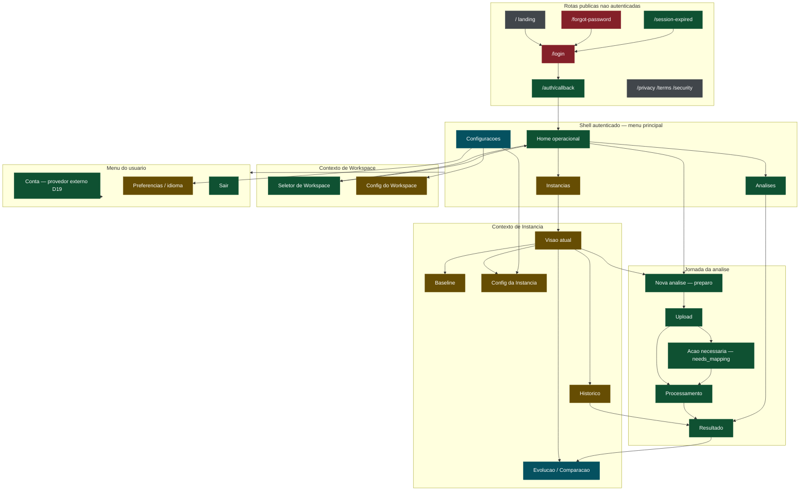
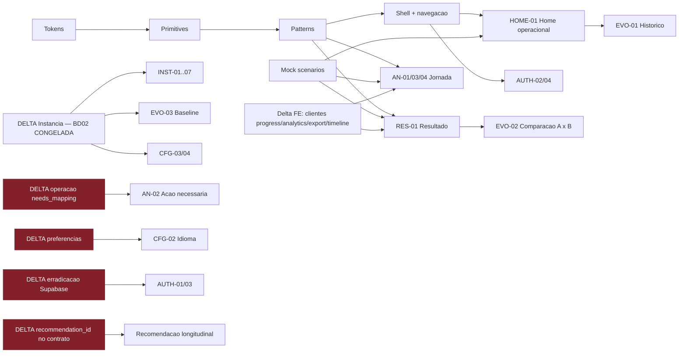

# EXPERIENCE BLUEPRINT V1

> **Autoridade de MAPA:** superfícies, estados, scenarios, componentes e dependências.
> **Não** é autoridade de regra arquitetural (→ `FRONT-ARCHITECTURE-AND-MOCK-CONTRACT.md`),
> visual (→ `FRONT-DESIGN-SYSTEM-CONSTITUTION.md`) nem de produto
> (→ `PRODUCT-EXPERIENCE-FREEZE-V1.md`).
>
> **Roteador:** `INDICE-DE-AUTORIDADE-V1.md`
>
> **Base:** `sentinela-front-e1` @ `77641c8`, atualizado após WS-A (`cf782e0`).
> Backend **congelado** · delta de Instância ✅ **AUTORIZADO e EXECUTADO** (BD02, `FREEZE: PASS`;
> B3 fechado) · Big Bang **bloqueado** · Supabase Auth ✅ **erradicado** (M01→M02).
>
> *(Banner reconciliado em 2026-08-12 sobre `064247b`. A linha `Base:` acima registra o commit em
> que o documento nasceu e não é atualizada a cada missão.)*

---

## 1. Fontes de autoridade

> ℹ️ **Após o DOC-FREEZE**, esta seção deixou de ser o índice canônico. A autoridade vigente está
> em `INDICE-DE-AUTORIDADE-V1.md`; os documentos abaixo passaram a **EVIDENCE/HISTORICAL**. O que
> segue vale como o **rastro** de onde cada regra veio, e a análise de conflitos de §1.2–1.4
> continua sendo a evidência de C1/C2/C3.

### 1.1 Documentos de origem (hoje EVIDENCE)

| domínio | autoridade vigente | observação |
|---|---|---|
| **Experience Freeze / D1–D18** | `docs/DISCOVERY-FRONT-EXPERIENCE.md` | encerrado |
| **D19–D23** | `docs/DISCOVERY-0B-SUPERFICIES-TRANSVERSAIS.md` | **D23 = autoridade sobre tema** |
| **D24–D30 + Q21–Q23** | `docs/DISCOVERY-0C-LONGITUDINALIDADE.md` | `FUNCTIONAL EXPERIENCE MAPPING — COMPLETE` (`e8e4a12`) |
| **Design 0** | `docs/DESIGN-0-DIRECAO-E-CONSTITUICAO.md` | P31 (proposta) + D32–D37 |
| **Design 0.5** | `docs/DESIGN-05-VISUAL-EVIDENCE.md` | T1 aprovado com A1–A4; V1–V12 (`77641c8`) |
| **Arquitetura / freeze Ondas 1–8** | Obsidian `02 - Arquitetura/ARQ - Arquitetura Entregue - Ondas 1 a 8 (congelamento).md` | |
| **Freeze operacional / rollout** | Obsidian `14 - Operação/OPS - Freeze Global e Pacote pre-Big-Bang.md` | |
| **Regras de ouro** | Obsidian `REGRA DE OURO ZERO.md` | §6: regra ARGOS **revogada**, história preservada |
| **Anti-monólito** | Obsidian `04 - Decisões/DEC - Arquitetura modular anti-monólito e topologia multi-repo.md` | *"acima de 1.000 linhas bloqueia fechamento"* |
| 🔴 **Contrato público V1** | `sentinela-facts/docs/contracts/public-v1.json` = **AUTHORITATIVE** (WS-A) | mirror STALE e cópia DERIVED — §1.2 |
| **Instância** | `DISCOVERY-0C` §11.1 + `DISCOVERY-FRONT-EXPERIENCE` (Q1′) | **delta não autorizado** |
| **Mock architecture** | `DESIGN-0` §6, preservada sem alteração | |
| **Auth canônico** | Keycloak via `src/lib/auth/` (`oidc-client-ts`) + `me_nota` do contrato | Supabase = resíduo a erradicar |
| **Privacy** | `analytics_nota` do contrato + locks `privacidadeNoNavegador` | |

**Revogados — não usar como autoridade:** a regra *"não tocar no ARGOS"*; a cláusula de tema como
se fosse decidida (P31 **não** é decisão); qualquer leitura de que "Supabase morreu" já cobria auth.

### 1.2 🔴 Conflito documental C1 — três contratos públicos divergentes

| origem | operações | contém |
|---|---|---|
| **`sentinela-facts/docs/contracts/public-v1.json`** | **11** | + `/analytics`, `/analytics/export/download`, `/progress`, `/timeline`, e os read models de `/v1/me` |
| `sentinela/docs/contracts/public-v1.json` | **6** | só a jornada base |
| `sentinela-front-e1/src/lib/v1/contract/public-v1.types.ts` | tipos de **6** ops **+ `MeView`** | não tem analytics/progress/timeline/export |

**Qual vence:** `sentinela-facts`. Não por preferência — é o que o próprio gate elege. O
`contract-sync.test.ts` ordena as origens e **a primeira que existir vence**, e `sentinela-facts`
vem primeiro. O gate ainda documenta o perigo por escrito: *"podem ser worktrees do mesmo
repositório em branches diferentes […] com contratos que NÃO batem entre si"*. Previu, e aconteceu.

🔴 **E o gate está verde mesmo assim** — porque compara **campos de interface**, nunca a **lista de
operações**. Quatro operações contratadas não têm cliente no front e nada acusa.

> **Consequência para o Blueprint, e é grande:** superfícies que eu classificaria como "precisa de
> delta de backend" são, na verdade, **REAL com delta de frontend**. O contrato já as suporta.

### 1.3 Conflito C2 — `/v1/me` fora de `operations[]`

O contrato eleito congela `me_read_model_fields`, `me_user_fields`, `me_workspace_fields`,
`me_capabilities` e diz *"Congelado a partir da Onda 8"* — mas **`/v1/me` não aparece no array
`operations`**. O read model é autoridade; a lista de operações está incompleta. **Vence o read
model** (é o que o gate compara e o que o cliente usa). **WS-A3 resolveu por prova: é defeito do
manifesto**, não semântica intencional — o Gateway implementa a rota e o contrato congela quatro
grupos de campos dela. O patch JSON exato está em `WS-A-AUTORIDADE-DO-CONTRATO.md` §A3, **não
aplicado** (repo congelado).

### 1.4 Conflito C3 — `/canonical/*` vaza nome de implementação

As rotas AS-IS `/canonical/analyses…` publicam um nome de **camada interna** na URL. Sem decisão
explícita, isso não pode virar IA pública. **Decidido em §3.4** (WS-A10).

---

## 2. Vocabulário congelado — a base de tudo

Extraído do contrato eleito. **São dois vocabulários distintos e não se colapsam.**

**A) `public_states` — estado da ANÁLISE** (8):
`preparing · receiving · queued · running · recovering · needs_mapping · completed · failed`

**B) `progress_axes` / `progress_states` — quatro eixos independentes:**

| eixo | estados |
|---|---|
| `engine` | `pending · running · ready · failed` |
| `analytics` | `pending · running · ready · partial · withheld · failed · unknown` |
| `export` | `unavailable · preparing · ready · expired · failed · unknown` |
| `final_result` | `pending · ready · failed` |

> ⚠️ **`pending` e `unknown` não são estados de análise** — só de eixo. **`recovering` e
> `needs_mapping` não são estados de eixo** — só de análise. Misturar as duas listas produz uma
> máquina de estados que não existe.

**Nunca públicos:** `engine_version`, `assembly_manifest`, `dataset_fingerprint`.

**Problem codes → HTTP:** `invalid_input` 400 · `authentication_required` 401 ·
`forbidden_or_not_found` 404 · `result_not_available` 404 · `idempotency_conflict` 409 ·
`analysis_not_ready` 409 · `non_retryable_failure` 422 · `capacity_wait` 503 ·
`temporarily_unavailable` 503.

---

## 3. Mapa global da experiência

### 3.1 IA e navegação



Legenda: **verde** = REAL · **âmbar** = APPROVED DELTA · **azul** = parcialmente real ·
**vermelho** = conflito (Supabase) · **cinza** = AS-IS legado.

### 3.2 Deep links canônicos (pretendidos)

`/analyses/{id}` · `/analyses/{id}/result` · `/analyses/{id}/result#comparison` — **registrados**.
`/instances/{id}` — **entregue pela M36** (`/instances` e `/instances/:instanceId`). `/instances/{id}/evolution` segue **conceitual**: B3 fechou, mas Evolution é outra superfície e nenhuma missão a implementou.
`/analyses/compare/{analysisAId}/{analysisBId}` — **congelada em 2026-08-12** para **EVO-02**.

> **A fonte mudou, a rota não.** Desde a Two-View Recovery, EVO-02 compara **`analysis-result-v3`**
> — cada lado pedindo `?result_schema_version=3`, **sem fallback v1/v2 e sem `/analytics`**. Uma
> Analysis sem v3 **não tem lado ARGOS comparável**, e isso é apresentado, não disfarçado com o
> documento histórico.
>
> **Escopo da V1: duas famílias.** `indicators` (identidade `indicator.id`) e as quatro
> **health dimensions** (`measurement.id`). As outras nove estão classificadas — com o porquê de
> cada uma — em `src/features/canonical-analysis/result/familiasDaComparacao.ts`, sob catraca
> executável (`evo02-m39-freeze.test.ts`).
>
> **Os scenarios 20 e 21 foram construídos sobre v1** e são cobertura **histórica** de
> `indicators`: eles não provam a M39 v3. Faltam três massas v3 — compatível, quebra documental e
> par de dimensão incompatível por metodologia — e é isso que impede a M39 de ser marcada `READY`.
Os dois identificadores são **identidade durável na URL**, e a ordem A/B é a da rota: refresh e
deep link reconstroem a comparação pelos dois ids. **Sem query param, sem storage, sem navigation
state** como fonte de verdade — a mesma regra que a M37 aplicou ao contexto de Instância.
`/canonical/*` é **interno/compatibilidade**, nunca IA pública.

### 3.3 Rotas de compatibilidade AS-IS (existem e redirecionam)

`/dashboard` → compat · `/dashboard/analysis|diagnostics|guardrails|optimization` → `/dashboard` ·
`/manage-context`, `/dashboard/workspaces`, `/dashboard/manage-context` → `/workspaces` ·
`/dashboard/history/:id` → detalhe canônico ·
**`/dashboard/history` → `/analyses`** (decisão de 2026-08-12; o redirect é entregue **pela M38**,
e a partir dela a rota legada **não pode voltar a ter lista própria**).

### 3.4 Rotas públicas — **DECISÃO REGISTRADA** (WS-A10, 2026-08-09)

| AS-IS | proposta | motivo |
|---|---|---|
| `/canonical/analyses` | `/analyses` | `canonical` é nome de camada interna. **Desde 2026-08-12 é também a rota canônica de EVO-01** (§4.7) |
| `/canonical/analyses/new` | `/analyses/new` | idem |
| `/canonical/analyses/:id` | `/analyses/:id` | idem |
| `/canonical/analyses/:id/result` | `/analyses/:id/result` | idem |
| `/home` | 🔶 **NÃO congelado** | primeiro é preciso provar o *ownership* de `/`, hoje da `LandingPage`. Pergunta aberta, não decisão adiada em silêncio |

#### 3.4.1 As duas visões — **CONGELADO** (Two-View Recovery)

| rota | papel | fonte |
|---|---|---|
| `/analyses/:id` | lifecycle da Analysis · identidade, estado, progresso, entradas das duas visões | `GET /{id}`, `/progress` |
| `/analyses/:id/argos` | **visão ARGOS** | `analysis-result-v3`, pedido por `?result_schema_version=3` |
| `/analyses/:id/analytics` | **visão Analytics** | `GET /{id}/analytics` |
| `/analyses/:id/result` | **LEGACY COMPATIBILITY** | v1/v2 — inalterada |

Por que **subrotas** e não abas: o produto não tem `Tabs` (nem no Design System, nem em uso, nem
citado por autoridade nenhuma), e a Recovery proíbe inventar primitivo estrutural sem
equivalente. Subrota também entrega o que a experiência exige de graça — deep link por visão,
refresh na visão certa e histórico do navegador.

Por que o lifecycle **não** vira terceira página de dados: o mesmo dado em três lugares diverge
em dois.

---

## 4. Inventário de superfícies V1

Campos por superfície: `surface_id` · nome · objetivo · objeto · rota pretendida · rota AS-IS ·
contexto · entrada · saída · CTA principal · CTAs secundários · estados · componentes · fonte de
verdade · view model · scenarios · deep link · refresh · responsive · i18n · a11y · dependências ·
blockers · contrato.

Para caber, o inventário está em tabela densa; as colunas longas (`estados`, `componentes`,
`scenarios`) referenciam §5, §6 e §11.

### 4.1 Auth — 6 superfícies

| id | nome / objetivo | objeto | rota pretendida | AS-IS | entrada → saída | CTA principal | estados | fonte de verdade | contrato |
|---|---|---|---|---|---|---|---|---|---|
| **AUTH-01** | **Login** — autenticar | Sessão | `/login` | `/login` | landing/deep link expirado → callback | "Entrar" | idle · redirecionando · erro | 🔴 **Supabase** (resíduo) / Keycloak (canônico) | 🔴 **conflito** — ver §4.1.1 |
| **AUTH-02** | **Callback** — trocar código por sessão | Sessão | `/auth/callback` | `/auth/callback` | provedor → destino original | — (automático) | processando · sucesso · falha | `lib/auth` (oidc) | **REAL** |
| **AUTH-03** | **Recuperação de acesso** | Identidade | delegar ao provedor | `/forgot-password`, `/auth/reset-password` | login → provedor | "Recuperar acesso" | idle · enviado · erro | 🔴 Supabase | 🔴 **conflito** |
| **AUTH-04** | **Sessão expirada** — reentrada sem perder destino | Sessão | `/session-expired` | `/session-expired` | 401 em qualquer rota → login | "Entrar novamente" | expirada | `problem.code = authentication_required` | **REAL** |
| **AUTH-05** | **Conta no provedor** (D19) | Identidade | link externo | — | menu do usuário → Account Management | "Gerenciar conta" | — | provedor canônico | **REAL** (é link) |
| **AUTH-06** | **Registro** | Identidade | — | `/register` | landing | — | — | 🔴 Supabase | **FUTURE / DO NOT BUILD** na V1 sem decisão de onboarding |

#### 4.1.1 O conflito de AUTH-01/03

O contrato diz *"a projeção vem das claims do provedor de identidade, **nunca de tabela**"*, e o
front tem `oidc-client-ts` (Keycloak) em `lib/auth`. Mas `/login` e `/forgot-password` **roteados**
chamam `supabase.auth.*`. **Não é decisão de design e não se resolve aqui**: é o delta obrigatório
de erradicação. Até ele acontecer, AUTH-01 e AUTH-03 são **contrato ambíguo** e **não podem ser
redesenhadas** — redesenhar uma tela que vai mudar de provedor é trabalho jogado fora.

### 4.2 Workspace — 4 superfícies

| id | nome / objetivo | rota pretendida | AS-IS | CTA principal | estados | fonte de verdade | contrato |
|---|---|---|---|---|---|---|---|
| **WS-01** | **Sem Workspace** — explicar e desbloquear | `/workspaces` (vazio) | `/workspaces` | "Falar com quem administra" | vazio | `GET /v1/me` → `workspaces: []` | **REAL** |
| **WS-02** | **Criação de Workspace** | — | — | "Criar Workspace" | — | **não existe operação** | **APPROVED DELTA** — D22 decidiu ownership; criação exige delta |
| **WS-03** | **Troca de Workspace** — mudar escopo sem contaminar cache | seletor no shell | `/workspaces` | "Trocar" | idle · trocando | `GET /v1/me` + `workspaceKeys.root` | **REAL** |
| **WS-04** | **Configuração do Workspace** (D22) | `/workspaces/{id}/settings` | — | "Salvar" | — | **não existe operação** | **APPROVED DELTA** |

> `role` (`viewer/member/admin/owner`) já vem em `me_workspace_fields` — **REAL** para gating de UI.
> Mas **D-Q1′** decidiu não mostrar "ADMIN": role governa o que aparece, não vira rótulo.

### 4.3 Home operacional — 1 superfície, 5 regiões

**HOME-01** · objetivo: responder *"o que precisa de mim agora?"* · objeto: Workspace ·
rota `/` autenticado (AS-IS `/home`) · entrada: callback, troca de workspace, deep link expirado ·
saída: análise, instância, nova análise.

| região | conteúdo | fonte de verdade | contrato |
|---|---|---|---|
| **Ações necessárias** | análises em `needs_mapping` e `failed` com `retry_allowed` | `GET /v1/analyses` (filtro no view model, sem recálculo) | **REAL** |
| **Em andamento** | `preparing/receiving/queued/running/recovering` | idem + `GET /progress` para detalhe | **REAL** (`/progress` sem cliente — delta FE) |
| **Instâncias** | agrupamento por Instância | — | **APPROVED DELTA** |
| **Resultados recentes** | `completed` com `result_available` | `GET /v1/analyses` | **REAL** |
| **Empty / loading / error** | os três, distintos | — | **REAL** |

CTA principal: **"Nova análise"**. Secundários: abrir análise, retomar `needs_mapping`, trocar
Workspace. Refresh: reconstrói de `GET /v1/analyses`; nenhum estado de fila vive no browser.

### 4.4 Instância — 7 superfícies, **todas APPROVED DELTA**

Produto decidiu (Q1′) que a V1 terá Instância. O delta foi **autorizado, executado e congelado**
pela **BD02** (`FREEZE: PASS`, E2E por processos reais) e o gate **B3 está fechado** — o Gateway já
não descarta o escopo, e `instance_id` é campo publicado.

**Construível ≠ entregue, e ≠ tem produtor.** Das sete: **INST-01 e INST-03 entregues** (M36);
**INST-04 entregue** (M37); **INST-06** é **delta declarado** — evolução longitudinal sem produtor;
**INST-05** depende de baseline, e ele **passou a existir no contrato**: a `BD10 · Baseline
Reference` foi autorizada **e implementada** em 2026-08-13, publicando `GET`/`POST`/`DELETE`
`/v1/instances/{id}/baseline` e o filtro de candidatos `baseline_eligible`. A superfície é
**construível e não construída**. Ela pode mostrar/definir/substituir/remover — e **não** pode
mostrar evolução, delta, melhora, piora, tendência nem ranquear candidatos: isso é comparação
longitudinal, que segue sem produtor; **INST-02 e
INST-07** são delta declarado por falta de produtor. O contrato de Instance publica
`instance_id`, `name`, `created_at` — e `create`/`list`/`get`, sem `update`, `PATCH` nem `delete`.

| id | nome | objetivo | contrato |
|---|---|---|---|
| **INST-01** | Visão atual | o que este sistema é e como está agora | **APPROVED DELTA** |
| **INST-02** | Estado | leitura do estado corrente + procedência | 🔴 **DELTA DECLARADO — sem produtor de estado corrente** |
| **INST-03** | Histórico | execuções em ordem | **APPROVED DELTA** |
| **INST-04** | Nova análise (a partir da Instância) | pré-preencher o escopo | ✅ **ENTREGUE** — M37 |
| **INST-05** | Baseline | marcar/substituir/remover a régua (D25) | **APPROVED DELTA** — ✅ **BACKEND READY** (BD10) · ✅ **SCENARIOS MATERIALIZED** (24, 38, 39) · **FRONT NOT STARTED**. Sem evolução/delta/direção/ranking: isso é comparação longitudinal, e a BD10 não a entrega |
| **INST-06** | Evolução | 🔴 **DELTA DECLARADO — evolução longitudinal da Instance sem produtor** |
| **INST-07** | Configuração da Instância (D22) | | 🔴 **DELTA DECLARADO — sem produtor de configuração; D22 depende de BD04** |

### 4.5 Análise — 4 superfícies (os demais itens são **estados**, §5)

| id | nome | rota pretendida | AS-IS | CTA principal | estados que suporta | contrato |
|---|---|---|---|---|---|---|
| **AN-01** | **Preparo + upload** | `/analyses/new` | `/canonical/analyses/new` | "Enviar conversas" | idle · `preparing` · `receiving` · **upload inválido** · **falha de rede** · `idempotency_conflict` | **REAL** (`prepare`, `data`, `submit`) |
| **AN-02** | **Ação necessária** (`needs_mapping`) | `/analyses/{id}` | `/canonical/analyses/:id` | "Confirmar interpretação" | `needs_mapping` | 🔶 **APPROVED DELTA** — estado REAL; operação **existe no Ingestion**, **não** na fronteira pública |
| **AN-03** | **Processamento** | `/analyses/{id}` | `/canonical/analyses/:id` | — (acompanhar) | `queued · running · recovering` + 4 eixos | **REAL** (`/progress` sem cliente) |
| **AN-04** | **Falha** | `/analyses/{id}` | `/canonical/analyses/:id` | "Tentar novamente" se `retry_allowed` | `failed` retryable / não-retryable · `capacity_wait` | **REAL** (`retry`) |

> 🔴 **AN-02 — corrigido em 2026-08-09 após verificação exigida pelo owner.** A afirmação
> anterior (*"não há operação para resolvê-lo"*) estava **errada**. A operação **existe**, e o par
> completo existe, no **Ingestion Service**:
>
> - `POST /ingestions/{ingestion_id}/profile` — *"Olha o arquivo e **PROPÕE**. Não decide nada — a
>   confirmação é outra rota."* → é a **leitura** que a tela precisa;
> - `POST /ingestions/{ingestion_id}/mapping` — *"**O portão humano.** Depois daqui a ingestão
>   entra na fila de validação."* → é a **escrita**;
> - `mapping/sugestao.py` foi escrito **para a tela**: *"opções na tela, confirmação"*;
> - `mapping/ativacao.py` documenta as **oito condições conjuntivas** — faltando uma,
>   `needs_mapping`.
>
> **O que realmente falta são três coisas, e todas menores do que construir a jornada:**
> 1. **exposição pública** — `public-v1.json` não tem nenhuma operação de mapping;
> 2. **ponte de identidade** — o público é chaveado por `analysis_id`; o Ingestion, por
>    `ingestion_id`. A ponte existe no banco (`orchestrator_ingestion_inbox.analysis_id`), **não**
>    na fronteira pública;
> 3. **leitura pública dos candidatos** — o `PerfilDaIngestao` existe e é `extra="forbid"`, mas não
>    atravessa o `/v1`.
>
> Isto rebaixa B2 de *"delta de backend grande"* para **exposição no Gateway + ponte de
> identidade** — a lógica de domínio já está construída e testada. Continua sendo delta explícito,
> e **nenhuma tela de mapping pode ser aprovada antes dele**.

### 4.6 Resultado — **ONE ANALYSIS → TWO VIEWS**

A Two-View Recovery cindiu esta seção. RES-01 nasceu quando havia **um** documento de resultado
com o analytics embutido; o `analysis-result-v3` desfez a fusão no backend, e a experiência
passou a ter duas leituras complementares da mesma Analysis.

| id | visão | rota | fonte ÚNICA |
|---|---|---|---|
| **ARG-01** | ARGOS — a inteligência | `/analyses/{id}/argos` | `analysis-result-v3` (pedido explícito) |
| **ANL-01** | Analytics — a exploração | `/analyses/{id}/analytics` | `GET /analytics` |
| **RES-01** | **LEGACY COMPATIBILITY** | `/analyses/{id}/result` | v1/v2, como sempre foi |

**Entregues** na Two-View Recovery, com captura em `docs/two-view/` (desktop · tablet · mobile):
ARGOS populado, ARGOS sem documento, Analytics `ready`/`partial`/`withheld`, e a jornada
oferecendo as duas entradas.

> `evidence_level` foi pedido pela Recovery e **nenhum contrato público o entrega** —
> apresentá-lo exigiria inventá-lo. `flag_crosses`/`numeric_crosses` seguem contados e não
> apresentados, decisão anterior a esta fase. O `detail` do alerta não é exibido: o cadeado da
> jornada proíbe `.detail` na UI e não distingue do campo homônimo do v3.

**Não são abas.** São subrotas irmãs: o produto não possui o pattern `Tabs`, e nenhuma
autoridade o menciona. A entrada para as duas mora no shell da Analysis (AN-02).

**Não fundir.** Nenhuma das duas visões lê a fonte da outra. `ARG-01` não chama `/analytics`;
`ANL-01` não pede o v3. O bloco analítico embutido no v2 **não** é segunda fonte canônica.

**Dimensões são conceitos diferentes nos dois lados.** As quatro dimensões de **saúde** do ARGOS
(`semantic`, `behavioral`, `structural`, `economic`) não são as dimensões do Analytics. O nome
coincide; o significado, a fonte e o produtor não.

#### RES-01 · LEGACY COMPATIBILITY — 9 regiões

**RES-01** · objetivo: entregar o resultado canônico com evidência · objeto: Análise ·
rota `/analyses/{id}/result` (AS-IS `/canonical/analyses/:id/result`) · deep link direto e
compartilhável · refresh: refaz `GET /result`; nada é reconstruído do browser.

> **Congelada.** Continua funcional e servindo deep link antigo; **não recebe feature nova** e
> não vira ARGOS-only em silêncio. Nenhuma navegação canônica nova aponta para ela quando a
> visão correta existe. Aposentadoria é decisão posterior.

| região | fonte de verdade | contrato |
|---|---|---|
| **O que merece atenção** | derivado do documento canônico (ordenação, sem recálculo) | **REAL** |
| **Indicadores** | `result` (v1/v2), discriminado por `result_schema_version` | **REAL** |
| **Recomendações** | `result` | 🔶 **REAL para exibir · APPROVED DELTA para longitudinal** (L6: `recommendation_id` não chega ao documento) |
| **Analytics** | `GET /analytics` — `component_status`, `snapshot`, `withheld` | **REAL** (sem cliente — delta FE) |
| **Evidências** | `result` v2 (facts) | **REAL** |
| **Qualidade** | contagens A/B/C reconciliadas | **REAL** |
| **Trust / procedência** | §10 | **REAL — 11/11** disponíveis; `method_*` e `privacy_policy_version` são **delta de front** (ler o que já chega) |
| **Export** | `GET /analytics/export/download` + eixo `export` | **REAL** (sem cliente — delta FE) |
| **Comparação com anterior** | duas leituras de `/result` + `indicator.id` | **REAL** para o par; **APPROVED DELTA** para "anterior da Instância" |

### 4.7 Evolução — 3 superfícies

| id | nome | rota canônica | contrato |
|---|---|---|---|
| **EVO-01** | **Histórico cronológico** | **`/analyses`** | ✅ **ENTREGUE** — M38 · **REAL** (`GET /v1/analyses` por cursor) |
| **EVO-02** | **Comparação ARGOS A×B** — ✅ **ENTREGUE** | **`/analyses/compare/{analysisAId}/{analysisBId}`** | **REAL** — duas leituras de `/result` **com `?result_schema_version=3`**, regra canônica em `comparacao.ts`. **V1 = `indicators` + health `dimensions`**; as outras nove famílias estão classificadas em `result/familiasDaComparacao.ts`. Quebra documental (D26) tem estado próprio, e um lado sem v3 é dito — nunca comparação parcial com o legado |
| **EVO-03** | **Baseline** | — | **APPROVED DELTA** (pertence à Instância) |

> **EVO-01 mora em `/analyses`, e não nasce como terceira tela.** Decisão de owner de 2026-08-12.
> A lista canônica já existe ali desde a Onda 6 E4 (renomeada pela M24): o que a **M38** faz é
> *consolidar* — fechar a semântica de EVO-01 nessa rota, provar a paginação por cursor e
> **encerrar a duplicata** `/dashboard/history`, que passa a ser alias de compatibilidade sem
> implementação própria. **Uma terceira rota de histórico é proibida.**
>
> Isto reconcilia duas leituras que conviviam sem se enxergar: o PLAN dizia "EVO-01 → M38, não
> iniciada" enquanto o Discovery registrava a superfície existindo — duplicada — desde a Onda 6. As
> duas estavam certas sobre coisas diferentes: existia **infraestrutura**, não existia **superfície
> consolidada**.

### 4.8 Configurações — 4 superfícies (D22)

| id | nome | contrato |
|---|---|---|
| **CFG-01** | Conta / Usuário — dados de `GET /v1/me`, alteração **delegada** (D19) | **REAL** (leitura) |
| **CFG-02** | Preferências — **idioma** (D23) | 🔶 **APPROVED DELTA** — não há contrato de preferência. Tema **não entra** (D23 vigente) |
| **CFG-03** | Workspace | **APPROVED DELTA** |
| **CFG-04** | Instância | **APPROVED DELTA** |

> **Excluir conta:** D21 — **FUTURE / DO NOT BUILD**. Nenhum CTA pode permanecer.

### 4.9 Erros globais — 6 superfícies

| id | situação | code | comportamento |
|---|---|---|---|
| **ERR-401** | não autenticado | `authentication_required` | → AUTH-04 preservando destino |
| **ERR-403/404** | proibido **ou** inexistente | `forbidden_or_not_found` | **uma** tela — o contrato funde os dois de propósito (não revelar existência) |
| **ERR-409** | conflito de idempotência / não pronto | `idempotency_conflict`, `analysis_not_ready` | inline, não página |
| **ERR-422** | falha não recuperável | `non_retryable_failure` | sem "tentar novamente" |
| **ERR-503** | capacidade / indisponível | `capacity_wait`, `temporarily_unavailable` | "aguarde", `retryable: true` |
| **ERR-PUB** | erro público genérico | — | `detail` **nunca** carrega SQL/host/bucket/trace |

### 4.10 Contagem

| classe | superfícies |
|---|---|
| **REAL** | 16 |
| **APPROVED DELTA** (total ou parcial) | 17 |
| **FUTURE / DO NOT BUILD** | 2 (AUTH-06 registro, excluir conta) |
| 🔴 **contrato ambíguo** (Supabase) | 2 (AUTH-01, AUTH-03) |
| **TOTAL** | **37** |

---

## 5. State Matrix global

**Vocabulário A — estado da análise** (nunca colapsar com B):

| estado backend | significado de produto | pattern | superfícies | CTA permitido | comunicação externa? |
|---|---|---|---|---|---|
| `preparing` | reservada, ainda não recebeu dado | `ProgressiveState` | AN-01, HOME-01 | cancelar upload local | não |
| `receiving` | recebendo a base | `UploadProgress` | AN-01 | — | não |
| `queued` | submetida, aguardando execução | `ProgressiveState` | AN-03, HOME-01 | — | não |
| `running` | em execução | `ProgressiveState` | AN-03, HOME-01 | — | não |
| `recovering` | re-enfileirada após uma tentativa | `ProgressiveState` (variante) | AN-03 | — | não |
| `needs_mapping` | **parada de NEGÓCIO** — espera uma pessoa | `ActionRequired` | AN-02, HOME-01 | 🔶 "Confirmar" **sem operação** | ✅ `analysis.action_required`? — §12 |
| `completed` | resultado disponível | `ResultAvailable` | RES-01, HOME-01, EVO-01 | "Abrir resultado" | ✅ `analysis.completed` |
| `failed` | falha terminal | `FailureState` | AN-04, HOME-01 | "Tentar novamente" **se** `retry_allowed` | ✅ `analysis.failed` |

**Vocabulário B — eixos de progresso:**

| eixo · estado | significado | pattern | CTA | externa? |
|---|---|---|---|---|
| `engine: pending/running` | fatos ainda não existem | `AxisState` | — | não |
| `engine: ready` | fatos existem | `AxisState` | — | não |
| `engine: failed` | fatos não existirão | `FailureState` | retry se permitido | ✅ |
| `analytics: pending/running` | projeção em curso | `AxisState` | — | não |
| `analytics: ready` | projeção completa | `AxisState` | — | não |
| `analytics: partial` | **terminou e parte foi omitida** para não reconstruir grupos pequenos | `PrivacyNotice` (variante `partial`) | — | ✅ se evento existir |
| `analytics: withheld` | **nada pode ser liberado**; `snapshot` nulo | `PrivacyNotice` (variante `withheld`) | — | ✅ se evento existir |
| `analytics: failed` | projeção não existirá | `FailureState` | — | ✅ |
| `analytics: unknown` | **não sabemos** — não é zero, não é falha | `UnknownState` | — | não |
| `export: unavailable` | não há o que exportar | `ExportState` | — | não |
| `export: preparing` | sendo montado | `ExportState` | — | não |
| `export: ready` | disponível | `ExportState` | "Baixar" | ✅ se evento existir |
| `export: expired` | **não entrego mais** (≠ não existe mais) | `ExportState` | "Gerar novamente" se operação existir | não |
| `export: failed` / `unknown` | falhou / desconhecido | `ExportState` | — | não |
| `final_result: pending/ready/failed` | documento canônico | `ResultAvailable` | "Abrir resultado" | ✅ |

**Regras que a matriz preserva:**
`partial` ≠ `failed` (nenhum dos dois é erro no `analytics`) · `withheld` ≠ zero ·
`unknown` ≠ ausência ≠ zero ≠ "resolveu" · `needs_mapping` ≠ `failed` (retry repetiria o mesmo
resultado) · `recovering` ≠ `failed` · `expired` ≠ `purged` · **delta ≠ drift**.

---

## 6. Component Map

### 6.1 Camadas

| camada | conhece domínio? | acessa query/backend? |
|---|---|---|
| **TOKENS** | não | não |
| **PRIMITIVES** | **não** | não |
| **PATTERNS** | não | não |
| **PRODUCT COMPONENTS** | **sim**, mas recebe **view model** | não |
| **PAGE COMPOSITIONS** | sim | **sim** (via query) |

### 6.2 Candidatos

**PRIMITIVES (11)** — `Button` · `Chip` · `Bar` (existe: `analytics/primitivas.tsx`) · `Text` ·
`Stack` · `Field` · `Disclosure` · `Dialog` (Radix) · `Tooltip` (Radix) · `Table` · `Icon`.
Nenhum conhece Análise/Instância/Workspace. Entrada: props visuais. **Não podem:** decidir estado
semântico, formatar número de domínio, ler i18n de produto.

**PATTERNS (10):**

| pattern | superfícies | estados/variantes | não pode |
|---|---|---|---|
| `EmptyState` | WS-01, HOME-01, EVO-01, INST-* | vazio-inicial · vazio-por-filtro | virar erro |
| `ErrorState` | todas | 401 · 403/404 · 409 · 422 · 503 · genérico | mostrar `detail` cru de infra |
| `LoadingState` | todas | esqueleto · inline | fingir progresso |
| `ProgressiveState` | AN-03, HOME-01, RES-01 | por eixo | inventar % agregado |
| `ActionRequired` | AN-02, HOME-01 | com/sem operação | oferecer CTA sem operação |
| `ConfirmDestructive` | EVO/INST (futuro) | digitação exata do nome da Instância | aceitar "EXCLUIR" |
| `ProvenanceMargin` | §7 | persistente · disclosure | repetir payload cru |
| `ComparisonRow` | RES-01, EVO-02 | comparável · **quebra de comparabilidade** | atravessar quebra de schema |
| `DataTable` | HOME-01 · *(previsto para EVO-01, **não vinculante** — ver nota)* | tabela · **stacked** | perder coluna no mobile |
| `Toolbar` | RES-01 · *(previsto para EVO-01, **não vinculante** — ver nota)* | — | — |

**PRODUCT COMPONENTS (9)** — e é aqui que mora o risco que a missão quer matar:

| componente | superfícies | view model | responsabilidade |
|---|---|---|---|
| 🔴 **`StatusBadge`** | **HOME-01, AN-02/03/04, RES-01, EVO-01, INST-01/03** | `{ estado, eixo?, rotulado }` | **UM só componente para os dois vocabulários.** É explicitamente a defesa contra `HomeStatus`/`InstanceStatus`/`AnalysisStatus` com três linguagens |
| `IndicatorCard` | RES-01, EVO-02 | indicador já formatado | exibir valor + procedência |
| `AnalyticsBlock` | RES-01 | `{ status, snapshot? }` | união discriminada (existe) |
| `PrivacyNotice` | RES-01, HOME-01 | `{ applied, output_count, reason_code }` | explicar `partial`/`withheld` |
| `ExportButton` | RES-01 | eixo `export` | um botão por estado, não um botão que mente |
| `AnalysisListItem` | HOME-01, EVO-01, INST-03 | `AnalysisListItem` | linha da lista |

> **Esta tabela mapeia patterns PREVISTOS, não estrutura física obrigatória.** Decisão de owner de
> 2026-08-12: o que vincula uma superfície é a **semântica** — para EVO-01, ordem vinda do
> produtor, paginação por cursor, `AnalysisListItem` honesto, estado publicado e empty/loading/error
> distintos. `DataTable` e `Toolbar` foram citados numa versão anterior deste mapa; se a lista viva
> já representa tudo isso, **trocá-la por `DataTable` seria redesenho sem necessidade**. `Toolbar`
> só entra quando houver função real autorizada — barra vazia ou com controle inventado é pior que
> ausência.
| `WorkspaceSwitcher` | shell | `MeView.workspaces` | trocar escopo |
| `ProvenancePopover` | RES-01 | procedência | §10 |
| `ComparisonPanel` | EVO-02, RES-01 | par de resultados | §8 |

> **`comparacao.ts` é a ÚNICA regra canônica de comparação A×B** (D29). Nenhum componente
> implementa regra concorrente — de pareamento, de quebra, de delta ou de ausência. O
> `RunComparePanel` legado **não é AS-IS de regra**: ele é **referência visual/estrutura legada**,
> e a sua subtração local (`delta: number`) mais a decisão de comparabilidade **por linha**
> contradizem D26 e D29. Sobreviver, ele só sobrevive como *presenter* sobre a regra canônica —
> ou é substituído.

**PAGE COMPOSITIONS:** uma por superfície de §4. **Nenhuma interpreta payload bruto.**

**Total de candidatos: 11 + 10 + 9 = 30.**

---

## 7. Pattern especial — marginália de evidência

**Conceito:** `valor → contexto/procedência acessível`. É a assinatura de T1 (V9).

| onde aparece | o que a marginália carrega |
|---|---|
| **indicador** | `record_count`, janela, `indicator_registry_version` |
| **gráfico** | domínio da escala, unidade, se há corte declarado (§8) |
| **comparação** | base do delta, e se houve quebra de comparabilidade |
| **qualidade** | as contagens reconciliadas |
| **trust** | §10 |

**Regras (A3 + V9):**

- **desktop:** marginália **persistente** ao lado do dado;
- **abaixo do breakpoint de tablet:** colapsa em **disclosure presa ao próprio dado**;
- **nunca** desaparece no mobile;
- **nunca** depende exclusivamente de hover (não existe hover no toque);
- **nunca** vira tooltip inacessível — é `<button aria-expanded>` + região com `aria-controls`;
- **nunca** repete payload técnico cru;
- **escopo:** **indicador publicado**, não todo número da tela — senão vira papel de parede.

---

## 8. Data visualization

| tipo de informação | visualização permitida | escala | unidade | comparação | ausência / privacy |
|---|---|---|---|---|---|
| **magnitude entre categorias** | barra | **parte de zero**, exceção explícita e marcada | do domínio | lado a lado | ausente = lacuna rotulada, **nunca 0** |
| **variação no tempo** | linha / *small multiples* | domínio **pode** ser não-zero, **com limites expostos** | do domínio | mesma escala entre séries | linha **não atravessa** o buraco |
| **delta A×B** | barra divergente | **simétrica em torno de zero** | do domínio | direção nomeada + base declarada | quebra de schema → **não conecta** |
| **composição** | barra empilhada; **nunca donut** | 0–100 % | % | — | `withheld` some da escala, não vira 0 |
| **concentração / Pareto** | barra ordenada | zero | contagem | — | faixa suprimida é declarada |
| **estado** | chip + **forma/ícone** | — | — | — | cor **nunca** é canal único |

**Invariantes:** biblioteca é **renderer**, nunca *owner* semântico · **nenhuma agregação nova no
Front** · **nenhuma inferência de drift** · domínio chega **decidido** pelo view model · eixo
cortado é **declarado, não deduzido** · quebra de `result_schema_version` ou
`indicator_registry_version` **interrompe a comparabilidade numérica** (D26).

---

## 9. Longitudinalidade — as quatro camadas

| camada | o que é | disponível hoje? |
|---|---|---|
| **1. Continuidade** | as execuções existem e são listáveis em ordem | ✅ **SIM** — `GET /v1/analyses` por cursor |
| **2. Identidade** | duas execuções pertencem ao **mesmo sistema observado** | ✅ **SIM** — `instance_id` na Instance e no read model de Analysis (BD02) |
| **3. Referência** | existe uma régua (baseline) | ✅ **SIM, desde 2026-08-13** — a **BD10** publica `GET`/`POST`/`DELETE` `/v1/instances/{id}/baseline` + candidatos por `baseline_eligible`. *(Era: "baseline não existe no contrato público… e nenhuma BD a produz".)* **A camada 4 — confrontar contra a régua — continua ❌:** ter referência não é comparar, e a BD10 diz isso por escrito |
| **4. Comportamento** | o sistema **mudou de comportamento** (drift) | ❌ **NÃO** — falta referência + limiar + owner canônico |

**Hoje a camada 1 permite dizer:** *"esta análise vs. a imediatamente anterior desta lista"*.
**Não permite dizer:** *"esta Instância piorou"*.

**Baseline (D25):** pertence à Instância · é análise **marcada explicitamente** · **pode não
existir** · **nunca muda em silêncio** · é versionável no histórico · **análise que é baseline ativo
não pode ser excluída** antes de remover/substituir a referência (R4).

**Recomendação longitudinal (D27):** **somente por `recommendation_id`**. Nunca por título, texto,
similaridade, posição ou heurística. 🔴 **Blocker medido:** o id existe na origem mas **não chega
ao documento canônico** — sem ele, **nenhuma afirmação** de persistiu/apareceu/sumiu.

**Drift:** permanece **fora** enquanto não houver referência + limiar + owner canônico.
**Delta ≠ drift.**

---

## 10. Trust — "por que confiar neste resultado?"

Só informação canônica **existente**. Nenhum "trust score" inventado.

| informação | fonte | disponível? |
|---|---|---|
| versão do documento | `result_schema_version` | ✅ |
| vocabulário de indicadores | `indicator_registry_version` | ✅ |
| contrato do snapshot | `snapshot_contract_version` | ✅ |
| digest do snapshot | `snapshot_digest` | ✅ |
| digest da projeção | `projection_digest` | ✅ |
| **política de privacidade aplicada** | `disclosure_rule_version` | ✅ |
| **omissão** | `withheld = {applied, output_count, reason_code}` | ✅ |
| momento da geração | `generated_at` | ✅ |
| contagens reconciliadas | A/B/C (MF6.3) | ✅ |
| **linha do tempo** | `GET /timeline` (`public-events-v1`) — lida dos **eventos duráveis**, não remontada | ✅ contrato / ❌ sem cliente |
| **`min_group_size`** | `snapshot` → `ResumoDeDistribuicao`, `Concentracao`, `Cruzamento` | ✅ **existe E chega ao front** — `analyticsProjection.ts:63` o declara; `adapterV2.ts:365` mapeia `minGroupSize` |
| **`method_id`, `method_version`, `method_parameters`, `method_definition_digest`** | `analytics_service/contracts/metodo.py` + `snapshot.py:120-125` | ⚠️ **existem no documento, o front NÃO os lê** |
| `privacy_policy_version` | `contracts/distribuicao.py` | ⚠️ idem — existe, não é lido |

> 🔴 **Correção de 2026-08-09, exigida pelo owner — a versão anterior desta tabela estava errada.**
> Eu havia declarado que `method_id`/`method_version`/`min_group_size` *"não existem no contrato
> público"*. **Existem.** O erro foi de **instrumento, não de leitura**: procurei apenas em
> `public-v1.json` e em `canonicalSchemaV2.ts`. Mas `analytics_read_model_fields` lista `snapshot`
> como um documento **aninhado**, e é **dentro dele** que esses campos vivem — o JSON de topo nunca
> os mostraria.
>
> **Não houve mudança de autoridade nem divergência de versão.** A `0c` estava certa. O que muda:
>
> - dos 11 itens pedidos, **11 existem** — nenhum precisa ser inventado, nenhum vira delta de
>   contrato;
> - **`min_group_size` já chega ao front** e já é consumido;
> - `method_*` e `privacy_policy_version` **chegam no documento e são descartados na leitura** —
>   é **delta de frontend** (ler o que já vem), não delta de backend;
> - `method_definition_digest` é o campo que transforma *"method_version = 1"* numa **afirmação
>   verificável** — mudar a fórmula sem trocar a versão fica detectável. É exatamente a matéria da
>   superfície de trust, e está disponível.

---

## 11. Mock Scenario Catalog — 39 cenários

Todo scenario é **nome + lista de handlers**. Fixture derivada do schema publicado (§17).

| # | id | superfícies | contrato | estado inicial → transições | bloqueado? |
|---|---|---|---|---|---|
| 1 | `workspace-empty` | WS-01 | `/v1/me` | `workspaces: []` | — |
| 2 | `instance-empty` | INST-01 | `/v1/instances` | `items: []` | **desbloqueado pela BD02** |
| 3 | `analysis-uploading` | AN-01 | prepare→data | `preparing → receiving` | — |
| 4 | `upload-invalid` | AN-01 | `invalid_input` 400 | erro sem consumir a operação | — |
| 5 | `upload-network-failure` | AN-01 | — | falha de transporte, retomável | — |
| 6 | `needs-mapping` | AN-02, HOME-01 | status | `receiving → needs_mapping` | ⚠️ **parcial** — exibir sim, **resolver não** |
| 7 | `engine-running` | AN-03 | `/progress` | `engine: running` | — |
| 8 | `analytics-running` | AN-03 | `/progress` | `analytics: running` | — |
| 9 | `analytics-ready-engine-running` | AN-03 | `/progress` | eixos dessincronizados | — |
| 10 | `engine-ready-analytics-running` | AN-03 | `/progress` | idem, invertido | — |
| 11 | `analytics-partial` | RES-01 | `/analytics` | `component_status: partial` | — |
| 12 | `analytics-withheld` | RES-01 | `/analytics` | `withheld`, `snapshot: null` | — |
| 13 | `engine-failed-analytics-ready` | AN-04, RES-01 | `/progress` | — | — |
| 14 | `analytics-failed-engine-ready` | AN-04, RES-01 | `/progress` | — | — |
| 15 | `both-failed` | AN-04 | `/progress` | — | — |
| 16 | `final-ready` | RES-01 | `/result` | `final_result: ready` | — |
| 17 | `export-preparing` | RES-01 | `/progress` | `export: preparing` | — |
| 18 | `export-ready` | RES-01 | export | `export: ready` | — |
| 19 | `export-expired` | RES-01 | export | `expired` ≠ purged | — |
| 20 | `comparison-compatible` | EVO-02 | dois `/result` | mesmas versões | 🔶 **v1 — não prova a M39 v3** |
| 21 | `comparison-schema-break` | EVO-02 | dois `/result` | `indicator_registry_version` diferente → **descontinuidade** | 🔶 **v1 — não prova a M39 v3** |
| 22 | `recommendation-persisted` | RES-01, EVO-02 | `/result` | — | 🔴 **BLOQUEADO** — o v3 traz o campo `id`, mas nenhuma autoridade o declara durável ENTRE análises |
| 36 | `comparison-v3-compatible` | EVO-02 | dois `/result?result_schema_version=3` | 14 pares de indicador · 4 de dimensão, com valores distintos | — |
| 37 | `comparison-v3-document-break` | EVO-02 | dois `/result?result_schema_version=3` | `indicator_registry_version` divergente, e **nada mais** | — |
| 23 | `privacy-omission` | RES-01 | `/analytics` | `withheld.reason_code` | — |
| 24 | `no-baseline` | INST-05 | `GET .../baseline` + `GET /v1/analyses?instance_id=&baseline_eligible=true` | `200` + as duas chaves `null` · **3 candidatos elegíveis** · `POST` elege → `DELETE` volta a `NO_BASELINE` | — **DESBLOQUEADO pela BD10** |
| 25 | `baseline-active` | INST-05 | — | régua ativa **bloqueia exclusão** | 🔴 **BLOQUEADO — scenario COMPOSTO histórico.** A metade "mostrar régua ativa" foi entregue pelo **38**; a outra metade exige **exclusão pública de Analysis** (B10 → `BD06`), que não existe. **Não é prova canônica de INST-05** |
| 38 | `baseline-set` | INST-05 | `GET/POST/DELETE .../baseline` + candidatos | régua em `an-cand-0001` com `set_at` · **3 candidatos** · `POST` troca para outra **sem passar por `NO_BASELINE`** · `DELETE` limpa, e repetido mantém | — |
| 39 | `baseline-no-candidates` | INST-05 | idem | `NO_BASELINE` + candidatos `[]` | — **`[]` significa "o backend consultou e achou zero"**, nunca "endpoint ausente". É o primeiro estado de toda Instance nova, e sem ele a INST-05 teria caminho primário não provado |
| 26 | `session-expired` | AUTH-04 | 401 | preserva destino | — |
| 27 | `forbidden` | ERR-403/404 | 404 `forbidden_or_not_found` | — | — |
| 28 | `not-found` | ERR-403/404 | idem | **mesma tela**, por contrato | — |
| 29 | `capacity-wait` | AN-03, ERR-503 | 503 `capacity_wait` | `retryable: true` | — |
| 30 | `result-v1-legacy` | RES-01 | `/result` | `result_schema_version: analysis-result-v1` | — |
| 31 | `idempotency-conflict` | AN-01 | 409 | resubmit do mesmo | — |
| 32 | `list-pagination` | EVO-01, HOME-01 | `/v1/analyses` | `next_cursor` → 2ª página | — |
| 33 | `instance-present` | INST-01 | `/v1/instances`, `/v1/instances/{id}` | uma Instance: `instance_id`, `name`, `created_at` | — |
| 34 | `instance-history` | INST-03 | `/v1/analyses?instance_id=` | análises DA Instance, em ordem, com `next_cursor` | — |
| 35 | `instance-new-analysis` | INST-04 | `POST /v1/analyses?instance_id=` | prepare COM contexto: a associação nasce no write e só é legível no status | — |

O 35 nasceu com o **Checkpoint 0 da M37** e existe porque INST-04 não é uma tela nova de Análise:
é o fluxo canônico recebendo o contexto da Instância. O produtor já publica essa capacidade —
`prepare_analysis` aceita `instance_id` como **query param OPCIONAL e ADITIVO**, e é o Orchestrator,
não o Gateway, que valida existência e tenant. A associação **não volta na resposta do prepare**
(`{analysis_id, status}` e nada mais): ela só se torna legível depois, em `status_read_model_fields`.
Por isso o scenario é o único do catálogo que **lembra o que o write recebeu** — um mock que
devolvesse 201 e esquecesse deixaria passar um Front que perdeu o contexto pelo caminho, e a tela
pareceria funcionar criando análise solta.

**INST-07 não recebe scenario, e INST-02 continua sem.** As duas são falta de PRODUTOR, não de
massa: não há operação de configuração — nem `update`, `PATCH` ou `delete` —, não há estado
corrente publicado, e o D22 de que a INST-07 depende está preso à **BD04**. Fabricar fixture para
qualquer uma faria a tela montar e o delta parecer feito.

Os cenários 33 e 34 nasceram com a **M36**, e existem porque `instance-empty` só prova o vazio: não se
constrói "visão atual da Instância" sem nenhuma Instância. Eles representam o produtor REAL já
congelado pela BD02 — `instance_id`, `name`, `created_at` e nada mais. Nenhum `status`, `health`,
contador ou `updated_at`, porque nada disso existe no contrato; é a mesma razão pela qual
**INST-02 não recebe scenario**.

> ⚠️ **Isto valia enquanto EVO-02 lia o documento legado.** `comparison-compatible` e
> `comparison-schema-break` provaram o que precisavam provar — o par comparável, e que a quebra
> de `indicator_registry_version` **interrompe a comparabilidade do DOCUMENTO** (D26), não linha
> a linha. Mas ambos servem `RESULT_VIEW`, que é **v1**.
>
> Desde a Two-View Recovery a M39 compara `analysis-result-v3`. Os dois seguem válidos como
> **cobertura histórica de `indicators`/v1**, e **não** provam a missão atual. As três massas v3
> que faltam estão listadas na entrada da M39 no PLAN, e são o que impede marcá-la `READY`.
>
> O **22** (`recommendation-persisted`) continua **🔴 bloqueado por BD03** e **não faz parte do
> DoD da M39**. A razão, porém, foi **qualificada**:
> o `analysis-result-v3` **traz** um campo `id` em `recommendations[]` — o que faltava no v1.
> O que continua faltando é uma autoridade declarando esse id **durável entre análises**. D27
> exige identidade canônica, e campo presente não é identidade declarada. Ele estar mapeado para
> EVO-02 não o torna requisito de fechamento.

**Bloqueados: 3** (`recommendation-persisted`, `no-baseline`, `baseline-active`)
**+ 1 parcial** (`needs-mapping`). **Nenhuma fixture será inventada para eles.**

`instance-empty` saiu desta lista pela BD02: o produtor real existe e devolve
`{"items": [], "next_cursor": null}` para workspace autorizado sem Instances — medido por Gateway
real, não fixture inventada. É a única saída de bloqueio autorizada até aqui.

---

## 12. Communication / re-entry map

| evento | canal | CTA | deep link | destino | existe? |
|---|---|---|---|---|---|
| `analysis.completed` | e-mail + webhook | "Ver resultado" | `/analyses/{id}/result` | RES-01 | ✅ evento existe |
| `analysis.failed` | e-mail + webhook | "Ver o que houve" | `/analyses/{id}` | AN-04 | ✅ |
| `result.available` | e-mail + webhook | "Abrir resultado" | `/analyses/{id}/result` | RES-01 | ✅ |
| **ação necessária** | — | "Confirmar interpretação" | `/analyses/{id}` | AN-02 | 🔴 **evento não confirmado** |
| **conclusão com restrição** (`partial`/`withheld`) | — | "Ver o que foi omitido" | `/analyses/{id}/result` | RES-01 | 🔴 **evento não confirmado** |
| **export pronto** | — | "Baixar" | `/analyses/{id}/result` | RES-01 | 🔴 **evento não confirmado** |

> 🔴 **Q15 permanece prova técnica.** A cadeia `Workspace owner → identidade → e-mail →
> `Mensagem.destino`` **não está comprovada** (`Mensagem.destino` nasce vazio e é preenchido fora do
> compositor). **Comunicação externa não pode ser declarada operacionalmente fechada.** E o deep
> link do e-mail aponta hoje para rota inexistente.

---

## 13. Lifecycle e ações destrutivas

| objeto | retenção | expiração | purge | exclusão pelo usuário | abandono |
|---|---|---|---|---|---|
| **Análise** | indefinida | — | — | **D28** — só quando o backend suportar | — |
| **Artefato de entrada** | dono é o **Ingestion** | — | purga com **certidão durável** | ❌ não pelo caminho da análise — **sinaliza** | — |
| **Export** | por prazo | `expired` = *não entrego mais* | `purged_at` = *não existe mais* | — | — |
| **Workspace** | — | — | — | **FUTURE** | — |
| **Instância** | — | — | — | **APPROVED DELTA** | — |
| **`prepared` abandonado** | — | — | — | ❌ **não é ação do usuário** | 🔴 **nunca expira** (B4) |

**Exclusão de análise:** só quando a operação real existir · **nunca** como cancelamento escondido
(R1) · confirmação exige **digitar exatamente o nome da Instância** · **baseline ativo bloqueia**
até remoção/substituição (R4) · auditoria conserva **só** `analysis_id · workspace_id/instance_id ·
actor · timestamp · motivo/ação · resultado` (**D30**), nunca o conteúdo destruído.

---

## 14. Responsive Transformation Map

| pattern | desktop | tablet | mobile | o que **não** pode perder |
|---|---|---|---|---|
| `DataTable` | tabela | tabela com colunas secundárias ocultas | **stacked list** com hierarquia | nenhuma coluna que carregue decisão |
| `ComparisonPanel` | lado a lado | lado a lado comprimido | **blocos sequenciais** com base repetida | a **base** do delta em cada bloco |
| `ProvenanceMargin` | marginália persistente | marginália | **disclosure presa ao dado** | a procedência — nunca some |
| Sidebar | expandida | ícone + rótulo | **navegação compacta** | o "você está aqui" |
| Ações | toolbar completa | toolbar | **primária visível**, resto em menu | a **prioridade** |
| `ProgressiveState` | 4 eixos lado a lado | 2×2 | empilhado | os **4 eixos** — nunca vira barra única |
| `PrivacyNotice` | inline ao bloco | inline | inline | o `reason_code` |

**Regra:** o mobile **nunca** perde informação relevante só porque não coube. Ele **reorganiza**.

---

## 15. Copy / i18n

**Termos congelados** — nenhuma tela nova pode introduzir sinônimo:

| conceito | PT-BR | EN | **nunca** |
|---|---|---|---|
| `partial` | parcial | partial | "incompleto", "com erro" |
| `withheld` | restrito | withheld | "vazio", "zero", "retido" |
| `needs_mapping` | ação necessária | action required | "erro", "pendente" |
| `recovering` | retomando | recovering | "falhou" |
| `failed` | falha | failed | "erro temporário" |
| `unknown` | desconhecido | unknown | "zero", "nenhum" |
| `expired` | expirado | expired | "apagado" |
| delta | delta | delta | "drift" |
| drift | drift | drift | "delta", "variação" |

> **`withheld` = "restrito", corrigido pela M34 (2026-08-10).** A tabela dizia "retido", e o
> `/ux-copy` da AN-03 mostrou por que não serve: `recovering` é **"Retomando"**, e AN-03 é a
> primeira superfície onde os dois aparecem juntos — o banner da análise diria "Retomando"
> enquanto o eixo diria "Retido", duas palavras do mesmo radical significando coisas opostas.
> "Retido" também sugere atraso, colidindo com `pending`. "Restrito" diz que há uma regra
> impedindo mostrar, que é o que `withheld` é. EN permanece `withheld`.

**CTAs canonizados:** "Nova análise" / *New analysis* · "Enviar conversas" / *Upload conversations*
· "Abrir resultado" / *Open result* · "Tentar novamente" / *Try again* · "Baixar" / *Download* ·
"Confirmar interpretação" / *Confirm interpretation* · "Trocar Workspace" / *Switch workspace*.

**Erros:** o quê + por quê + como resolver. Nunca `detail` cru de infra.
**Empty states:** o que é + por que está vazio + como começar.
**Orçamento:** +30 % de EN para PT-BR; nenhum rótulo com largura fixa.
**Tema não entra como requisito** enquanto D23 vigorar.

---

## 16. Accessibility Contract

| tipo | requisitos mínimos |
|---|---|
| **todas** | navegação completa por teclado · foco visível (`:focus-visible`) · nome/papel/valor · contraste texto ≥ 4.5:1 e não-texto ≥ 3:1 · alvo ≥ 44×44 · `prefers-reduced-motion` · **informação nunca só por cor** |
| `StatusBadge` | cor **+** ícone/forma **+** rótulo textual; `role="status"` quando muda em tempo real |
| `ProgressiveState` | `aria-live="polite"` na transição de eixo; nunca `assertive` (não é emergência) |
| `ProvenanceMargin` | `<button aria-expanded>` + `aria-controls`; **jamais** só hover |
| `ConfirmDestructive` | foco preso no diálogo, `aria-describedby` nas consequências, CTA desabilitado até correspondência exata |
| `DataTable` | cabeçalhos associados; no modo stacked, cada campo mantém seu rótulo |
| Gráficos | alternativa textual com os mesmos números; séries distinguíveis em escala de cinza e sob deuteranopia |
| `ErrorState` | anunciado; foco movido para a mensagem |

---

## 17. Architecture boundary

```
Page                 compoe; NAO interpreta payload bruto
  |
Product component    conhece dominio; recebe VIEW MODEL
  |
View model / Query   TanStack Query + adapters puros
  |
lib/v1               cliente canonico do contrato publico
  |
HTTP                 fetch real, SEMPRE
  |
MSW  ou  Gateway     trocado por ambiente, nunca por codigo de UI
```

**Nenhuma página conhece fixture** · **nenhum componente de Design conhece query/backend** ·
**nenhum mock cria domínio paralelo** · **nenhuma biblioteca externa vira API pública de página**.

---

## 18. Dependency map



**Construíveis sem nenhum delta:** Tokens → Primitives → Patterns → Shell → **RES-01** → **HOME-01**
→ **AN-01/03/04** → **EVO-01** → **EVO-02** (par avulso) → AUTH-02/04 → WS-01/03 → erros.

**Bloqueadas por delta:** EVO-03 · CFG-02/03/04 · WS-02/04 · AN-02 (o CTA) · AUTH-01/03 ·
recomendação longitudinal.

**Desbloqueadas pela BD02** (`FREEZE: PASS`, B3 fechado): **INST-01 e INST-03…07**. A Instância existe no
contrato público — `create_instance`/`list_instances`/`get_instance`, `instance_id` nas projeções
de Analysis e histórico por Instance —, e o scenario 2 saiu de bloqueado.

Desbloqueado é AUTORIZADO A IMPLEMENTAR, não entregue — e a distinção continua valendo para as
que faltam. **Entregues: INST-01 e INST-03 (M36) e INST-04 (M37).** Seguem sem caminho INST-02 e
INST-07 (delta declarado, sem produtor), INST-05 (baseline sem produtor) e INST-06 (evolução
longitudinal sem produtor — saiu da M39 em 2026-08-12).

**Duas superfícies e uma operação ficam registradas sem missão.** INST-02 (Estado) e INST-07
(Configuração) não têm produtor: o contrato publica `instance_id`, `name`, `created_at` e as
operações `create`/`list`/`get` — não há estado, nem `update`/`PATCH`/`delete`, e nem renomear é
possível. O D22, de que a INST-07 depende, está ligado a **BD04**, ainda sem autorização.

E `create_instance` é o caso inverso: a operação **existe** no contrato e o Discovery §9.1 tem o
nó *"Criar primeira Instância"*, mas **nenhuma das sete superfícies INST é criar Instância** — a
M37 é INST-04, nova *análise* a partir dela. Capacidade pública sem superfície é o simétrico de
superfície sem produtor, e as duas ficam declaradas em vez de silenciosas.

**INST-02 é a exceção, e ela não é de cronograma.** A BD02 publicou a Instance com três campos —
`instance_id`, `name`, `created_at` — e congelou deliberadamente **sem** `status`, `health`,
contadores ou `updated_at`. INST-02 pede *"estado corrente"*, e nenhuma derivação honesta existe:
última Analysis como estado seria inferir saúde pelo histórico, e `created_at` como status seria
transformar data em diagnóstico. A superfície fica registrada, **sem missão dona**, até que o
produto defina o que "estado corrente da Instância" significa e alguém o produza. Ver o delta
declarado no PLAN, na Fase 9.

**Paralelizável:** a coluna de Patterns e o catálogo de scenarios podem correr em paralelo com o
delta de frontend dos quatro clientes faltantes.

---

## 19. Definition of UI Complete — *Front V1 completo em modo mock*

Todos os critérios, sem exceção:

1. **todas as superfícies REAL** de §4 navegáveis em modo mock (as APPROVED DELTA ficam
   explicitamente **fora** e **inalcançáveis**, não meio-construídas);
2. **os 27 scenarios não bloqueados** de §11 reproduzíveis por nome;
3. **nenhum dado exclusivo do mock** — toda fixture valida contra o schema publicado;
4. **todo CTA tem operação real ou está explicitamente bloqueado** com motivo visível;
5. **responsive aceito** nos três tamanhos (D32), com §14 respeitado;
6. **PT-BR e EN** completos, sem texto hardcoded, com o orçamento de +30 %;
7. **a11y**: §16 satisfeito; `axe` sem violação crítica; teclado ponta a ponta;
8. **`/design-critique`** aplicado a cada superfície, achados resolvidos ou registrados;
9. **`/ux-heuristics`** ≥ 8/10 por superfície;
10. **`/ux-copy`** — nenhum sinônimo de conceito congelado (§15);
11. **erro, vazio e carregando** distintos e presentes em toda superfície;
12. **visual regression** quando a infraestrutura existir — e só entra em gate depois de uma
    mutação de token o fazer falhar;
13. **zero violação das fronteiras** de §17, provada por gate;
14. **zero uso de vocabulário interno** na UI (`nunca_publicos`);
15. **zero `#hex` literal em componente** — a E7 já provou que dá para manter em zero;
16. **um único vocabulário de tokens**, com **mutação de duplicidade falhando**;
17. **uma única semântica pública de estados** — sem estado bruto de backend na tela e sem
    vocabulário paralelo por superfície (a defesa contra `HomeStatus`/`InstanceStatus`/
    `AnalysisStatus` com três linguagens);
18. **paridade `pt.json` × `en.json`**.

> Isto é o futuro **UI EXPERIENCE FREEZE**, agora com **18 gates** (WS-A11). Não é atingível
> hoje: ver §20.

---

## 20. Matriz final de cobertura — o que ela detecta

| detecção | ocorrências |
|---|---|
| 🔴 **superfície sem scenario** | INST-02/06/07, CFG-02/03/04, WS-02/04 — **8** (INST-04 saiu: o Checkpoint 0 da M37 lhe dá `instance-new-analysis`; INST-01 e INST-03 saíram na M36). **Nenhuma é cronograma**; **INST-02, INST-06 e INST-07 são falta de PRODUTOR** — não há estado corrente publicado nem operação de configuração —, e nenhuma das duas terá scenario enquanto não tiver o que servir |
| 🔴 **scenario sem superfície construível** | `no-baseline`, `baseline-active` — **2** (`instance-empty` saiu: INST-01 passou a ser construível com a BD02) |
| ⚠️ **componente duplicado (risco)** | `StatusBadge` — **evitado por construção**: um componente para os dois vocabulários |
| 🔴 **CTA sem operação** | **AN-02** "Confirmar interpretação"; WS-02 "Criar Workspace"; CFG-02 "Salvar idioma"; EVO-03 "Definir baseline" — **4** |
| 🔴 **mock sem contrato** | `recommendation-persisted` (id não chega ao documento) — **1** |
| 🔴 **contrato sem consumidor** | `/progress`, `/analytics`, `/analytics/export/download`, `/timeline` — **4 operações contratadas e não consumidas**; o gate de contrato não pega porque compara campos, não operações |
| 🔴 **delta não autorizado bloqueando UI** | Instância → 7 superfícies + EVO-03 + CFG-03/04 |

### Blockers do UI Experience Freeze

| # | blocker | classe |
|---|---|---|
| **B1** | **1** operação contratada **sem cliente** no front: `create_instance`. As quatro da Fase 3 fecharam (M20–M23); a **BD02 reabriu** o gate com três operações de Instance e a M36 o levou de 3 a 1 | **delta de frontend** — mas **sem missão dona**: falta superfície no Blueprint e missão no PLAN, não código |
| **B2** | `needs_mapping`: operação **existe no Ingestion** (`/profile` + `/mapping`), mas **não é pública** e a chave é `ingestion_id`, não `analysis_id` | **exposição no Gateway + ponte de identidade** |
| **B3** | ✅ **FECHADO** — Instância autorizada, executada e congelada pela **BD02** (`FREEZE: PASS`) | delta de produto+backend, **concluído** |
| **B4** | `recommendation_id` **não chega** ao documento canônico | delta de contrato |
| **B5** | **Q15** — cadeia do destinatário não comprovada | prova técnica |
| **B6** | **Supabase Auth** vivo e roteado | delta obrigatório separado |
| **B7** | Contrato de **preferências** (idioma) inexistente | delta de backend |
| **B8** | **`prepared` abandonado nunca expira** | delta de lifecycle |
| **B9** | três contratos divergentes (C1) | 🔶 **PARCIAL após WS-A** — o gate deixou de ser cego: compara operações, resolve autoridade por digest e recusa escolher em ambiguidade. Restam os **patches em repo congelado**. Ver `WS-A-AUTORIDADE-DO-CONTRATO.md` §A12.13 |

---

## 21. Consolidação proposta — cinco documentos oficiais

**Não criados nesta missão** (criá-los exigiria reescrever autoridade agora).

| documento | recebe de | status das fontes |
|---|---|---|
| **1. `PRODUCT-EXPERIENCE-FREEZE-V1.md`** | D1–D30 dos três Discovery + §5 e §13 deste Blueprint | os três Discovery viram **evidência/histórico**; o freeze passa a ser a autoridade |
| **2. `FRONT-DESIGN-SYSTEM-CONSTITUTION.md`** | `DESIGN-0` §4–§5, §9–§11, §16 + `DESIGN-05` A1–A4 e V1–V12 | `DESIGN-0` e `DESIGN-05` viram **evidência**; **P31 entra como proposta**, não requisito |
| **3. `EXPERIENCE-BLUEPRINT-V1.md`** | **este documento** | já é a autoridade da experiência |
| **4. `FRONT-ARCHITECTURE-AND-MOCK-CONTRACT.md`** | `DESIGN-0` §6, §17 e §11 deste, + o catálogo de scenarios | absorve a arquitetura de mock **sem alteração** |
| **5. `FRONT-V1-IMPLEMENTATION-PLAN.md`** | §22 deste | **não escrever ainda** |

**Continuam autoridade SUPERIOR, acima dos cinco:** Regras de Ouro · DEC anti-monólito ·
`ARQ - Arquitetura Entregue Ondas 1–8` · **o contrato público congelado**.

### Conflitos a resolver ANTES da consolidação

| # | conflito | resolução necessária |
|---|---|---|
| **C1** | três contratos públicos divergentes | eleger **uma** origem, alinhar as outras duas, e **estender o gate para comparar operações**, não só campos |
| **C2** | `/v1/me` fora de `operations[]` | incluir a operação; o read model já é autoridade |
| **C3** | `/canonical/*` vaza nome de implementação | decisão explícita sobre a IA pública (§3.4) |
| **C4** | D23 × P31 | permanece: **D23 vence** até decisão do owner |
| **C5** | `AnalysisStatus` do front omite os 4 eixos | consequência de C1; resolve junto |

---

## 22. Anexo — insumos para o planejamento (não é o plano)

### Workstreams naturais

| WS | conteúdo | depende de | paraleliza com |
|---|---|---|---|
| **WS-A** | **Higiene de contrato** — resolver C1/C2, estender o gate a operações | nada | tudo |
| **WS-B** | **Fundação visual** — token único, nomeação por papel, `color-scheme`, motion tokens | nada | WS-A, WS-C |
| **WS-C** | **Clientes faltantes** — `/progress`, `/analytics`, `/export/download`, `/timeline` | **WS-A** | WS-B |
| **WS-D** | **Mock catalog** — 27 scenarios não bloqueados | WS-A, WS-C | WS-B |
| **WS-E** | **Patterns + primeiro product component** (`StatusBadge`, `ProvenanceMargin`) | WS-B | WS-C, WS-D |
| **WS-F** | **RES-01** — a superfície que tensiona tudo | WS-C, WS-D, WS-E | — |
| **WS-G** | **HOME-01 + AN-01/03/04 + EVO-01** | WS-F | — |
| **WS-H** | **Erradicação do Supabase Auth** — frente própria | — | todas (é separada) |

### Deltas necessários

**Backend:** **expor** `/profile` + `/mapping` no `/v1` e ligar `analysis_id ↔ ingestion_id` (B2 — a lógica já existe) · Instância inteira (B3) ·
`recommendation_id` no documento canônico (B4) · cadeia do destinatário (B5) · contrato de
preferências (B7) · expiração de `prepared` (B8) · operação de exclusão de análise (D28).

**Frontend obrigatórios:** 4 clientes + tipos (B1) · unificação de token (R1) · `color-scheme` no
`<html>` · comutador de tema **só se P31 for autorizada** · decomposição de `LandingPage`/`AionPage`
(missão própria) · remoção de `sonner`/`jspdf`/`tailwindcss-animate`.

### Ordem técnica sugerida

`WS-A → (WS-B ∥ WS-C) → WS-D → WS-E → WS-F → WS-G`, com **WS-H em paralelo** e independente.

### Gates entre frentes

| gate | condição |
|---|---|
| **A→C** | uma só origem de contrato, e o gate compara **operações** |
| **B→E** | um só vocabulário de token; mutação que reintroduz `--background` **falha** |
| **C→D** | todo scenario valida contra o schema publicado |
| **D→F** | os 27 scenarios reproduzíveis por nome |
| **E→F** | `StatusBadge` provado nos **dois** vocabulários e nas 8 combinações de D37 |
| **F→G** | RES-01 passa em §19 inteiro |

---

## Anexo — o que esta missão NÃO fez

Não implementou, não criou componente nem página, não desenhou wireframe, não alterou backend,
contrato ou infraestrutura, não instalou dependência, não navegou o produto AS-IS (a evidência de
rotas veio do código-fonte, que é mais preciso que o browser para isto), não fez push, deploy,
Railway nem Big Bang.
