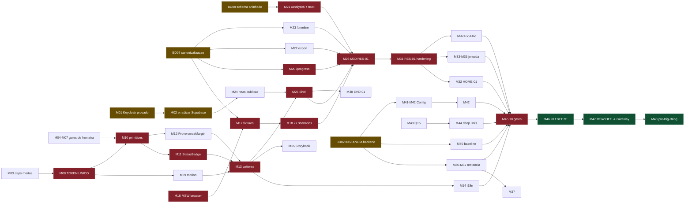

# FRONT V1 — IMPLEMENTATION PLAN

> **Autoridade de EXECUÇÃO.** Ordem, missões, gates e Definition of Done. Não redefine produto
> (→ `PRODUCT-EXPERIENCE-FREEZE-V1.md`), visual (→ `FRONT-DESIGN-SYSTEM-CONSTITUTION.md`), mapa
> (→ `EXPERIENCE-BLUEPRINT-V1.md`) nem engenharia (→ `FRONT-ARCHITECTURE-AND-MOCK-CONTRACT.md`).
>
> **Roteador:** `INDICE-DE-AUTORIDADE-V1.md` · **Base:** `0deeac3`
>
> **Só planejamento.** Nenhuma linha implementada nesta missão.

---

## 0. Decisões do owner incorporadas

| # | decisão | efeito no plano |
|---|---|---|
| 1 | **Tema:** D23 permanece. Light/Dark **fora** da V1. P31 futura | D37 vira `2 idiomas × 1 tema × 2 breakpoints` = **4 combinações**. `next-themes` **sai**. Token único continua — vale por si |
| 2 | **`/` pertence à landing/site público.** Home autenticada permanece em `/home` | **B11 RESOLVIDO.** O Shell pode congelar. `/home/welcome` (duplicata sem diferença) sai |
| 3 | **Instância:** delta **autorizado** como requisito da V1, em **missão backend própria** com contrato/testes/freeze próprios. Não reabre Ondas 1–8 | **B3 autorizado.** Vira `BD02`, e as superfícies dependentes destravam **só após o freeze dela** |
| 4 | **Patches de contrato do WS-A:** autorizados como **missões técnicas explícitas** | **B9 tem caminho.** Viram `BD07` e `BD08` — nunca alteração silenciosa |
| 5 | **Supabase Auth:** erradicação **obrigatória**; cada fluxo **substituído/provado no Keycloak antes** de remover o equivalente | **B6 autorizado**, e a ordem é lei: `M03` (prova) **antes** de `M04` (remoção) |

**Continuam sem autorização:** nada. Os cinco pontos que dependiam do owner foram decididos.
**Permanece proposta:** P31.

---

## 1. Estrutura: 17 fases, 46 missões

| fase | nome | missões | fecha com |
|---|---|---|---|
| **0** | Higiene e segurança | M01–M07 · BD07 · BD08 | árvore sem dívida silenciosa |
| **1** | Fundação do Design System | M08–M15 | primitive+pattern provados |
| **2** | Arquitetura de mock | M16–M19 | 27 scenarios por nome |
| **3** | Clientes públicos faltantes | M20–M23 | B1 fechado |
| **4** | Shell e navegação | M24–M25 | IA pública congelada |
| **5** | Resultado (crash test) | M26–M31 | RES-01 nos 18 gates |
| **6** | Home operacional | M32 | HOME-01 aprovada |
| **7** | Jornada de análise | M33–M35 | jornada REAL completa |
| **8** | Backend delta de Instância | BD02 | freeze próprio |
| **9** | Instância | M36–M37 | INST navegável |
| **10** | Evolução | M38–M40 | comparação canônica |
| **11** | Configurações | M41–M42 | ownership de D22 |
| **12** | Comunicação / re-entry | M43–M44 | deep links corretos |
| **13** | Hardening | M45 | 18 gates verdes |
| **14** | **UI EXPERIENCE FREEZE** | M46 | 🏁 marco |
| **15** | Integração | M47 | 🏁 MSW OFF |
| **16** | Pre-Big-Bang | M48 | 🏁 evidência final |

**Deltas de backend, cada um com contrato/testes/freeze próprios:** `BD01` mapping bridge ·
`BD02` Instância · `BD03` `recommendation_id` · `BD04` preferências · `BD05` `prepared` lifecycle ·
`BD06` exclusão de análise · `BD07` canonicalização de contrato · `BD08` schema aninhado do
Analytics · `BD09` resolução de destinatário (**condicional** à prova de Q15).

**Total: 46 missões de front + 9 de backend = 55.**

---

# FASE 0 — Higiene e segurança

> **Gate de saída:** nenhuma dívida silenciosa na árvore. Todo gate de fronteira falha por mutação.

### BD07 · Canonicalização dos contratos (C1 + C2)
- **Objetivo:** eliminar a ambiguidade física entre as três representações do contrato.
- **Existe porque:** hoje `sentinela-facts` tem 11 operações e `sentinela` tem 6 com a **mesma
  `version`**, e `/v1/me` está implementado mas fora de `operations[]`.
- **Pré:** autorização do owner (decisão 4 — ✅). **Depende de:** nada. **Paraleliza com:** tudo.
- **Escopo:** (a) acrescentar `{"method":"GET","operationId":"get_me","path":"/v1/me","required_headers":[],"required_query":[],"success_status":[200]}` em `operations[]`; (b) alinhar o mirror **ou** declará-lo snapshot histórico com `version` própria.
- **Fora:** qualquer mudança de comportamento do Gateway. É manifesto, não código.
- **Repos:** `sentinela-facts`, `sentinela`. **Contratos:** `public-v1.json`.
- **Superfícies:** nenhuma. **Componentes:** nenhum. **Scenarios:** nenhum.
- **Testes/Gates:** `contract-authority` passa a resolver por `candidata-unica` **ou**
  `candidatas-identicas`, **sem** `SENTINELA_CONTRACT_ORIGIN`. `contract-operations`:
  `extra_in_front` fica **vazio**, e `SEM_ENTRADA_NO_CONTRATO` é **esvaziado** no mesmo commit.
- **DoD:** o gate de autoridade fica verde **sem env var**. **Evidência:** digests iguais ou
  candidata única, no log do gate.
- **Blocker:** **B9** (parte documental). **Autorização backend:** ✅ decisão 4.

### BD08 · Publicação do schema aninhado do Analytics (C5)
- **Objetivo:** o produtor publicar canonicamente a superfície de `snapshot`.
- **Existe porque:** hoje o gate `contract-nested` compara o front com **modelos Pydantic de outro
  repo**. Funciona, e atravessa fronteira que não deveria atravessar.
- **Pré:** BD07 fechado (ordem, não dependência técnica). **Paraleliza com:** Fase 1.
- **Escopo:** publicar `analytics-snapshot-v*.json` em `docs/contracts/` do Analytics, derivado dos
  modelos existentes. **Fora:** mudar qualquer campo. É publicação, não redesenho.
- **Repos:** `sentinela-analytics-service`. **Superfícies/Componentes/Scenarios:** nenhum.
- **Testes/Gates:** `contract-nested` passa a ler o JSON publicado; a prova de mutação nº 4
  (remover campo aninhado) precisa continuar matando.
- **DoD:** `nestedProjection.ts` não importa mais `.py`. **Evidência:** mutação 4 re-executada.
- **Blocker:** **B9** (parte técnica). **Autorização:** ✅ decisão 4.

### M01 · Cadeia Keycloak provada (pré-erradicação) — CONCLUIDA
- **Objetivo:** provar que Keycloak cobre **login, recuperação e callback** antes de remover
  qualquer equivalente Supabase.
- **Existe porque:** `/login` e `/forgot-password` são caminho de autenticação **real**. Remover
  sem substituto tira o acesso de quem entra por ali.
- **Pré:** autorização (decisão 5 — ✅). **Depende de:** nada. **Paraleliza com:** BD07, BD08.
- **Escopo:** provar os três fluxos contra Keycloak, com teste. **Fora:** remover Supabase.
- **Repos:** `sentinela-front-e1`. **Contratos:** `/v1/me` (membership autoritativa).
- **Superfícies:** AUTH-01, AUTH-02, AUTH-03. **Scenarios:** `session-expired`.
- **Testes/Gates:** teste de fluxo por rota; `me.test.ts` estendido.
- **DoD:** os três fluxos verdes **sem** Supabase no caminho. **Evidência:** log do teste.
- **Entregue:** `src/lib/auth/keycloak-cadeia.test.tsx` — 8 casos, **3/3 mutações**. Espião que
  registra **qualquer** acesso a `supabase.auth` (Proxy), não só os métodos hoje chamados.
- 🔎 **Corrigido durante a execução:** a tela de login sob Keycloak é **híbrida** — vive na SPA
  com os botões sociais e o "Continue with email", e só a **senha** é digitada no provedor. Meus
  primeiros casos esperavam redirect ao montar e falharam; a leitura errada era minha. Não
  contraria D19, que trata de credencial.
- 🔴 **Duas pré-condições para a M02, descobertas aqui:**
  1. **o módulo ainda está no caminho.** `lib/auth/index.ts` importa `@/lib/supabase`
     **estaticamente**, e as três páginas também. Nenhuma **função** é chamada sob Keycloak —
     isso está provado — mas o módulo é avaliado no carregamento. Remover o import é M02.
  2. **a recuperação depende de configuração de realm.** `startPasswordReset()` redireciona para a
     tela hospedada do Keycloak, que só oferece "esqueci a senha" com `resetPasswordAllowed`
     ligado. O front não consegue provar isso. **A M02 não pode remover `/forgot-password` antes
     de essa configuração ser verificada no realm**, sob pena de a recuperação sumir em silêncio.
- **Blocker:** **B6** (metade). **Autorização:** ✅ decisão 5.

### M02 · Erradicação do Supabase Auth — CONCLUIDA
- **Objetivo:** zero `@supabase/*` no `src/`, zero rota dependente, dependência fora do `package.json`.
- **Existe porque:** Supabase está **aposentado** por decisão arquitetural e o resíduo continua
  roteado.
- **Pré:** 🔴 **M01 fechada** — ordem obrigatória (decisão 5). **Paraleliza com:** M03–M07.
- **Escopo:** remover `lib/supabase`, reescrever `LoginPage`/`ForgotPasswordPage`, remover a
  dependência. **Fora:** redesenhar as telas (isso é Fase 4).
- **Repos:** `sentinela-front-e1`. **Superfícies:** AUTH-01, AUTH-03, AUTH-06.
- **Testes/Gates:** **gate por AST** que falha se `@supabase/*` reaparecer — grep não prova
  ausência.
- **DoD:** gate AST verde + suíte verde. **Evidência:** mutação que reintroduz o import → vermelho.
- **Blocker:** **B6 FECHADO no front.** Zero import, zero `supabase.auth`, pacote removido,
  Keycloak como único provider. 4/4 mutações.
- 🔴 **Release gate SEPARADO, ainda aberto:** antes de deploy sem Supabase Auth em ambiente já
  provisionado, provar **no realm em execução** `resetPasswordAllowed=true` + SMTP funcional. O
  JSON versionado **não basta** — `--import-realm` não reimporta realm existente.

### M03 · Remoção de dependências e arquivos mortos
- **Objetivo:** tirar peso e superfície sem dono.
- **Existe porque:** `sonner`, `jspdf`, `tailwindcss-animate` e `next-themes` têm **zero uso**;
  `src/index.css` e `src/App.css` **não são importados por ninguém** — e um deles guarda a única
  regra `.dark` do repo, que é fantasma.
- **Pré:** nenhuma. **Paraleliza com:** M02, M04–M07.
- **Escopo:** remover os pacotes sem uso e os dois CSS mortos. **`next-themes` sai** — decisão 1
  tirou tema da V1. **Fora:** tocar `tokens.css`/`globals.css` (isso é M08).
- 🔴 **Corrigido na execução:** eram **três** pacotes, não quatro. `tailwindcss-animate` **fica** —
  é **plugin** em `tailwind.config.ts:98`, e 5 componentes Radix vivos consomem suas classes. A
  auditoria da Design 0 mediu importação de módulo, que ele não tem, e concluiu "zero uso".
- **Repos:** `sentinela-front-e1`. **Superfícies:** nenhuma.
- **Testes/Gates:** build + suíte + gate de "arquivo CSS órfão".
- **DoD:** `package.json` sem os quatro; nenhum CSS não importado. **Evidência:** diff + build.
- **Blocker:** nenhum. Higiene.

### ✅ M04 · Gate de fronteira: DS não conhece domínio nem query — **CONCLUÍDA**
- **Escopo:** gate AST — `src/design/**` não pode conter `analysis|instance|workspace` nem importar
  `@tanstack/react-query`.
- **Pré:** nenhuma (o gate pode nascer antes da pasta). **Paraleliza com:** M02, M03, M05–M07.
- **Testes/Gates:** o próprio. **DoD:** mutação (escrever `analysis` em `src/design/**`) → vermelho.
- **Evidência:** `fronteiraDoDesign.ts` (AST via API do TypeScript, zero dependência nova) +
  `design-boundary.test.ts`. **4/4 mutações** mataram o caso esperado, com controle verde antes:
  domínio no DS · import de query · import na camada TOKENS · **apagar `src/design/`**.
- ⚠️ **Acrescentado ao previsto, com motivo:** a pasta tem **zero arquivos `.ts`**, então varrê-la
  passaria por vacuidade. O analisador foi separado do teste e provado contra fontes sintéticas —
  cada regra com um caso que pega e um vizinho que **não** pode pegar — e o gate reprova se a
  pasta desaparecer. Sem isso, o gate nasceria verde por não ter olhado nada.
- **Blocker:** prepara Fase 1.

### M05 · Gate de fronteira: mock não vaza
- **Escopo:** import graph — `src/mocks/**` só importável por `src/mocks/**`, `src/test/**`,
  `*.stories.tsx` e bootstrap de dev; identificadores `mock|fixture|scenario|MSW` proibidos em
  `features/**/ui/**` e `design/**`, **por AST**.
- **Pré:** nenhuma. **Paraleliza com:** M02–M07.
- **DoD:** mutação (importar `src/mocks` de um componente) → vermelho. **Blocker:** prepara Fase 2.

### M06 · Gate de fronteira: biblioteca externa não é API pública de página
- **Escopo:** `@radix-ui/*`, `recharts`, `motion` só importáveis dentro de `src/design/**`.
- **Pré:** nenhuma. **Paraleliza com:** M02–M07.
- **DoD:** mutação (importar Radix em `features/**/ui/**`) → vermelho.

### M07 · Gate anti-monólito ativo
- **Objetivo:** transformar a regra literal em gate.
- **Existe porque:** *"acima de 1.000 linhas bloqueia fechamento"* é regra da casa, e
  `LandingPage` (1.215) e `AionPage` (1.180) a violam **hoje**.
- **Escopo:** gate com **baseline declarada** dos dois arquivos — novo arquivo acima de 1.000 falha,
  e **os dois só podem encolher**. **Fora:** decompor (D17: missão própria).
- **DoD:** gate verde com baseline; mutação (crescer 1 linha em `LandingPage`) → vermelho.
- **Blocker:** transforma dívida invisível em dívida medida.

---

# FASE 1 — Fundação do Design System

> **Gate de saída (Foundation → Surface):** um vocabulário de token existe e a duplicidade falha
> por mutação; **um primitive** (`StatusBadge`) e **um pattern** (`ProvenanceMargin`) provados nas
> **4 combinações** de D37; tokens de motion existem com reduced motion.
> **Sem Light/Dark** (decisão 1).

### ✅ M08 · Vocabulário único de tokens, nomeado por papel — **CONCLUÍDA**
- **Objetivo:** três vocabulários → **um**, com nomes por papel (V3/A2).
- **Existe porque:** `tokens.css` fala `--color-*` em hex, `globals.css` fala shadcn/HSL, e
  `--background`/`--primary` estão definidos **duas vezes com valores diferentes** (colisão
  adormecida, hoje inerte só porque um arquivo está morto).
- **Pré:** M03 (CSS mortos removidos). **Paraleliza com:** M09, M12.
- **Escopo:** `src/design/tokens/`; `surface-base|raised|overlay`, `text-primary|secondary|muted`,
  `border-default|strong`, `accent`, semânticos, `state-*`, `chart-*`; alinhar `tailwind.config`.
  **Fora:** segundo tema (decisão 1); `color-scheme` fica, com **um** valor.
- **Repos:** `sentinela-front-e1`. **Superfícies:** todas (transversal).
- **Testes/Gates:** um só namespace no `:root`; **zero `#hex` em componente**; **nome × valor**
  (apontar `--success` para azul falha).
- **DoD:** mutação que reintroduz `--background` num segundo arquivo → **vermelho**.
- **Evidência:** 3/3 mutações mataram o gate esperado; **zero regressão visual provada** — 32 dos
  34 tokens legados resolvem valor idêntico e **todas as regras de pintura são byte-idênticas**
  (42535 = 42535). Os 2 que mudaram são `--critical`/`--critical-foreground`, removidos por terem
  **0 consumidores**. **Blocker: R1 fechado.**
- ⚠️ **Corrigido na execução:** o escopo previa tratar a colisão `--background`/`--primary`, mas a
  M03 já a eliminara ao apagar `index.css` — os dois arquivos vivos tinham **zero** nome em comum.
  A colisão real era outra e mais perigosa: `--accent` significa **superfície** no shadcn e **cor
  de ação** na Constituição. Resolvida por namespace `--ds-`.

### M09 · Tokens de motion + reduced motion
- **Escopo:** 5 durações, 4 curvas, `spring-direct`; tabela de reduced motion que **preserva a
  informação e remove o deslocamento**. **Fora:** instalar Motion for React (Fase 5, se necessário).
- **Pré:** M08. **Paraleliza com:** M10, M12.
- **Testes/Gates:** nenhum timing fora dos tokens; `prefers-reduced-motion` provado por teste.
- **DoD:** mutação (timing literal em componente) → vermelho.

### ✅ M10 · Primitives — **CONCLUÍDA**
- **Escopo:** `src/design/primitives/` — promover `analytics/primitivas.tsx` (a barra) e criar
  `Button`, `Chip`, `Text`, `Stack`, `Field`, `Disclosure`, `Table`, `Icon`. **Fora:** migração em
  massa do legado.
- **Pré:** M08, M04. **Paraleliza com:** M12, M13.
- **Testes/Gates:** M04 ativo; nenhum primitive conhece domínio.
- **DoD:** cada primitive nas **4 combinações**; `axe` limpo.
- **Entregue:** 9 primitives — `Bar`, `DefinitionGrid`, `Note`, `Panel` (promovidos, com os 4
  consumidores migrados) e `Chip`, `Stack`, `Text`, `Icon`, `Disclosure` (novos). 53 casos, 44
  deles cobrindo as 4 combinações com `axe`.
- ⚠️ **Três divergências, todas registradas:**
  1. **`Button`, `Field` e `Table` NÃO foram criados.** `components/ui/button` tem **27
     consumidores**, e `input`/`label` têm 6 cada — criar segundas versões produziria no nível de
     componente exatamente o defeito que a M08 matou no nível do token. Convergem quando forem
     tocados por missão própria, não por cópia. `Table` fica para o pattern `DataTable` (M13):
     primitive sem consumidor é API especulativa.
  2. **A barra importava `useLanguage`** e por isso não era primitive — o gate da M04 a reprovaria.
     O rótulo do caso suprimido virou **prop**, preenchida pela camada de produto, que é quem
     conhece o vocabulário congelado.
  3. **`Icon` nasceu como dois componentes** (`IconeInformativo`/`IconeDecorativo`) em vez de um
     com flag: ícone informativo sem nome acessível é informação que o leitor de tela não recebe, e
     ícone decorativo anunciado é ruído. Sem default — quem usa escolhe.

### M11 · `StatusBadge` — semântica única de estados — CONCLUIDA
- **Objetivo:** **um** componente para os **dois** vocabulários (análise e eixos).
- **Existe porque:** é a defesa contra `HomeStatus`/`InstanceStatus`/`AnalysisStatus` com três
  linguagens para o mesmo estado — o critério 17 de UI COMPLETE.
- **Pré:** M08, M10. **Paraleliza com:** M12, M14.
- **Escopo:** variantes **explícitas** (não modo por string); V6 obrigatório — cor **+** forma/ícone
  **+** rótulo. **Fora:** ler backend.
- **Superfícies:** HOME-01, AN-02/03/04, RES-01, EVO-01, INST-01/03.
- **Testes/Gates:** cobre `preparing receiving queued running recovering needs_mapping completed
  failed` **e** os 4 eixos; prova em **escala de cinza** e sob **deuteranopia**.
- **DoD:** as 4 combinações + as duas provas de canal. **Evidência:** mutação (remover o ícone,
  deixar só cor) → vermelho.
- **Entregue:** `src/design/patterns/` com `estados.ts` (a **única** tradução estado→aparência,
  cobrindo os **8** estados públicos e os **10** de eixo) e `StatusBadge.tsx`. 36 casos, 4/4
  mutações. **Nenhum token novo** — os 18 estados usam 4 tons já existentes.
- **Três achados da execução:** (1) o gate da M04 reprovou meus tipos batizados a partir de objeto
  de domínio, com razão — renomeados para o vocabulário do contrato, sem exceção; (2) o teste de V6
  achou três colisões no meu próprio mapa, resolvidas com as formas `reservado`, `recebendo` e
  `montando`; (3) `success` × `warning` medem 1,14:1 — registrado como aberto.
- **Blocker:** habilita critério **17**.

### M12 · `ProvenanceMargin` — a assinatura
- **Objetivo:** o pattern `valor → procedência acessível` (V9 + A3).
- **Pré:** M08, M10. **Paraleliza com:** M11, M13.
- **Escopo:** desktop persistente; abaixo de tablet **disclosure presa ao dado**;
  `<button aria-expanded>` + `aria-controls`; alvo ≥ 44×44. **Fora:** decidir *quais* campos de
  trust aparecem (isso é M22/M28).
- **Testes/Gates:** **nunca** some no mobile; **nunca** só hover; teclado ponta a ponta.
- **DoD:** as 4 combinações + prova mobile sem hover.

### M13 · Patterns fundamentais — CONCLUIDA
- **Escopo:** `EmptyState`, `ErrorState`, `LoadingState`, `ProgressiveState`, `ActionRequired`,
  `ConfirmDestructive`, `DataTable`, `ComparisonRow`, `Toolbar`.
- **Pré:** M10, M11. **Paraleliza com:** Fase 2.
- **Testes/Gates:** `ErrorState` cobre os 9 `problem_codes`; `ProgressiveState` **nunca** inventa
  percentual agregado; `ConfirmDestructive` exige **correspondência exata**.
- **DoD:** cada pattern nas 4 combinações.
- **Entregue:** os 9 patterns em `src/design/patterns/`. 71 casos, **4/4 mutações**. Nenhum token
  novo: `chart-*`, `info` e `border-strong` seguem sem valor, sem consumidor.
- **Garantias que viraram estrutura, não convenção:** `ErrorState` **lança** se declarar ação sem
  botão · `Toolbar` **lança** se houver secundárias sem menu mobile · `ConfirmDestructive` compara
  **estritamente** (nem `trim`, nem caixa, nem acento) · `ProgressiveState` não tem prop de total
  · `DataTable` renderiza as **mesmas** colunas nas duas formas.
- ⚠️ **Divergências:** (1) `EmptyState`, `ErrorState`, `LoadingState` e `ConfirmDestructive` já
  tinham equivalentes legados em `src/shared/` com **15 consumidores**. Não migrei (seria migração
  em massa) e não dupliquei em silêncio: o canônico passou a ser `src/design/patterns/`, e um gate
  **congela a contagem** do legado para que tela nova não nasça no vocabulário antigo.
  (2) `ActionRequired` e `ComparisonRow` nasceram com **duas formas explícitas** cada — com e sem
  operação, comparável e quebrada — porque a diferença não é de aparência: no caso quebrado o delta
  **não existe**, e uma prop booleana convidaria a passar `null` e mostrar zero.

### M14 · i18n — infraestrutura e paridade
- **Escopo:** gate de **paridade `pt.json` × `en.json`** (hoje 506/506, quebra em silêncio); gate de
  texto hardcoded; orçamento de **+30 %** verificado nos patterns.
- **Pré:** M13. **Paraleliza com:** M15.
- **DoD:** mutação (remover uma chave de `en.json`) → vermelho. **Blocker:** critério **18**.

### M15 · Storybook + infraestrutura visual
- **Escopo:** Storybook consumindo **`scenarios/`**; story **não pode declarar dado inline**.
  Baseline de visual regression. **Fora:** colocar visual regression em gate (só depois de uma
  mutação de token o fazer falhar).
- **Pré:** M13, M16. **Paraleliza com:** Fase 3.
- **DoD:** toda story escolhe um cenário; nenhuma declara payload.

---

# FASE 2 — Arquitetura de mock

> **Gate de saída (Mock → UI):** os **27 scenarios não bloqueados** reproduzíveis **por nome**,
> toda fixture validando contra o **schema publicado**, e nenhuma UI conhecendo mock.

### M16 · MSW no browser
- **Existe porque:** `package.json` declara `msw.workerDirectory` e o **worker nunca é montado**.
  A arquitetura exige `MSW OFF → Gateway` sem tocar em componente.
- **Escopo:** `src/mocks/browser.ts` + `node.ts`; ligado **por env**, nunca por código de UI.
- **Pré:** M05. **Paraleliza com:** Fase 1 tardia.
- **DoD:** trocar mock↔real muda **uma variável**, zero arquivo de UI. **Blocker:** B10-front.

### M17 · Fixtures presas ao schema publicado
- **Existe porque:** é a barreira que mata em silêncio — o contrato evolui, a fixture não, e a
  suíte segue verde porque testa a fixture contra ela mesma.
- **Escopo:** fixtures **derivadas** do schema publicado; gate que compara o digest do schema
  consumido com o do contrato.
- **Pré:** M16, BD07. **DoD:** mutação (remover campo obrigatório da fixture) → vermelho.

### M18 · Catálogo dos 27 scenarios
- **Escopo:** os 32 do Blueprint **menos os 4 bloqueados** (`instance-empty`,
  `recommendation-persisted`, `no-baseline`, `baseline-active`) e menos o parcial
  (`needs-mapping`, que entra só como **exibição**). **Nenhuma fixture inventada** para os bloqueados.
- **Pré:** M17. **DoD:** cada scenario invocável por nome; os 4 bloqueados **falham explicitamente**
  com a razão.

### M19 · Gates de import do mock
- **Escopo:** ativar M05 contra a árvore real de `src/mocks/`. **DoD:** mutação → vermelho.

---

# FASE 3 — Clientes públicos faltantes

> **Gate de saída:** `missing_in_front` **vazio** e `SEM_CLIENTE_NO_FRONT` **esvaziada no mesmo
> commit**. B1 fechado.

### M20 · Cliente `/progress`
- **Escopo:** cliente + tipos dos **4 eixos** com seus vocabulários próprios; query key
  tenant-scoped. **Fora:** qualquer agregação — **nunca** um percentual único.
- **Pré:** BD07. **Paraleliza com:** M21–M23.
- **Superfícies:** AN-03, HOME-01, RES-01. **Scenarios:** 7–10, 13–15, 17–19.
- **DoD:** `contract-operations` deixa de listar a operação; `contract-sync` cobre os 4 eixos.

### M21 · Cliente `/analytics` + leitura de trust
- **Escopo:** cliente + `component_status`, `snapshot`, `withheld`; **passa a ler** `method_id`,
  `method_version`, `method_parameters`, `method_definition_digest`, `privacy_policy_version`,
  `top_k`, `max_tracked_categories`, `max_tracked_values`, `max_time_buckets`,
  `series_contract_version`, e **`min_group_size` em Concentração e Série** (hoje lido só em
  Distribuição). **Fora:** qualquer cálculo analítico novo.
- **Pré:** BD08. **Paraleliza com:** M20, M22, M23.
- **DoD:** `PUBLICADO_E_NAO_LIDO` reduzida aos **deliberados**; `lido_sem_publicacao` continua zero.
- **Blocker:** fecha a faixa "contratado e não consumido" do Trust.

### M22 · Cliente `/analytics/export/download`
- **Escopo:** download + estados do eixo `export`; `expired` ≠ `purged`. **Fora:** gerar export.
- **Pré:** BD07. **Scenarios:** 17–19. **DoD:** operação sai do `missing_in_front`.

### M23 · Cliente `/timeline`
- **Escopo:** leitura dos eventos duráveis (`public-events-v1`); **não remontar** do estado atual —
  remontar produz uma história plausível em vez da que aconteceu, e as duas divergem no caso
  interessante. **Sem percentual.**
- **Pré:** BD07. **DoD:** operação sai do `missing_in_front`; **B1 fechado**.

---

# FASE 4 — Shell e navegação

> **Gate de saída:** IA pública congelada; todo deep link resolve; `/canonical/*` só redireciona.

### M24 · Rotas públicas e redirects — ✅ EXECUTADA
> **Estado:** executada. Gate: `src/test/v1/rotas-publicas.test.tsx` (17 casos, 5 mutações mortas).
> **B11 fechado.** `/canonical/*` e `/home/welcome` sobrevivem **só** como redirect: saem como
> destino, não como endereço. 404 numa URL que já circulou é defeito que só aparece para quem
> não está por perto para reclamar.

- **Escopo:** `/analyses`, `/analyses/new`, `/analyses/:id`, `/analyses/:id/result`,
  `#comparison`; `/canonical/*` → redirect permanente; remover `/home/welcome` (duplicata).
  **`/` permanece landing pública e `/home` permanece a Home autenticada** (decisão 2).
- **Pré:** M02. **Paraleliza com:** M25.
- **Testes/Gates:** gate que proíbe `canonical` em rota **nova**; todo deep link do Blueprint resolve.
- **DoD:** nenhuma rota pública nova carrega nome de camada interna. **Blocker:** **B11 fechado**.

### M25 · Shell, workspace context e menu do usuário
- **Escopo:** navegação principal, seletor de Workspace (escopo **sempre visível**), menu do usuário
  com link externo de conta (D19), `color-scheme` no `<html>` com **um** valor.
- **Pré:** M13, M24. **Contratos:** `GET /v1/me` (**única** autoridade de membership).
- **Testes/Gates:** troca de workspace **invalida o cache por construção** (`workspaceKeys.root`);
  `role` governa o que aparece e **nunca vira rótulo** (D3).
- **DoD:** 4 combinações + teclado; resposta tardia do workspace antigo **não contamina** o novo.

---

# FASE 5 — Resultado (o crash test)

> RES-01 é a primeira superfície porque tensiona **tudo**: DS, analytics, trust, estados,
> comparação, export, responsive, i18n, motion, data viz — e é a única que já tem contrato,
> adapter, validador e Gateway provados.
>
> **Gate de saída:** RES-01 passa nos **18 critérios** sozinha.

### M26 · RES-01 — composição, atenção e indicadores
- **Escopo:** página que **compõe**; nenhuma interpretação de payload bruto; "o que merece atenção"
  por ordenação (sem recálculo); `IndicatorCard` com `ProvenanceMargin`.
- **Pré:** M11, M12, M13, M21. **Superfícies:** RES-01. **Scenarios:** 16, 30.
- **DoD:** v1 e v2 discriminados por `result_schema_version`; **sem fallback silencioso**.

### M27 · RES-01 — analytics, partial/withheld e qualidade
- **Escopo:** `AnalyticsBlock` por união discriminada; `PrivacyNotice` com
  `{applied, output_count, reason_code}`; as **contagens A/B/C**; `withheld` **some da escala**,
  nunca vira 0.
- **Pré:** M21, M26. **Scenarios:** 11, 12, 23.
- **DoD:** `partial` ≠ falha e `withheld` ≠ zero, provados por asserção separada.

### M28 · RES-01 — Trust e timeline
- **Escopo:** superfície de procedência com os **11 elementos**; `ProvenancePopover`; timeline lida
  do `/timeline`. **Fora:** qualquer "trust score" — não existe e não se inventa.
- **Pré:** M21, M23, M12. **DoD:** cada elemento exibido tem origem canônica apontável.

### M29 · RES-01 — export
- **Escopo:** um botão **por estado** do eixo, não um botão que mente. **Pré:** M22.
- **Scenarios:** 17–19. **DoD:** `expired` oferece o caminho certo, sem prometer o que não há.

### M30 · RES-01 — comparação com a anterior
- **Escopo:** resumo *"esta vs. imediatamente anterior"*; pareamento **só por `indicator.id`**;
  **quebra de `indicator_registry_version` interrompe a comparabilidade** com descontinuidade
  explícita. **Fora:** série de Instância (Fase 10).
- **Pré:** M26. **Scenarios:** 20, 21. **DoD:** a quebra **nunca** vira aumento ou queda.

### M31 · RES-01 — hardening
- **Escopo:** responsive (§8 do DS), PT/EN, `axe`, teclado, `/design-critique`,
  `/ux-heuristics` ≥ 8, `/ux-copy`. **DoD:** os 18 critérios **nesta superfície**.
- **Evidência:** relatório por critério. **Gate de fase: Fase 5 → 6.**

---

# FASE 6 — Home operacional

### M32 · HOME-01
- **Escopo:** as 4 regiões de D9 — ações necessárias, em andamento, Instâncias, resultados
  recentes — mais empty/loading/error **distintos**. A região de Instâncias fica **inalcançável**
  até BD02 (não meio-construída).
- **Pré:** M25, M20, M31. **Superfícies:** HOME-01. **Scenarios:** 1, 6, 7–10, 16, 26–29, 32.
- **DoD:** 18 critérios; a Home responde *"o que precisa de mim"*, não *"quantos temos"*.

---

# FASE 7 — Jornada de análise

### M33 · AN-01 — nova análise, upload e erros
- **Escopo:** `prepare → data → submit`; upload inválido, falha de rede, `idempotency_conflict`.
  **Fora:** cancelar (D15 — fora da V1, e nenhum CTA pode sugerir).
- **Pré:** M25, M13. **Scenarios:** 3, 4, 5, 31.

### M34 · AN-03 — processamento, recovery e disponibilidade progressiva
- **Escopo:** 4 eixos lado a lado; `recovering` ≠ falha; **analytics aparece com `ready|partial`
  mesmo com `final_result` pendente** (D13) — e isso **não** se chama "resultado parcial".
- **Pré:** M20, M33. **Scenarios:** 7–10, 29.

### M35 · AN-04 — falhas terminais
- **Escopo:** `retry` só quando `retry_allowed`; `non_retryable_failure` **sem** "tentar novamente";
  `capacity_wait` com espera. **Pré:** M33. **Scenarios:** 13–15, 29.
- 🔴 **AN-02 (`needs_mapping`) fica INACESSÍVEL** até `BD01`. Exibir sim, **agir não** — CTA sem
  operação é o erro que custou D21.

---

# FASE 8 — Backend delta de Instância

### BD02 · Instância (missão backend própria)
- **Objetivo:** o nível `Instância` existir no contrato, com contrato/testes/**freeze próprios**.
- **Existe porque:** o Gateway hoje executa `del project_id, environment_id`; sem isso não há
  identidade entre execuções (camada 2 de longitudinalidade).
- **Pré:** ✅ decisão 3. **Não reabre Ondas 1–8.** **Paraleliza com:** Fases 5–7.
- **Critérios mínimos congelados:** `create`/`list`/`get` Instance · Analysis **associada** à
  Instance · associação **persistida** · read models recuperam o contexto · histórico e listagem
  **por Instance** · timeline e deep link · **refresh preserva o contexto**.
- **DoD:** freeze próprio, com E2E por processos reais. **Blocker:** **B3**.
- **Gate:** nenhuma superfície da Fase 9 abre antes do freeze desta.

---

# FASE 9 — Instância

### M36 · INST-01/02/03 — visão, estado e histórico
- **Pré:** 🔴 **BD02 congelada.** **Scenarios:** 2 (destravado por BD02).
### M37 · INST-04/07 — nova análise contextual e configuração
- **Pré:** M36. **Escopo:** pré-preencher escopo; configuração contextual (D22).

---

# FASE 10 — Evolução

### M38 · EVO-01 — histórico cronológico
- **Pré:** M25. **Paraleliza com:** Fase 5. **Scenarios:** 32. É a superfície mais barata do plano.
### M39 · EVO-02 — comparação A×B e quebra de comparabilidade
- **Pré:** M30, M38. **Escopo:** **uma** regra canônica compartilhada com RES-01 (D29).
  **Scenarios:** 20, 21.
### M40 · EVO-03 — baseline explícito
- **Pré:** 🔴 **BD02.** **Escopo:** marcar/substituir/remover; **nunca muda em silêncio**; baseline
  ativo **bloqueia exclusão**. **Scenarios:** 24, 25 (destravados).

> **Recomendação longitudinal só após `BD03`.** Sem `recommendation_id` no documento canônico,
> **nenhuma afirmação** de persistiu/apareceu/sumiu. **Delta ≠ drift**, e drift continua fora.

---

# FASE 11 — Configurações

### M41 · CFG-01/02 — conta e idioma
- **Pré:** 🔴 **BD04** (contrato de preferências). **Escopo:** leitura de `/v1/me`; alteração de
  credencial **delegada** ao provedor (D19); idioma. **Tema não entra** (decisão 1).
### M42 · CFG-03/04 — Workspace e Instância
- **Pré:** 🔴 **BD02** e BD04. **Escopo:** ownership de D22. Ações destrutivas **só** quando
  suportadas — `ConfirmDestructive` exige digitar o nome da Instância (D28).

---

# FASE 12 — Comunicação e re-entry

### M43 · Q15 — prova da cadeia do destinatário
- **Objetivo:** provar `Workspace owner → identidade → e-mail → Mensagem.destino`.
- **Existe porque:** `Mensagem.destino` **nasce vazio** e é preenchido fora do compositor.
- **DoD:** cadeia provada **ou** `BD09` aberta com o delta exato. **Blocker:** **B5**.
- **Regra:** **comunicação externa não pode ser declarada fechada** antes disto.
### M44 · Deep links e eventos suportados
- **Escopo:** corrigir o link do e-mail (hoje aponta para rota **inexistente**); mapear
  `analysis.completed`, `analysis.failed`, `result.available`. **Ação necessária, conclusão com
  restrição e export pronto entram só se o evento existir** — não se inventa evento para justificar
  CTA. **Pré:** M43, M24.

---

# FASE 13 — Hardening

### M45 · Os 18 gates de UI COMPLETE
Rodar sobre **todas** as superfícies REAL: superfícies navegáveis · 27 scenarios · nenhum dado
exclusivo do mock · todo CTA com operação **ou explicitamente bloqueado** · responsive · PT/EN ·
a11y · critique · heuristics ≥ 8 · copy · erro/vazio/carregando · visual regression (**só entra em
gate depois de uma mutação de token a fazer falhar**) · fronteiras · vocabulário interno ·
zero `#hex` · token único · **semântica única de estado** · paridade i18n.

---

# FASE 14 — 🏁 UI EXPERIENCE FREEZE

### M46 · UI EXPERIENCE FREEZE
**Ponto exato:** ao fim de M45, com **M46 registrando o marco**.
**Requisito:** Front inteiro da V1 **navegável e aprovado em modo mock**. Backend real **pode**
estar desconectado das jornadas que não precisam dele para validação visual.
**Não inclui:** superfícies bloqueadas por delta não congelado — elas ficam **inalcançáveis**, não
meio-construídas.
**Evidência:** relatório dos 18 critérios por superfície + HEADs congelados.

---

# FASE 15 — 🏁 Integração

### M47 · MSW OFF → Gateway ON
**Ponto exato de MSW OFF:** primeira ação de M47, **depois** de M46.
**Regra:** a troca **não altera nenhum componente ou página** — muda **uma variável de ambiente**.
Se algum arquivo de UI precisar mudar, a Fase 2 falhou e a integração **para**.
**Escopo:** contract parity (o gate de operações contra o Gateway **real**) + E2E por processos reais.
**DoD:** jornada canônica ponta a ponta contra Gateway real, com o corredor da MF6.4c.

---

# FASE 16 — 🏁 Pre-Big-Bang

### M48 · Pacote pré-Big-Bang
**Critérios:** B5 provado · B6 fechado · **B9 fechado fisicamente** (BD07+BD08) · lifecycle
(`prepared` expira — BD05) · segurança · **contract sync sem env var** · E2E · performance ·
acessibilidade · evidências · freeze final.
**Mais:** o blocker herdado do freeze global — **publicação do `sentinela-result-assembler`**, sem a
qual o Orchestrator não compõe o v2 e **não falha visivelmente** (o gatilho é fail-open).
**Ordem de rollout preservada:** Migrations → Assembler → **FRONTEND** → Analytics → Engine →
Dispatcher → **ORCHESTRATOR** → Gateway.

---

## 2. Deltas de backend — cada um com contrato, testes e freeze próprios

| id | delta | blocker | autorizado? | destrava |
|---|---|---|---|---|
| **BD01** | **Mapping public bridge** — expor `profile`+`mapping` no `/v1` e ligar `analysis_id ↔ ingestion_id`. **Não** é criar domínio: ele existe e é testado | B2 | ⏳ **falta autorizar** | AN-02 |
| **BD02** | **Instância** | B3 | ✅ decisão 3 | Fase 9, M40, M42 |
| **BD03** | **`recommendation_id`** no documento canônico | B4 | ⏳ falta autorizar | recomendação longitudinal |
| **BD04** | **Preferências** (idioma) | B7 | ⏳ falta autorizar | M41, M42 |
| **BD05** | **`prepared` lifecycle** — hoje **nunca expira** | B8 | ⏳ falta autorizar | M48 |
| **BD06** | **Exclusão de análise** (D28/D30) | B10 | ⏳ falta autorizar | ação destrutiva real |
| **BD07** | **Canonicalização de contrato** (C1+C2) | B9 | ✅ decisão 4 | Fase 3, M48 |
| **BD08** | **Schema aninhado do Analytics** (C5) | B9 | ✅ decisão 4 | M21 |
| **BD09** | **Resolução de destinatário** — **condicional** ao resultado de M43 | B5 | condicional | M44, M48 |

---

## 3. DAG de execução e critical path



### Critical path (vermelho)

```
BD07 -> M17 -> M18 -> M26 -> M31 -> M45 -> M46 -> M47 -> M48
        (com M08 -> M10 -> M11 -> M13 -> M25 entrando em M26,
         e M20/M21 como co-requisitos de M26)
```

**14 missões no caminho crítico.** O gargalo real é **M26–M31 (RES-01)**: tudo converge nela e nada
depois começa sem ela.

### O que corre em paralelo

| trilha | missões | independente de |
|---|---|---|
| **higiene** | M03, M04–M07 | tudo |
| **auth** | M01 → M02 | Fase 1 |
| **contrato backend** | BD07, BD08 | Fase 1 |
| **DS** | M08 → M09/M10 → M11/M12 → M13 → M14/M15 | Fases 2 e 3 |
| **mock** | M16 → M17 → M18 | Fase 1 (converge em M26) |
| **clientes** | M20, M21, M22, M23 — **os quatro em paralelo** | Fases 1 e 2 |
| **Instância backend** | BD02 | Fases 5, 6, 7 inteiras |
| **barata e cedo** | M38 (EVO-01) | Fase 5 |

**Não paralelizar:** M01 ∥ M02 (ordem é lei — decisão 5) · M08 com qualquer coisa que escreva token
· BD07 com M17 · duas missões que alterem a mesma autoridade documental.

---

## 4. Mapas

### Missão → blocker

| blocker | fecha em |
|---|---|
| **B1** | M20, M21, M22, **M23** |
| **B2** | BD01 (destrava AN-02) |
| **B3** | **BD02** |
| **B4** | BD03 |
| **B5** | **M43** (+ BD09 se a prova revelar delta) |
| **B6** | M01 → **M02** |
| **B7** | BD04 |
| **B8** | BD05 |
| **B9** | **BD07 + BD08** |
| **B10** | BD06 |
| **B11** | **M24** (decisão 2 já resolveu; M24 executa) |

### Missão → superfície

| superfície | missão |
|---|---|
| AUTH-01/02/03/04 | M01, M02, M25 |
| WS-01/03 | M25 · WS-02/04 → M42 |
| **HOME-01** | M32 |
| AN-01 | M33 · AN-03 → M34 · AN-04 → M35 · **AN-02 → bloqueada por BD01** |
| **RES-01** | M26–M31 |
| EVO-01 | M38 · EVO-02 → M39 · EVO-03 → M40 |
| INST-01…07 | M36, M37 (após BD02) |
| CFG-01/02 | M41 · CFG-03/04 → M42 |
| erros globais | M13 (`ErrorState`) + M25 |

### Missão → repo

| repo | missões |
|---|---|
| **`sentinela-front-e1`** | M01–M48 (46) |
| `sentinela-facts` | BD07, BD01(gateway), BD02(gateway) |
| `sentinela` | BD07 (mirror) |
| `sentinela-analytics-service` | BD08 |
| `sentinela-orchestrator` | BD02, BD03, BD04, BD05, BD06 |
| `sentinela-ingestion-service` | BD01 |
| `sentinela-result-assembler` | BD03 |
| `sentinela-event-dispatcher` | BD09 |

### Pontos exatos de autorização backend

| momento | o que autorizar | se não autorizar |
|---|---|---|
| **agora** | ✅ BD07, BD08, BD02 — já autorizados | — |
| **antes da Fase 7 fechar** | **BD01** | AN-02 fica inacessível na V1; a jornada tem um estado que informa e não age |
| **antes da Fase 10** | **BD03** | recomendação longitudinal sai da V1 (contradiz D27) |
| **antes da Fase 11** | **BD04** | CFG-02 sem operação; idioma vira preferência sem casa |
| **após M43** | **BD09**, se a prova revelar delta | comunicação externa não pode ser declarada fechada |
| **antes da Fase 16** | **BD05**, **BD06** | `prepared` acumula para sempre; D28 fica sem operação |

---

## 5. Definition of Done — por missão e por fase

### Padrão de DoD por missão (todas)

1. escopo entregue e **fora de escopo intocado**;
2. testes da missão verdes;
3. **gate próprio provado por mutação** — verde sem vermelho não fecha;
4. `npm run typecheck` (nunca `npx tsc` na raiz — verifica **zero** arquivos) e `lint` no baseline;
5. suíte `src/test/v1/` verde;
6. nenhuma fronteira de §17 violada;
7. commit com evidência citável;
8. dívida declarada **atualizada no mesmo commit** (as listas encolhem junto).

### Gates de fase

| passagem | gate objetivo |
|---|---|
| **0 → 1** | todo gate de fronteira falha por mutação; zero dependência morta; Supabase erradicado com gate AST |
| **1 → 2** | **um** vocabulário de token com mutação de duplicidade falhando; `StatusBadge` e `ProvenanceMargin` provados nas **4 combinações** + escala de cinza + daltonismo |
| **2 → 3** | 27 scenarios por nome; toda fixture validando contra o schema publicado; mutação de fixture → vermelho |
| **3 → 4** | `missing_in_front` **vazio**; `SEM_CLIENTE_NO_FRONT` esvaziada no mesmo commit |
| **4 → 5** | todo deep link resolve; nenhuma rota pública com nome de camada interna |
| **5 → 6** | **RES-01 passa nos 18 critérios sozinha** |
| **6 → 7** | HOME-01 nos 18 critérios |
| **7 → 9** | jornada REAL completa; AN-02 **inacessível e declarada**, não meio-feita |
| **8 → 9** | **freeze próprio de BD02**, com E2E por processos reais |
| **12 → 13** | Q15 provada **ou** BD09 aberta com delta exato |
| **13 → 14** | **os 18 critérios em todas as superfícies REAL** |
| **14 → 15** | UI FREEZE registrado; HEADs congelados |
| **15 → 16** | backend real + **contract parity** + E2E verdes |

---

## 6. Os três marcos, com o ponto exato

| marco | ponto exato | condição |
|---|---|---|
| 🏁 **UI EXPERIENCE FREEZE** | **fim de M45, registrado em M46** | Front V1 navegável e aprovado **em modo mock**; 18 critérios em todas as superfícies REAL; bloqueadas por delta ficam **inalcançáveis** |
| 🏁 **MSW OFF** | **primeira ação de M47**, após M46 | a troca **não altera nenhum componente ou página**. Se alterar, a Fase 2 falhou e a integração **para** |
| 🏁 **Integração** | **M47 completa** | contract parity contra o Gateway **real** + E2E por processos reais |
| 🏁 **Pre-Big-Bang** | **M48** | B5, B6, B9 fechados; `prepared` expira; contract sync **sem env var**; assembler publicado; rollout na ordem congelada |

---

## 7. Primeira missão de implementação recomendada

# ▶ M08 — Vocabulário único de tokens

**Por que ela e não outra:**

1. **É o delta nº 1 medido**, e o único que destrava a Fase 1 inteira — nada do DS existe antes;
2. **vale por si, sem tema.** A decisão 1 tirou Light/Dark da V1, e o token único continua sendo
   pré-requisito de tudo — não é trabalho investido num tema que não vem;
3. **é a colisão adormecida:** `--background` e `--primary` estão definidos duas vezes com valores
   diferentes, hoje inertes só porque um arquivo está morto. A primeira pessoa que importar
   `index.css` acorda o defeito;
4. **tem gate óbvio e mutação óbvia** — reintroduzir `--background` num segundo arquivo deve ficar
   vermelho. Fecha com prova no primeiro dia;
5. **não depende de nenhuma autorização pendente.**

**Pré-requisito imediato:** **M03** (remover os CSS mortos e os quatro pacotes sem uso) — é pequena
e evita unificar tokens com dois arquivos fantasmas ainda na árvore.

**Sequência sugerida das primeiras cinco:** `M03 → M08 → M04 → M10 → M11`.
Em paralelo, e sem conflito: **BD07** e **M01**.
